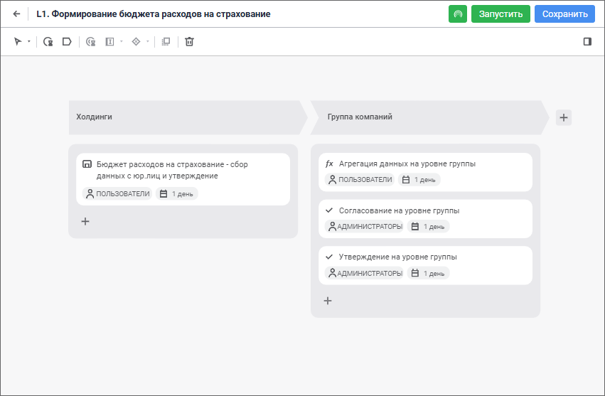
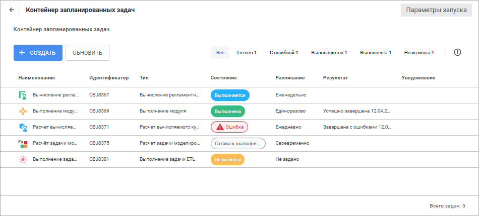

# Управление процессами и задачами

Управление процессами и задачами
-

# Управление процессами и задачами

В продукте «Форсайт. Аналитическая платформа»
 управление процессами и задачами выполняется с помощью различных инструментов.

## Моделирование бизнес-процессов и их выполнение

Расширение «[Управление бизнес-процессами](BPM.chm::/Modeling_of_business_processes.htm)» предназначено для визуального
 моделирования бизнес-процессов, их выполнения и мониторинга.

## Планирование задач и выполнение их по расписанию

Инструмент «[Планировщик задач](uiappsrv.chm::/uiappsrv_purpose.htm)»
 предназначен для выполнения ресурсоёмких задач на сервере по установленному
 расписанию, заданному условию или при наступлении определённого события.

См. также:

[Веб-приложение
 и настольное приложение](../Desktop_and_web_application.htm)

		Справочная
		 система на версию 10.9
		 от 18/08/2025,
		 © ООО «ФОРСАЙТ»,
