# Описание интерфейса инструментов

Описание интерфейса инструментов
-

Описание представлено для инструментов в настольном приложении и для инструментов в веб-приложении, интерфейс которых совпадает с настольным приложением.

# Описание интерфейса инструментов

	Интерфейс содержит общие элементы для работы с инструментами:

		- Главное меню. Основные
		 команды для работы с инструментом;

		- Лента инструментов.
		 Быстрый доступ к командам для манипулирования объектами во всех
		 инструментах;

		- Боковая панель.
		 Управление свойствами активного объекта, которое акцентирует внимание
		 пользователя на необходимых настройках;

		- Рабочая область.
		 Построение инструмента;

		- Строка статуса.
		 Настройка параметров расчета базовых агрегатов выделенного диапазона
		 ячеек таблицы, отображения результатов расчета, отображения информации
		 о выделенных объектах и индикации работы режимов CAP, NUM и SCRL.

	Общий интерфейс инструментов:

	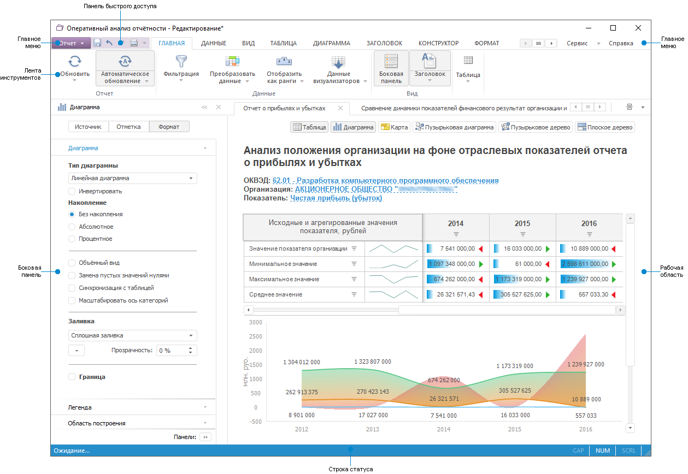

	[Особенности
	 интерфейса веб-приложения](javascript:TextPopup(this))

		В левой верхней части страницы веб-приложения доступен выбор
		 инструмента при помощи раскрывающегося списка, и переход к [окну приветствия](../GetStarted/Get_Started.htm):

			- список доступен во время работы с любым инструментом:

		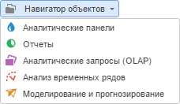

			- переход к окну приветствия осуществляется при нажатии на
			 кнопку .

	Для изучения основных принципов работы инструментов в настольном
	 и веб-приложении обратитесь к разделу «[Общие
	 принципы работы](uinav.chm::/GUI/General_principles.htm)».

## Главное меню

	Главное меню содержит список команд, предназначенных для выполнения
	 различных операций с инструментом, и состоит из нескольких подменю:

		- Основное меню. Содержит
		 команды для работы с инструментом;

	Примечание.
	 Название меню зависит от инструмента, например, в инструменте «Аналитические панели» основное
	 меню называется «Документ».

		- Сервис. Содержит
		 команды для настройки параметров инструмента;

		- Справка. Содержит
		 команды для вызова справочной системы и окна с информацией о программе.

## Лента инструментов

	Лента инструментов позволяет быстро находить необходимые команды.
	 Команды упорядочены в логические группы, собранные на вкладках. Каждая
	 вкладка связана с видом выполняемого действия, например, работа с
	 данными или с разметкой страницы.

	Некоторые вкладки выводятся на экран только по мере необходимости.
	 Такие вкладки называются контекстными,
	 так как для их появления необходимо срабатывание какого-либо события.
	 Например, вкладки «Объект.Диаграмма»
	 и «Объект.Формат» отображаются
	 в инструменте «Отчёты» при
	 выделении диаграммы на листе отчёта.

	При уменьшении размера окна группы кнопок сжимаются до одной кнопки.
	 При нажатии на такую кнопку во всплывающем окне будет отображена вся
	 группа команд.

	Основные возможности и функции ленты:

	[Сворачивание
	 ленты](javascript:TextPopup(this))

		Для экономии места на экране лента может быть свёрнута. В свёрнутом
		 виде отображаются только названия вкладок.

		Полная лента:

		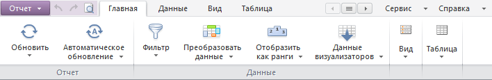

		Свёрнутая лента:

		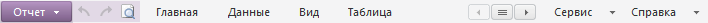

		Для того чтобы свернуть/восстановить ленту:

			- дважды щёлкните имя активной вкладки;

			- нажмите сочетание клавиш CTRL+F1;

			- установите/снимите флажок напротив команды «Скрыть
			 ленту» в контекстном меню ленты.

	[Прокрутка
	 вкладок](javascript:TextPopup(this))

		Для прокрутки вкладок ленты:

			- наведите курсор на ленту и прокрутите колесико мыши;

			- в случае, если какие-то вкладки не помещаются на экран
			 и скрыты, используйте кнопки 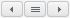 для прокрутки
			 вкладок.

		Примечание.
		 Доступно только в настольном приложении.

	[Прокрутка
	 панелей](javascript:TextPopup(this))

		Прокрутка панелей необходима, если все группы команд, сжатые
		 в кнопки, не помещаются на экран.

		Для этого используйте стрелки, которые появляются на вкладке
		 ленты:

		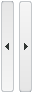

## Боковая панель

	Боковая панель - инструмент для управления свойствами активного
	 объекта.

	Боковая панель содержит набор вкладок, предназначенных для настройки
	 параметров объекта. Набор вкладок и их название зависит от типа объекта,
	 с которым ведется работа.

	Вкладки боковой панели объединены в группы. Для перехода по группам
	 вкладок используйте одноименные переключатели, расположенные в верхней
	 части боковой панели.

	Пример боковой панели при работе с диаграммой:

	В верхней части панели отображаются наименование и пиктограмма активного
	 объекта. На примере активный объект - диаграмма.

	Для отображения списка скрытых вкладок нажмите кнопку 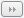 «Панели».
	 Для перехода к требуемой вкладке щелкните по её наименованию.

	Операции с боковой панелью:

	[Отображение/скрытие
	 боковой панели](javascript:TextPopup(this))

		Для отображения/скрытия боковой панели:

			- Перейдите на вкладку «Главная»
			 или «Вид» ленты инструментов.

			- Нажмите/переведите в ненажатое состояние кнопку  «Боковая панель».

		Для скрытия панели также можно использовать кнопку , расположенную в верхней
		 части боковой панели.

	[Сворачивание/разворачивание
	 боковой панели](javascript:TextPopup(this))

		Используйте кнопки, расположенные в верхней части боковой панели:

			- . Свернуть панель;

			- . Развернуть панель.

## Строка статуса

	Строка статуса представляет собой панель в нижней части окна.

	Расчет базовых агрегатов выделенного диапазона ячеек производится
	 с помощью команд контекстного меню строки статуса:

		- Среднее. Среднее
		 значение числовых данных выделенных ячеек;

		- Количество. Количество
		 ячеек, которые содержат данные;

		- Количество чисел. Количество ячеек, которые
		 содержат числовые данные;

		- Минимум. Наименьшее
		 из выделенных числовых значений;

		- Максимум. Наибольшее
		 из выделенных числовых значений;

		- Сумма. Сумма числовых
		 значений выделенных ячеек;

		- Нечисловые данные.
		 Количество ячеек, которые содержат нечисловые данные.

	Примечание.
	 Расчет базовых агрегатов выделенного диапазона ячеек доступен только
	 в отчетах и формах ввода.

	По умолчанию установлены флажки для команд «Среднее»
	 и «Сумма». При установке/снятии
	 флажка меню остается открытым, что позволяет осуществить выбор нескольких
	 агрегатов. Выбранные агрегаты сохраняются для текущего отчёта и при
	 следующем открытии отчёта отображаются в строке статуса. Если размеры
	 окна меняются и нет возможности отобразить все выбранные агрегаты
	 в строке, то скрываются агрегаты, начиная с последнего отображаемого.

	На строке статуса всегда отображена индикация работы режимов, включаемых
	 и выключаемых клавишами клавиатуры.

			 Режим
			 Клавиша
			 Описание

			 CAP
			 CAPS LOCK
			 Режим ввода прописных (заглавных) букв.

			 NUM
			 NUM LOCK
			 Режим использования дополнительной цифровой клавиатуры.

			 SCRL
			 SCROLL LOCK / SCRLK
			 Режим для изменения поведения клавиш управления с помощью
			 курсора.

## Дополнительные настройки интерфейса

### Панель инструментов

	Ряд инструментов продукта «Форсайт. Аналитическая платформа»
	 в своем интерфейсе используют не ленту, а панели инструментов. На
	 панелях инструментов продублированы часто используемые команды главного
	 меню. Также могут располагаться различные элементы управления, недоступные
	 в главном меню. При необходимости пользователь может создать собственную
	 панель инструментов и наполнить ее необходимыми элементами управления.

	Настройка панели инструментов доступна в [среде
	 разработки](UiDevEnv.chm::/01_Development_Environment/01_Purpose_of_the_constructor/Purpose_of_the_constructor.htm), [таблице стилей](UiNav.chm::/StylesTable/StylesTablePurpose.htm),
	 [контейнере
	 задач](UiAppSrv.chm::/Getting_Started.htm),
	 [справочнике
	 НСИ](UiNavObj.chm::/reference_book/Work/Work_Dictionary.htm#rds) и т.д.

	Для настройки панелей инструментов вызовите контекстное меню в области
	 главного меню или панелей инструментов и выполните команду «Настройка».

	[Настройка
	 команд](javascript:TextPopup(this))

		На вкладке «Команды»
		 доступен список всех команд главного меню. Для дублирования необходимой
		 команды на панели инструментов выберите ее в списке и перетащите
		 в область необходимой панели инструментов. При этом на панели
		 будет создана кнопка, выполняющая соответствующее действие.

	[Настройка
	 панелей инструментов](javascript:TextPopup(this))

		На вкладке «Панели инструментов»
		 содержится список панелей, которые определены для конкретного
		 инструмента «Форсайт. Аналитическая платформа».
		 Кнопки «Сбросить» и «Сбросить все» позволяют сбросить
		 настройки выделенной/всех панелей инструментов. При этом будут
		 удалены все команды, которые были добавлены пользователем, и будет
		 восстановлен системный список команд панелей инструментов.

		Для создания новой панели нажмите кнопку «Новая»
		 и в открывшемся диалоге укажите наименование создаваемой панели
		 инструментов. Для наполнения панели кнопками перейдите на вкладку
		 «Команды» и перетащите
		 необходимые команды на созданную панель.

	[Настройка
	 клавиатуры](javascript:TextPopup(this))

		Вкладка «Клавиатура»
		 используется для управления горячими клавишами. Горячие клавиши
		 предназначены для быстрого выполнения команд без обращения к главному
		 меню или панелям инструментов.

		Выберите категорию и необходимую команду, после этого в поле
		 «Текущие сочетания» будет
		 отображено текущее сочетание горячих клавиш, если оно назначено.
		 Для задания нового сочетания установите курсор в поле «Новое
		 сочетание», нажмите необходимое сочетание клавиш и нажмите
		 кнопку «Связать».

		Кнопка «Удалить» позволяет
		 убрать назначенное сочетание горячих клавиш с выбранной команды.
		 Кнопка «Сбросить все»
		 убирает все назначенные пользователем сочетания и восстанавливает
		 системные настройки.

### Панель быстрого доступа

	Панель быстрого доступа предназначена для размещения над лентой
	 инструментов наиболее часто выполняемых команд.

	В зависимости от используемого инструмента на панели быстрого доступа
	 доступны по умолчанию следующие команды:

		- во всех инструментах и расширении
		 «Алгоритмы расчёта»:

			- .
			 Сохраняет внесенные изменения;

		- в инструментах «Аналитические
		 запросы (OLAP)», «Аналитические
		 панели», «Отчёты»
		 и «Рабочее пространство»:

			- .
			 Отменяет последнее действие;

			- .
			 Повторяет последнее отмененное действие;

		- во всех инструментах и расширениях, кроме инструмента «Анализ временных рядов» и расширения
		 «Интерактивные формы ввода данных»:

			- .
			 Вызывает окно настройки параметров печати.

	Для настройки панели быстрого доступа выполните команду «Настроить
	 панель быстрого доступа» в контекстном меню ленты. Будет
	 открыт диалог настройки панели быстрого доступа:

	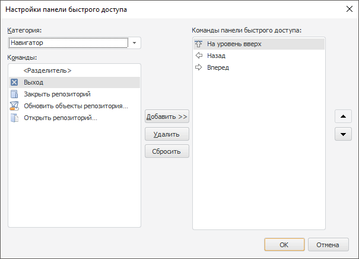

	Доступные операции с командами:

		- Добавление команды в панель
		 быстрого доступа. Выберите категорию команды в раскрывающемся
		 списке «Категория». В
		 поле «Команды» выберите
		 необходимую команду и нажмите кнопку «Добавить
		 >>». Команда будет добавлена в список команд панели
		 быстрого доступа;

		- Настройка порядка команд
		 в панели быстрого доступа. Для настройки порядка в поле
		 «Команды» выделите команду,
		 которую хотите переместить в списке. Стрелками «Вверх»
		 и «Вниз» управляйте расположением
		 команды в списке;

		- Удаление команды из панели
		 быстрого доступа. Выберите команду в поле «Команды».
		 Нажмите кнопку «Удалить»;

		- Сброс настройки панели
		 быстрого доступа. Для установки настроек по умолчанию для
		 панели быстрого доступа нажмите кнопку «Сбросить».

	Примечание.
	 В веб-приложении панель быстрого доступа зафиксирована и содержит
	 кнопки «Отменить» и «Повторить».

### Плавающая панель

	Плавающие
	 панели – это специальные окна, которые прикрепляются к одной
	 из сторон основного окна приложения и обеспечивают быстрый доступ
	 к логически сгруппированным функциям. Например, плавающая панель «Результаты поиска» в навигаторе
	 объектов репозитория отображает список всех найденных объектов по
	 заданным условиям и предоставляет функции работы с ними. Это позволяет
	 управлять объектами, расположенными в разных папках, из одного места.

	Перемещение панели возможно в любую позицию на экране или на другом
	 мониторе. Используйте функции автоматического скрытия для экономии
	 места на экране.

	[Перемещение
	 плавающей панели](javascript:TextPopup(this))

		Для перемещения плавающей панели выполните следующее:

			- Наведите курсор на заголовок панели;

			- Нажмите кнопку мыши и, удерживая её, перетащите панель
			 в нужную позицию.

		Для быстрого прикрепления панели к нужной стороне окна или к
		 другой панели в момент перетаскивания отображаются вспомогательные
		 элементы, которые соответствуют какому-либо конечному положению
		 панели. Перетащив панель на нужный вспомогательный элемент, отпустите
		 её – панель прикрепится к выбранной позиции:

		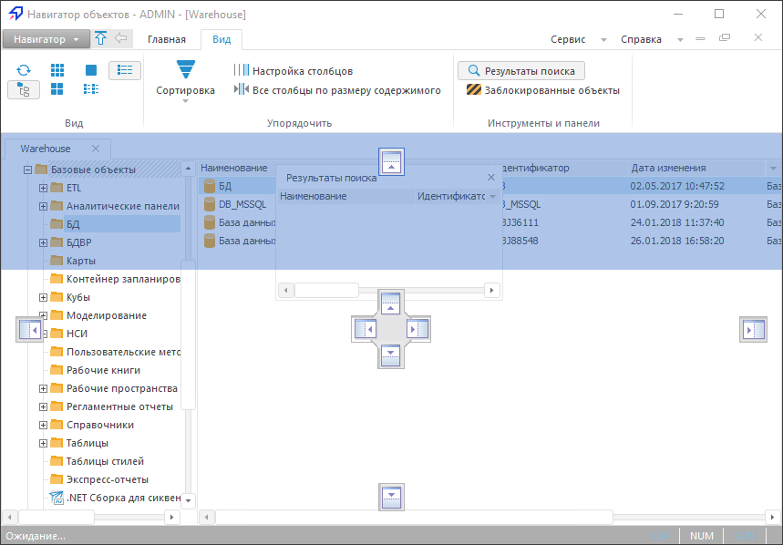

	[Функция
	 автоматического скрытия](javascript:TextPopup(this))

		Для экономии пространства экрана плавающие панели могут скрываться
		 в момент, когда они не используются.

		Для активации функции автоматического скрытия выполните одно
		 из следующих действий:

			- на заголовке плавающей панели нажмите кнопку вызова
			 меню  и выполните команду «Скрыть
			 автоматически»;

			- на заголовке плавающей панели нажмите кнопку ;

			- на заголовке плавающей панели выполните команду контекстного
			 меню «Скрыть автоматически».

		Теперь, когда плавающая панель станет неактивной, она автоматически
		 скроется, а в соответствующей области окна приложения будет отображена
		 кнопка со значком и названием скрытой панели. Для того чтобы отобразить
		 скрытую плавающую панель:

			- щёлкните по соответствующей кнопке;

			- выполните соответствующую команду главного меню.

### Сочетание клавиш

	Сочетания клавиш используются для быстрого доступа к командам меню
	 и ленты инструментов с клавиатуры.

	Сочетание клавиш – это любая клавиша на клавиатуре, нажатая с применением
	 модификаторов.

	Модификаторы – это клавиши CTRL, SHIFT, ALT. Сочетание клавиш может
	 содержать разное число модификаторов. В этом случае последовательность
	 их нажатия не имеет значения.

	Сочетания клавиш обозначаются с помощью знака «+», например:

		- CTRL+V;

		- CTRL+SHIFT +F;

		- CTRL+SHIFT+ALT+D.

	Настройка сочетаний клавиш осуществляется:

		- в окне «Сочетание клавиш»
		 из навигатора объектов;

		- в окне «Настройка»
		 на вкладке «Клавиатура»
		 для инструментов.

	[Для отображения
	 окон](javascript:TextPopup(this))

			- Выполните команду главного меню «Сервис
			 > Параметры».

			- В открывшемся окне перейдите на вкладку «Интерфейс».

			- Нажмите на кнопку «Настроить».

		Окно «Параметры»:

		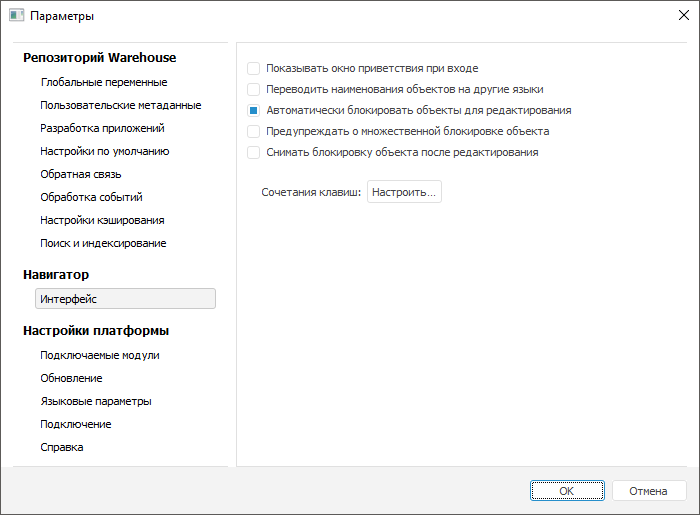

	Окно «Сочетание клавиш»
	 в навигаторе объектов:

	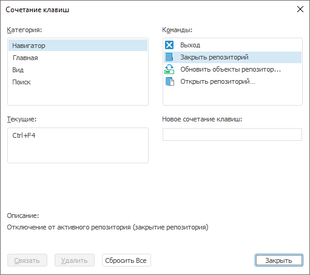

	Вкладка «Клавиатура» в окне
	 «Настройка» для инструментов:

	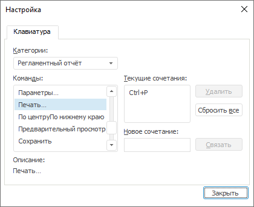

	Открытие окна «Настройка»
	 через команду главного меню «Сервис
	 > Параметры» осуществляется для инструментов:

		- [Аналитические
		 панели](UiAdhoc.chm::/launching.htm#setup);

		- [Аналитические
		 запросы (OLAP)](UiExpress.chm::/purpose/UiExpress_Organizational_Starting.htm#params);

		- [Анализ
		 временных рядов](UiDw.chm::/Purpose/TimeSeries_Setup.htm).

	Для остальных инструментов окно вызывается с помощью команды главного
	 меню «Сервис > Настройка»

	Доступны следующие настройки:

		- Категория/Категории.
		 Выберите необходимую категорию команд;

		- Команды. Укажите
		 необходимую команду в выбранной категории;

	Примечание.
	 Наборы команд зависят от инструмента, в котором было вызвано окно.

		- Текущие/Текущие сочетания.
		 В данном поле отображаются настроенные для выбранной команды сочетания
		 клавиш. Для удаления текущего сочетания клавиш выделите его и
		 нажмите кнопку «Удалить».
		 Для присвоения выделенной команде нового сочетания клавиш введите
		 его в поле «Новое сочетание клавиш/Новое
		 сочетание». Ввод осуществляется автоматически при нажатии
		 нужных клавиш. Далее нажмите кнопку «Связать».
		 Чтобы сбросить все текущие настройки сочетаний клавиш, нажмите
		 кнопку «Сбросить все»;

		- Описание. В данной
		 части приводится краткое описание выбранной команды.

См. также:

[Начало
 работы с веб-приложением и настольным приложением](../GetStarted/Get_Started.htm)

		Справочная
		 система на версию 10.9
		 от 18/08/2025,
		 © ООО «ФОРСАЙТ»,
