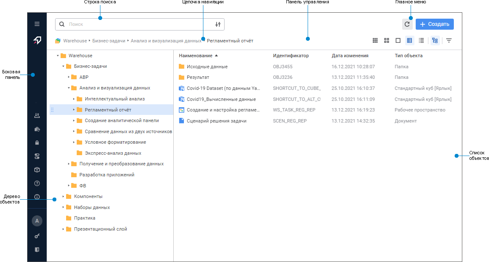
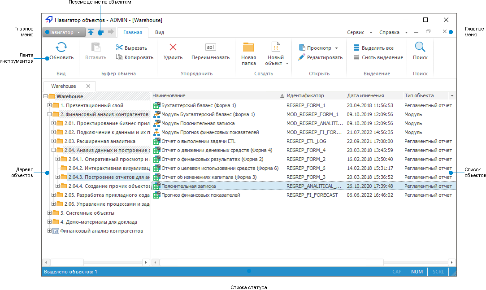
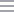

# Описание интерфейса навигатора

Описание интерфейса навигатора
-

# Описание интерфейса навигатора

	Навигатор объектов - это инструмент для визуального представления
	 [репозитория](../GetStarted/Repository.htm) и для работы
	 с его объектами.

	Для открытия навигатора объектов [запустите](../GetStarted/Get_Started.htm)
	 веб- или настольное приложение продукта «Форсайт. Аналитическая платформа».

	Примечание.
	 При запуске настольного приложения выберите навигатор объектов в [окне приветствия](../GetStarted/Get_Started.htm#startpage),
	 которое отображается по умолчанию. Если отображение окна приветствия
	 [отключено](../GetStarted/Get_Started.htm#features), то
	 навигатор объектов будет открыт сразу после запуска настольного приложения.

	После выполнения действия будет открыт навигатор объектов:

		Веб-приложение Настольное приложение

			

			

	При открытии навигатора объектов проверяется наличие базы данных,
	 заданной [по
	 умолчанию](uinav.chm::/02_Navigator/Repo_Default.htm).
	 Если база данных не задана, то будет предложено создать новую базу
	 данных или выбрать существующую в качестве базы данных по умолчанию.

	[Элементы
	 интерфейса навигатора объектов в веб-приложении](javascript:TextPopup(this))

			- [Главное
			 меню](GetStarted.chm::/Interface/Interface_Description.htm#main_menu). Содержит кнопки, предназначенные
			 для обновления списка объектов репозитория и создания нового
			 объекта.

			- Цепочка навигации.
			 Предназначена для перемещения по иерархии папок дерева объектов.

			- Дерево объектов.
			 Содержит иерархию папок. Составные объекты, такие как сборка,
			 база данных временных рядов, контейнер моделирования выступают
			 в роли папок и также отображаются в дереве.

			- Список объектов.
			 Содержит объекты в выбранной папке.

			- Строка поиска.
			 Предназначена для [поиска
			 объектов](UiNav.chm::/02_Navigator/uinav_findobject.htm) в репозитории.

			- Панель управления.
			 Предназначена для [управления отображением объектов](UiNav.chm::/GUI/View.htm)
			 в навигаторе.

			- Боковая панель.
			 Содержит логотип продукта «Форсайт. Аналитическая платформа»,
			 учётные данные пользователя и сервисные команды:

				- [импорт
				 данных без подготовки](UiNavObj.chm::/Data_import_wizard/Data_import_wizard.htm);

				- [создание
				 обновления](UpdManager.chm::/Admin_UpMBObj_RunManager.htm#create_update);

				- [открытие
				 готового обновления на просмотр](UpdManager.chm::/Admin_UpMBObj_RunManager.htm#open_update);

				- [установка
				 обновления](UpdManager.chm::/Admin_UpMBObj_DoUpdate.htm);

				- [открытие
				 менеджера безопасности](Admin.chm::/01_RunSecManager/Admin_Organizational_Starting.htm#run_web);

				- [изменение
				 параметров репозитория](setup.chm::/06_AK_Client_Config/Current_Repository_Settings.htm);

				- [запуск
				 консоли управления глобальным кешем](UiNav.chm::/02_Navigator/Cache_In_Blob.htm#console);

		Примечание.
		 Работа с консолью управления глобальным кешем доступна только
		 при [установленном
		 расширении](setup.chm::/Extensions/install_extensions_in_repository.htm) «Кеш
		 кубов».

				- [открытие
				 справочной системы на продукт «Форсайт. Аналитическая платформа»](uinav.chm::/02_Navigator/UiNav_RepoConfig_Help.htm);

				- [получение
				 информации о программе](UiNav.chm::/GUI/Info.htm);

				- просмотр [наименования
				 текущего пользователя](admin.chm::/03_Admin/Users/Admin_UserCreate.htm);

				- [смена
				 пароля пользователя](UiNav.chm::/02_Navigator/UiNav_ChangePass.htm);

				- [выход из навигатора объектов](#exit).

		Для разворачивания боковой панели
		 нажмите кнопку  «Развернуть
		 панель». Для сворачивания боковой панели -  «Свернуть
		 панель».

	[Элементы
	 интерфейса навигатора объектов в настольном приложении](javascript:TextPopup(this))

			- [Главное меню](GetStarted.chm::/Interface/Interface_Description.htm#main_menu). Содержит список команд, предназначенных
			 для открытия/закрытия репозитория, [обновления](UpdManager.chm::/Admin_UpMBObj_DoUpdate.htm)
			 объектов, выхода из навигатора и др.

			- [Лента инструментов](GetStarted.chm::/Interface/Interface_Description.htm#customize_ribbon). Содержит кнопки для
			 работы с объектами репозитория.

			- Дерево объектов.
			 Содержит вкладки подключенных репозиториев с иерархией папок.
			 Составные объекты, такие как сборка, база данных временных
			 рядов, контейнер моделирования и репозиторий НСИ, выступают
			 в роли папок и также отображаются в дереве.

			- Список объектов.
			 Содержит объекты в выбранной папке. Некоторые объекты можно
			 [просматривать
			 без открытия](uinav.chm::/GUI/View.htm#extralarge_icons), например, рабочие пространства,
			 репозитории НСИ и др.

			- Перемещение по объектам.
			 Содержит кнопки для быстрого перемещения по объектам:

				- .
				 Переход на верхний уровень по иерархии папок репозитория;

				- . Переход к предыдущему объекту.
				 Также используйте сочетание клавиш ALT+LEFT;

				- . Переход к следующему объекту.
				 Также используйте сочетание клавиш ALT+RIGHT.

			- [Строка
			 статуса](GetStarted.chm::/Interface/Interface_Description.htm#status_line). Содержит индикацию режимов
			 работы, регулируемых клавишами клавиатуры.

		В заголовке окна навигатора объектов отображается имя пользователя
		 и наименование подключенного репозитория в формате: «Навигатор
		 объектов - <имя
		 пользователя> - [<наименование репозитория>]».

	Ключевые возможности:

		- выполнение операций с объектами: создание, редактирование,
		 перемещение, настройка прав доступа, поиск объектов;

		- формирование визуальной структуры репозитория за счёт создания
		 иерархической структуры папок и распределения объектов по данным
		 папкам;

		- запуск инструментов анализа данных и прочих инструментов
		 продукта «Форсайт. Аналитическая платформа»;

		- подключение и работа в нескольких репозиториях одновременно.

	Для получения подробной информации о принципах работы в навигаторе
	 объектов обратитесь к разделу «[Работа
	 в навигаторе объектов](UiNav.chm::/02_Navigator/General_Principles_of_Work.htm)».

## Подключение нескольких репозиториев

	Для подключения нескольких репозиториев:

		- в веб-приложении откройте каждый репозиторий на отдельной
		 вкладке браузера;

		- в настольном приложении:

			- Откройте [окно
			 регистрации](../GetStarted/Get_Started.htm) одним из способов:

				- выполните команду «Открыть
				 репозиторий» в главном меню «Навигатор»;

				- нажмите клавишу F3.

			- [Войдите](../GetStarted/Get_Started.htm#login)
			 в систему.

			- Повторите первые два
			 действия для подключения нескольких репозиториев.

	Для перехода к необходимому репозиторию
	 используйте соответствующие вкладки в дереве объектов.

	После выполнения действий будет подключено несколько репозиториев.

## Отключение репозитория

	Для отключения репозитория:

		- выполните команду «Закрыть
		 репозиторий» в контекстном меню вкладки репозитория;

		- выполните команду «Закрыть
		 репозиторий» в главном меню «Навигатор»;

		- щёлкните колёсиком мыши по вкладке репозитория;

		- нажмите кнопку 
		 «Закрыть» на вкладке репозитория;

		- нажмите сочетание клавиш CTRL+F4.

	После выполнения одного из действий будет запрошено подтверждение
	 об отключении репозитория. При положительном ответе репозиторий будет
	 отключён.

	Примечание.
	 Доступно только в настольном приложении.

## Выход из навигатора объектов

	Для выхода из навигатора объектов:

		- в веб-приложении:

			- выполните команду  «Выход»
			 на боковой панели;

			- закройте вкладку браузера
			 с навигатором объектов;

	Примечание.
	 При закрытии вкладки браузера с навигатором объектов завершение пользовательской
	 сессии зависит от [настроек
	 таймаута работы BI-сервера](Setup.chm::/uiwebsetup/03_setup_web/setting_the_timeout.htm).

		- в настольном приложении:

			- выполните команду  «Выход» в главном меню «Навигатор»;

			- нажмите сочетание клавиш
			 ALT+F4.

См. также:

[Начало
 работы с веб-приложением и настольным приложением](../GetStarted/Get_Started.htm)

		Справочная
		 система на версию 10.9
		 от 18/08/2025,
		 © ООО «ФОРСАЙТ»,
