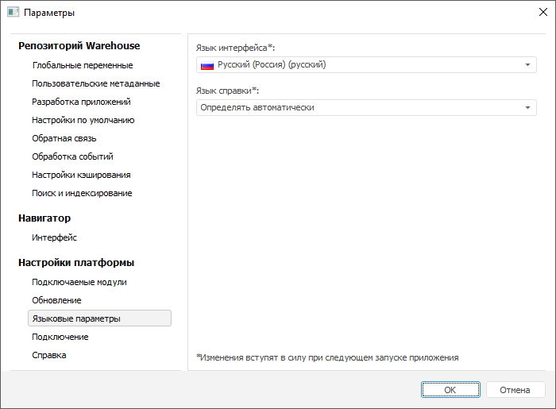

# Выбор языка интерфейса и справочной системы

Выбор языка интерфейса и справочной системы
-

# Выбор языка интерфейса и справочной системы

Изменить язык справочной системы и интерфейса продукта «Форсайт. Аналитическая платформа»
 можно:

	- в веб-приложении:

		- в [окне
		 регистрации](../GetStarted/Get_Started.htm);

	- в настольном приложении:

		- с помощью диалога «Параметры»;

		- с помощью приложения «Языковые параметры»;

[Настройка
 язык справочной системы и интерфейса в настольном приложении](javascript:TextPopup(this))

	Для открытия диалога «Параметры»:

		- в настольном приложении выполните команду «Сервис
		 > Параметры» в главном меню навигатора объектов.

	Отобразится диалог «Параметры»:

	

	Для открытия приложения «Языковые
	 параметры»:

		- Перейдите в главное меню Windows.

		- Выполните команду «Все
		 программы > Форсайт. Аналитическая платформа
		 > Языковые параметры».

	Отобразится окно «Языковые параметры»:

	

	Доступны следующие настройки:

		- Язык интерфейса.
		 Из раскрывающегося списка выберите один из поддерживаемых языков
		 интерфейса продукта «Форсайт. Аналитическая платформа».
		 По умолчанию выбран вариант «Использовать
		 язык интерфейса Windows (<текущий язык Windows>)»
		 и язык интерфейса платформы совпадает с языком операционной системы.

	Примечание.
	 Пункт «Использовать язык интерфейса
	 Windows» будет отсутствовать, если «Форсайт. Аналитическая платформа»
	 не поддерживает текущий язык операционной системы. В этом случае интерфейс
	 продукта «Форсайт. Аналитическая платформа»
	 будет отображен на английском языке.

		- Язык справочной системы.
		 Из раскрывающегося списка выберите один из поддерживаемых языков
		 справки продукта «Форсайт. Аналитическая платформа».
		 Список содержит только установленные справочные системы и вариант
		 «Определять автоматически».
		 Данный вариант выбран по умолчанию, будет выполнена попытка использовать
		 документацию на языке, соответствующем языку интерфейса продукта
		 «Форсайт. Аналитическая платформа».
		 Если документация на этом языке не установлена, то будет использоваться
		 документация на языке, значение которого содержит ключ реестра:

		HKEY_LOCAL_MACHINE\SOFTWARE\Wow6432Node\Foresight\Foresight Analytics Platform\10.0\DefaultLocaleHlp.

	Если ключ DefaultLocaleHlp не задан,
	 то для русского, украинского и казахского языков интерфейсов будет
	 выполнена попытка использовать русскую справку, для всех остальных
	 – английскую.

	Примечание.
	 Для синхронизации языка платформы и репозитория задайте соответствующие
	 [настройки
	 репозитория](uinav.chm::/02_Navigator/Repo_Default.htm).

См. также:

[Начало
 работы с веб-приложением и настольным приложением](../GetStarted/Get_Started.htm)

		Справочная
		 система на версию 10.9
		 от 18/08/2025,
		 © ООО «ФОРСАЙТ»,
