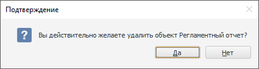
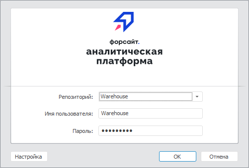
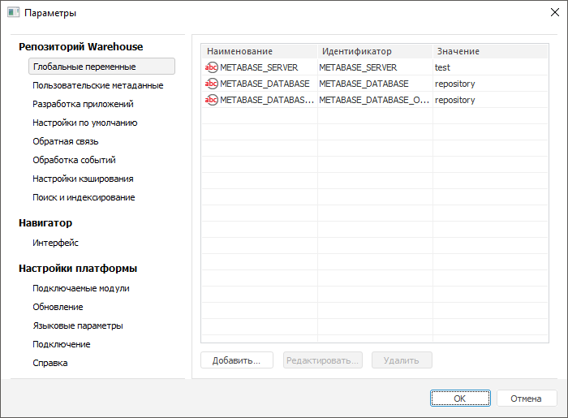

# Работа с окнами

Работа с окнами
-

Описание представлено для настольного приложения.

# Работа с окнами

Продукт «Форсайт. Аналитическая платформа»,
 как и другие Windows-приложения, использует оконный интерфейс. Окна делятся
 на основные, информационные и диалоговые. Внешний вид окон зависит от
 операционной системы, её темы оформления.

## Основное окно

Практически все инструменты, входящие в состав «Форсайт. Аналитическая платформа»,
 представлены в виде основных окон, которые могут включать в себя настраиваемые
 меню, ленты инструментов и плавающие панели. Основное окно отображается
 на панели задач Windows и поддерживает стандартные операции сворачивания,
 разворачивания, перемещения и т.д.

## Информационное окно

Информационные окна выводят информацию о текущем состоянии выполняемой
 операции. Информационные окна делятся на следующие виды: «Сообщение»
 и «Подтверждение». Сообщения в
 свою очередь делятся на информационные, предупреждения, сообщения об ошибках
 и критических ситуациях, и могут появляться в процессе работы при выполнении
 или невозможности выполнения каких-либо операций.

[Примеры информационных
 окон](javascript:TextPopup(this))

	Окно ««Форсайт. Аналитическая платформа»
	 - Ошибка» сообщает об ошибке, произошедшей непосредственно
	 в «Форсайт. Аналитическая платформа».

	При нажатии на кнопку «Подробнее»
	 окно сообщения разворачивается:

	Детальную информацию об ошибке «Форсайт. Аналитическая платформа»
	 можно скопировать в буфер обмена или отправить по электронной почте
	 непосредственно из самого окна.

	Окно «Подтверждение» отображается,
	 когда необходимо принять важное решение, которое может повлечь потерю
	 данных. Например, при удалении объекта репозитория:

	

## Окно

Окна (или диалоги, или модальные окна) «монополизируют» фокус
 внимания: работу с программой можно продолжить только после закрытия такого
 окна. Окна используются в основном для задания свойств объектов
 или при запуске задач, во время выполнения которых не допускается использование
 других функций программы.

Большинство окон содержат так называемые терминальные кнопки,
 которые его закрывают с применением или отменой сделанных изменений. Обычно
 эти кнопки называются «ОК» и «Отмена» соответственно. Иногда кнопка
 «ОК» может называться согласно
 выполняемой задаче. Например, в диалоге запуска какого-либо расчёта кнопка
 «ОК» может называться «Рассчитать»
 или «Выполнить». Некоторые диалоги
 могут содержать кнопку «Применить».
 Данная кнопка применяет сделанные изменения, но не закрывает диалог. После
 нажатия кнопки «Применить» нажатие
 кнопки «Отмена» не приводит к
 отмене сделанных изменений.

[Примеры окон](javascript:TextPopup(this))

	Окно «Регистрация» отображается
	 при запуске «Форсайт. Аналитическая платформа»:

	

	Окно «Параметры» содержит
	 [расширенные
	 возможности «Форсайт. Аналитическая платформа»](uinav.chm::/GUI/General_principles.htm#extend_performance):

	

См. также:

[Начало
 работы с веб-приложением и настольным приложением](../GetStarted/Get_Started.htm)

		Справочная
		 система на версию 10.9
		 от 18/08/2025,
		 © ООО «ФОРСАЙТ»,
