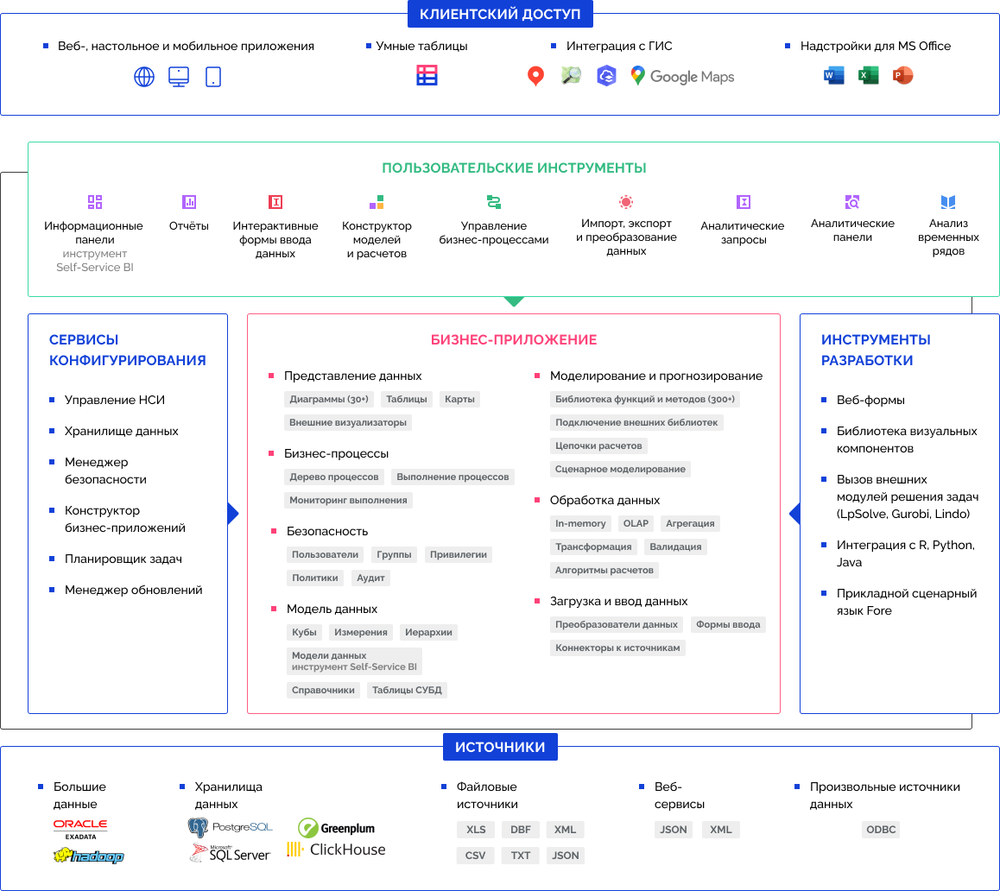

# Назначение и основные возможности продукта «Форсайт. Аналитическая платформа»

Назначение и основные возможности продукта «Форсайт. Аналитическая платформа»
-

# Назначение и основные возможности
 продукта «Форсайт. Аналитическая платформа»

Программный продукт «Форсайт. Аналитическая платформа»
 - это современная платформа бизнес-аналитики, предназначенная для формирования
 отчетности, управления бизнес-процессами, моделирования и прогнозирования
 показателей, визуализации и оперативного анализа данных, создания бизнес-приложений,
 в том числе веб-приложений и мобильных приложений.

Архитектура программного продукта «Форсайт. Аналитическая платформа»:

Основные характеристики:

	- инструменты подключения к данным позволяют подключиться к существующим
	 данным или выполнить их загрузку и провести подготовку данных для
	 последующего анализа;

	- инструменты анализа данных и построения отчётов позволяют выполнять:
	 оперативный просмотр и анализ данных (OLAP), построение аналитических
	 панелей, построение отчётов для печати, построение информационных
	 панелей. Готовые отчеты доступны через веб-приложение, настольное
	 приложение или мобильное приложение и легко экспортируются в распространенные
	 форматы;

	- интерактивные диаграммы, графики и карты позволяют анализировать
	 данные в различных плоскостях и обеспечивают максимальную наглядность
	 результатов анализа;

	- возможности расширенной аналитики, моделирования и прогнозирования,
	 а также интеллектуального анализа данных помогают рассмотреть несколько
	 вариантов развития событий, простроить прогноз и принять верное решение;

	- аналитические инструменты для управления процессами и задачами
	 позволяют моделировать бизнес-процессы, запускать и отслеживать их
	 выполнение;

	- конструктор бизнес-приложений предоставляет визуальные инструменты
	 поэтапного конструирования бизнес-приложения: настройка структуры,
	 репозитория метаданных, хранилища данных и НСИ, задач загрузки и согласования
	 данных, алгоритмов расчета, форм ввода и вывода.

Описание работы с приложениями и
 надстройками продукта «Форсайт. Аналитическая платформа»:

	- [веб-приложение
	 и настольное приложение;](../Desktop_and_web_application.htm)

	- [мобильное
	 приложение](MobileApp.chm::/mobile_app.htm);

	- [надстройки
	 для Microsoft Office](IntegrationTools.chm::/integrationtools_intro.htm).

См. также:

[Веб-приложение
 и настольное приложение](../Desktop_and_web_application.htm)

		Справочная
		 система на версию 10.9
		 от 18/08/2025,
		 © ООО «ФОРСАЙТ»,
