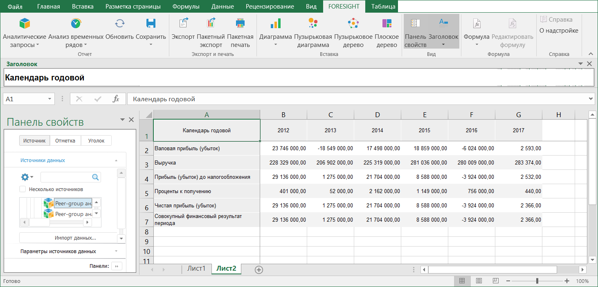
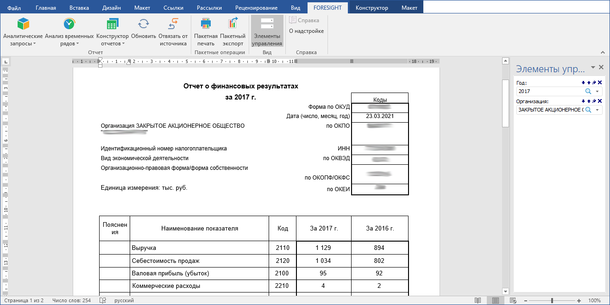

# Надстройки для Microsoft Office

Надстройки для Microsoft Office
-

# Надстройки для Microsoft Office

Продукт «Форсайт. Аналитическая платформа»
 предоставляет широкие возможности по интеграции с Microsoft Office, при
 этом становятся доступны все основные возможности инструментов продукта
 «Форсайт. Аналитическая платформа»
 по анализу данных и построению отчетов. Для расширения возможностей продуктов
 Microsoft Office используйте надстройки Foresight
 Add-in for Excel, Foresight
 Add-in for Word, Foresight
 Add-in for PowerPoint.

## Foresight Add-in for
 Excel

Надстройка [Foresight Add-in for Excel](ExcelAddin.chm::/ExcelAddin_Purpose.htm) позволяет работать с «Форсайт. Аналитическая платформа»
 с использованием в качестве рабочего места Microsoft Excel. Предназначена
 для создания табличных отчётов с использованием инструментов «[Аналитические
 запросы (OLAP)](UiExpress.chm::/purpose/UiExpress_Purpose.htm)» и «[Анализ
 временных рядов](UiDw.chm::/UiDw_Title.htm)».

## Foresight Add-in for
 Word

Надстройка [Foresight Add-in for Word](WordAddin.chm::/Title.htm) позволяет работать с «Форсайт. Аналитическая платформа»
 с использованием в качестве рабочего места Microsoft Word. Предназначена
 для создания текстовых отчётов с использованием инструментов «[Аналитические
 запросы (OLAP)](UiExpress.chm::/purpose/UiExpress_Purpose.htm)», «[Анализ
 временных рядов](UiDw.chm::/UiDw_Title.htm)», «[Отчёты](UiReport.chm::/UiReport_purpose.htm)».

## Foresight Add-in for
 PowerPoint

Надстройка [Foresight Add-in for PowerPoint](PowerPointAddIn.chm::/PowerPointAddIn_Title.htm)
 позволяет работать с «Форсайт. Аналитическая платформа»
 с использованием в качестве рабочего места Microsoft PowerPoint. Предназначена
 для создания презентаций на основе отчётов с использованием инструментов
 «[Аналитические
 запросы (OLAP)](UiExpress.chm::/purpose/UiExpress_Purpose.htm)», «[Анализ
 временных рядов](UiDw.chm::/UiDw_Title.htm)», «[Отчёты](UiReport.chm::/UiReport_purpose.htm)».

См. также:

[Foresight
 Add-in for Excel](ExcelAddin.chm::/ExcelAddin_Purpose.htm) | [Foresight
 Add-in for Word](WordAddin.chm::/Title.htm) | [Foresight Add-in for PowerPoint](PowerPointAddIn.chm::/PowerPointAddIn_Title.htm)

		Справочная
		 система на версию 10.9
		 от 18/08/2025,
		 © ООО «ФОРСАЙТ»,
