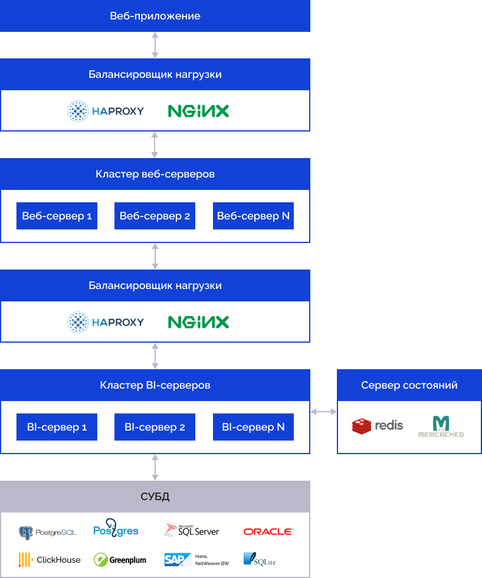

# Общие характеристики продукта

Общие характеристики продукта
-

# Общие характеристики продукта «Форсайт. Аналитическая платформа»

## Мультиязыковая поддержка

Продукт «Форсайт. Аналитическая платформа»
 поддерживает различные [языки
 интерфейса](GetStarted.chm::/Interface/Intro_Language.htm),
 в том числе английский, немецкий, французский, испанский, итальянский,
 китайский, португальский, русский, украинский, казахский, арабский, азербайджанский.

Для представления данных поддерживается стандарт юникод.

## Взаимодействие с веб-сервисами

Продукт «Форсайт. Аналитическая платформа»:

	- имеет интегрированную [среду
	 разработки приложений](UiDevEnv.chm::/01_Development_Environment/01_Purpose_of_the_constructor/Purpose_of_the_constructor.htm), которая позволяет работать
	 с веб-сервисами сторонних приложений, а также реализовывать новые
	 веб-сервисы на базе платформы;

	- поддерживает высокую доступность путем интеграции со сторонним
	 ПО класса High Availability, например, SQL Server Failover Cluster
	 и т.п.

## Синхронизация и обмен данными

Объекты репозитория и их метаданные можно копировать и переносить между
 различными [репозиториями](GetStarted.chm::/Interface/Interface_Navigator.htm).

Любой объект репозитория может быть скопирован и добавлен в репозиторий
 как объект-копия, при этом он будет являться самостоятельным объектом
 репозитория, доступным для редактирования и использования.

При работе над прикладными системами с использованием «Форсайт. Аналитическая платформа»
 для разделения процессов разработки, как правило, создаются несколько
 репозиториев - для разработки, для тестирования, для непосредственного
 использования. Настройки и состав объектов репозитория в процессе разработки
 могут изменяться. Для синхронизации объектов, данных и прав доступа между
 репозиториями, а также для синхронизации версий прикладных систем у разработчиков
 и у конечных пользователей в «Форсайт. Аналитическая платформа»
 используется [механизм
 обновления](UpdManager.chm::/Admin_UpdateTitle.htm)
 объектов репозитория, позволяющий переносить между репозиториями необходимую
 информацию (объекты, права доступа к объектам, данные).

## Повышенная производительность и
 отказоустойчивость

Продукт «Форсайт. Аналитическая платформа»
 позволяет использовать преимущества SMP-систем и может использовать все
 доступные ядра процессора. Запросы от пользователей выполняются множеством
 потоков в рамках сервера приложений. Потоки автоматически распределяются
 операционной системой на доступные ядра процессора. Таким образом, выполняется
 распределение вычислительной нагрузки.

Отказоустойчивость продукта «Форсайт. Аналитическая платформа»
 достигается за счёт размещения системы на нескольких серверах с единой
 точкой входа с помощью балансировщика рабочей нагрузки. В случае отказа
 одного из серверов в системе, запрос клиента передается для обработки
 на другой сервер. Данные о сеансах работы пользователей хранятся на выделенных
 узлах - серверах состояний. Для серверов состояний может выполняться резервное
 копирование и синхронизация.

## Масштабируемость

Продукт «Форсайт. Аналитическая платформа»
 является масштабируемым, так как производительность «Форсайт. Аналитическая платформа»
 увеличивается при увеличении выделяемых ей ресурсов.

Для увеличения производительности продукта «Форсайт. Аналитическая платформа»
 доступно два подхода:

	- вертикальное масштабирование.
	 Увеличение производительности достигается путём добавления ресурсов
	 (процессора, оперативной памяти, дискового пространства) в рамках
	 одного BI-сервера;

	- горизонтальное масштабирование.
	 Увеличение производительности достигается путём [добавления
	 еще одного BI-сервера](Setup.chm::/UiWebSetup/01_BIServer/Cluster/Cluster_Of_BI_Server.htm) или веб-сервера в систему.
	 Горизонтальное масштабирование характерно для распределённых систем,
	 в которых системы соединяются через сеть или объединяются в кластер.
	 Горизонтальное масштабирование позволяет использовать продукт для
	 построения облачных прикладных систем.

Масштабируемая архитектура продукта «Форсайт. Аналитическая платформа»,
 основанная на веб-сервисах, позволяет использовать продукт для построения
 облачных прикладных систем. Клиенты могут использовать общую БД с разграничением
 прав доступа средствами «Форсайт. Аналитическая платформа»
 или выделенную БД для каждого клиента:

Балансировка нагрузки выполняется при помощи Nginx или HAProxy. Для
 обеспечения отказоустойчивости BI-сервер сохраняет состояния открытых
 объектов на специальных узлах серверов состояний (основанных на Redis
 и Memcached).

Особенности построения системы:

	- количество BI-серверов должно превышать количество веб-серверов;

	- для каждого BI-сервера может быть развёрнут [сервер
	 состояний](Setup.chm::/UiWebSetup/01_BIServer/StateServer/State_Server.htm);

	- доступно масштабирование сервера баз данных, то есть использование
	 кластерных СУБД.

## Модульность

Политика лицензирования продукта «Форсайт. Аналитическая платформа»
 позволяет заказчику выбирать только те [функциональные блоки](setup.chm::/08_Licensing/AboutFeatures.htm),
 которые необходимы на данном этапе реализации прикладной системы.

См. также:

[Дополнительные справочные
 материалы](../Overview/AdditionalMaterials.htm)

		Справочная
		 система на версию 10.9
		 от 18/08/2025,
		 © ООО «ФОРСАЙТ»,
