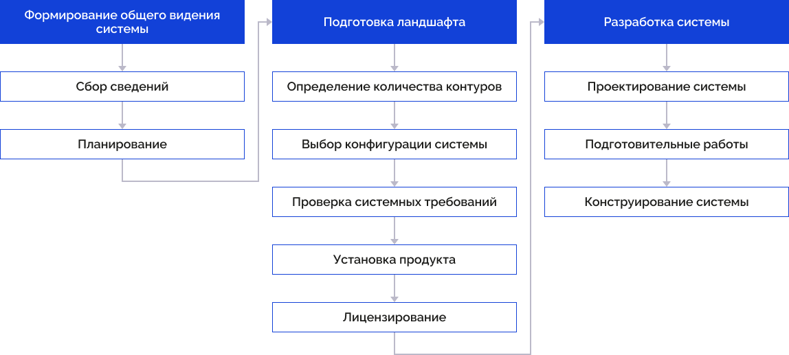

# Рекомендации по организации процесса разработки на базе продуктов компании «Форсайт»

Рекомендации по организации процесса разработки на базе продуктов компании «Форсайт»
-

# Рекомендации по организации процесса разработки на базе продуктов компании
 «Форсайт»

При организации процесса разработки прикладных систем для конечного
 заказчика на базе продуктов компании «Форсайт» партнерам компании «Форсайт»
 необходимо учитывать специфику продуктов линейки «Форсайт», а также общепринятые
 практики организации и построения самого процесса разработки сложных информационных
 систем.

Шаги по организации процесса:

[

Система – информационная система, создаваемая партнером на базе продукта
 для заказчика.

Партнер – компания, занимающаяся разработкой информационных систем и
 имеющая статус партнера компании «Форсайт».

Ландшафт – совокупность аппаратных и программных средств, как на территории
 партнера, так и на территории заказчика, обеспечивающая процесс разработки
 системы.

Заказчик – организация, в которой планируются к внедрению информационные
 системы, разработанные партнером.

Продукт – какой-либо продукт из линейки компании «Форсайт» («Форсайт. Аналитическая платформа»,
 «Форсайт. Бюджетирование», «Форсайт. Управление инвестициями», «Форсайт.
 Мобильная платформа»).

См. также:

Дополнительные справочные
 материалы](CommonVision.htm)

		Справочная
		 система на версию 10.9
		 от 18/08/2025,
		 © ООО «ФОРСАЙТ»,
