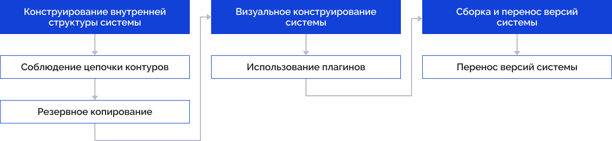
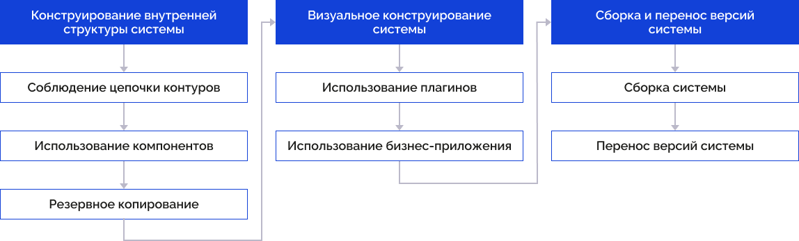

# Конструирование системы

Конструирование системы
-

# Конструирование системы

Конструирование системы зависит от наличия установленных расширений.

	Без расширений С расширениями

		

		[

		

## Конструирование внутренней структуры системы

Общими шагами при конструировании внутренней структуры являются: соблюдение
 последовательности прототипов и выполнение резервного копирования.

При использовании расширений добавляется шаг использования компонентов.

### ](#internal_structure)Соблюдение цепочки контуров

При разработке рекомендуется строго соблюдать определенную ранее последовательность
 контуров. Разработку новой функциональности вести только в контуре разработки
 (DEV). Переносить функциональность на контур промышленной эксплуатации
 (PROD) только после успешного прохождения тестирования в контуре тестирования
 (TEST).

### Выполнение резервного копирования

Рекомендуется ежедневно осуществлять резервное копирование базы репозитория
 метаданных.

### Использование компонентов

Внутренние объекты системы рекомендуется реализовывать, группируя функциональность
 с помощью объекта компонент.

Реализованную функциональность вне компонентов рекомендуется перенести
 под компоненты.

Реализованную расширенную функциональность рекомендуется разбить на
 логически независимые части и реализовать их в виде отдельных компонентов.

Разработанные пользовательские коннекторы к системам заказчика рекомендуется
 реализовать в виде отдельных компонентов.

Для получения подробной информации об объединении функциональности в
 компоненты обратитесь к статье «[Объединение
 функциональности в компоненты](Constructor.chm::/BasicControls/Basic_properties_of_component.htm)».

## Визуальное конструирование системы

При визуальном конструировании системы общим шагом является использование
 плагинов.

При использовании расширений добавляется шаг использования бизнес-приложения.

### Использование плагинов

Для расширения возможностей визуализации данных в веб-приложении в аналитических
 панелях, регламентных отчётах, формах ввода используйте сторонние визуализаторы,
 которые рекомендуется подключать в виде плагинов.

Для получения подробной информации об использовании плагинов обратитесь
 к разделу «[Плагины](DataAnalysis.chm::/Plugins/Plugins.htm)».

### Использование бизнес-приложения

При необходимости разработки веб-приложения для работы конечных пользователей
 рекомендуется использовать объект бизнес-приложения.

Для получения подробной информации о построении бизнес-приложения обратитесь
 к статье «[Построение
 бизнес-приложения](Constructor.chm::/BasicControls/General_principles.htm)».

## Сборка и перенос версий системы

Перенос системы без использования расширений отличается от переноса
 системы с использованием расширений.

При использовании расширений добавляется шаг сборка системы.

### Сборка системы

Для корректной сборки системы необходимо настроить зависимости бизнес-приложения
 и компонентов.

Для получения подробной информации о построении бизнес-приложения обратитесь
 к статье «[Настройка
 зависимостей приложения](Constructor.chm::/BasicControls/Configure_dependencies_application.htm)».

### Перенос версий системы

При отсутствии расширений синхронизацию объектов между репозиториями
 и их обновление выполняйте с помощью инструмента «Менеджер
 обновлений». Для получения подробной информации о работе с менеджером
 обновлений обратитесь к статье «[Перенос объектов между
 репозиториями и их обновление](UpdManager.chm::/Admin_UpdateTitle.htm)».

При установленных расширениях формировать и переносить обновления по
 цепочке контуров рекомендуется с помощью конструктора бизнес-приложений.
 Для получения подробной информации о формировании и установке пакетов
 обновлений обратитесь к статье «[Формирование
 и установка обновлений приложения](Constructor.chm::/BasicControls/Formation_installation_updates.htm)».

См. также:

[Разработка
 системы](SystemDevelopment.htm)

		Справочная
		 система на версию 10.9
		 от 18/08/2025,
		 © ООО «ФОРСАЙТ»,
