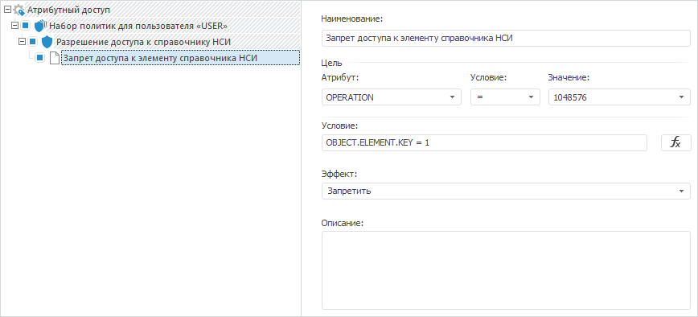

# Права доступа на элементы справочника НСИ

Права доступа на элементы справочника НСИ
-

# Права доступа на элементы справочника НСИ

Атрибутный метод разграничения доступа позволяет задавать права доступа
 на отдельные элементы справочника НСИ. Разграничение прав доступа на элементы
 справочников НСИ выполняется:

	- при одновременном использовании [атрибутного](admin.chm::/04_SecurityPolicy/Admin_ABAC.htm)
	 и [дискреционного](admin.chm::/04_SecurityPolicy/Admin_PermSep_D.htm)
	 методов;

	- при использовании только [атрибутного метода](admin.chm::/04_SecurityPolicy/Admin_ABAC.htm).

Атрибут элемента задается в виде «OBJECT.ELEMENT.<идентификатор
 атрибута>». Идентификаторы атрибута содержатся на вкладке «[Атрибуты](UiNavObj.chm::/reference_book/Master_RDS_reference_book/Attributes.htm)»
 при открытии [справочника](UiNavObj.chm::/reference_book/Work/Work_Dictionary.htm#edit)
 на редактирование.

Примечание.
 Атрибут элемента задается только в [дополнительном
 условии](Admin.chm::/04_SecurityPolicy/Creating_conditions.htm) правила. При составлении дополнительного условия
 учитывайте [особенности
 использования атрибута](admin.chm::/04_SecurityPolicy/Creating_conditions.htm#attr_element).

Операции над элементами справочника НСИ содержатся в перечислении [DictionarySpecificRights](KeSom.chm::/Enums/DictionarySpecificRights.htm).

Для получения подробной информации о разграничении прав доступа на элементы
 справочников НСИ обратитесь к разделу «[Права доступа
 на элементы справочников НСИ](Admin.chm::/03_Admin/Admin_ElementAccess.htm)».

Рассмотрим пример запрета доступа пользователю на чтение элемента справочника
 НСИ с ключом 1 при одновременном использовании атрибутного и дискреционного
 методов разграничения доступа.

## Пример

Для выполнения примера должны выполняться условия:

	- в корне репозитория содержится справочник НСИ с идентификатором
	 DICTIONARY. В справочнике должно содержаться не менее двух элементов;

	- в менеджере безопасности содержится пользователь с наименованием
	 «USER»;

	- в разделе «[Редактор политик](admin.chm::/04_SecurityPolicy/Admin_SecPolicy.htm#access_control)»
	 менеджера безопасности установлены флажки «Использовать
	 атрибутный доступ», «Использовать
	 дискреционный контроль» и выбран алгоритм комбинации прав доступа
	 «OR»;

	- в параметрах управления дискреционным контролем доступа для
	 конкретного пользователя разрешены все операции над объектами:

		- папка, в которой содержится справочник НСИ. Если справочник
		 НСИ расположен не в корне репозитория, а в отдельной папке или
		 иерархии папок, то для каждой папки не должно быть запрещенных
		 операций;

		- база данных, в которой хранятся данные справочника НСИ;

		- внутренняя таблица справочника НСИ.

Дискреционные права доступа настраиваются
 отдельно для каждого объекта на вкладке «[Дискреционный контроль](admin.chm::/03_Admin/Admin_AdminObjects_Discretionary.htm)»
 в окне «Параметры управления доступом».

Добавьте ссылки на системные сборки: ABAC, Metabase, Rds.

Sub UserProc;

Var

    PolicyObject: IABACRootPolicyObject;

    PolicySet: IABACPolicySet;

    Policy: IABACPolicy;

    Rules: IABACRules;

    Rule: IABACRule;

    MB: IMetabase;

    MS: IMetabaseSecurity;

    Lic: Object;

    DimObj: IMetabaseObject;

    Dim: IRdsDictionary;

Begin

    MB := MetabaseClass.Active;

    //Получим лицензию для возможности работы с менеджером безопасности

    Lic := MB.RequestLicense(UiLicenseFeatureType.Adm);

    MS := MB.Security;

    // Зададим признак «Элементы имеют атрибутные права доступа» для справочника НСИ

    DimObj := MB.ItemById("DICTIONARY").Edit;

    Dim := DimObj As IRdsDictionary;

    Dim.AbacSecured := True;

    DimObj.Save;

    // Получим структуру атрибутного доступа

    PolicyObject := MB.Security.Policy.ABACRules;

    // Очистим структуру атрибутного доступа и зададим новую

    PolicyObject.Policies.Clear;

    // Зададим алгоритм корневой политики атрибутного доступа - переопределение разрешением

    PolicyObject.CombineAlgorithm := ABACCombineAlgorithm.PermitOverride;

    // Добавим набор политик

    PolicySet := PolicyObject.Policies.Add;

    PolicySet.Name(MB.CurrentLocale) := "Набор политик для пользователя «USER»";

    PolicySet.Target.AttributeId := "SUBJECT.NAME";

    PolicySet.Target.Operation := ABACTargetOperation.Equal;

    PolicySet.Target.AttributeValue := "USER";

    PolicySet.CombineAlgorithm := ABACCombineAlgorithm.PermitOverride;

    // Добавим политику для доступа к справочнику НСИ с идентификатором DICTIONARY

    Policy := PolicySet.Policies.Add;

    Policy.Name(MB.CurrentLocale) := "Разрешение доступа к справочнику НСИ";

    Policy.Target.AttributeId := "OBJECT.ID";

    Policy.Target.Operation := ABACTargetOperation.Equal;

    Policy.Target.AttributeValue := "DICTIONARY";

    Policy.CombineAlgorithm := ABACCombineAlgorithm.PermitOverride;

    // Добавим правило на запрет доступа к элементу справочника НСИ с ключом 1

    Rules := Policy.Rules;

    Rule := Rules.Add;

    Rule.Name(LocaleCodeID.Russian) := "Запрет доступа к элементу справочника НСИ";

    Rule.Target.AttributeId := "OPERATION";

    Rule.Target.Operation := ABACTargetOperation.Equal;

    Rule.Target.AttributeValue := 1048576;

    Rule.Condition.AsString := "OBJECT.ELEMENT.KEY = 1";

    Rule.Effect := ABACRuleEffect.Deny;

    // Применим изменения в менеджере безопасности

    MS.Apply;

    // Освободим лицензию

    Lic := Null;

End Sub UserProc;

В результате выполнения примера:

	- в базовых настройках справочника НСИ будет установлен флажок
	 «[Элементы
	 имеют атрибутные права доступа](UiNavObj.chm::/reference_book/Master_RDS_reference_book/base_settings.htm#abac)»;

	- в разделе «[Атрибутный
	 доступ](Admin.chm::/04_SecurityPolicy/Admin_AttributeAccess.htm)» менеджера безопасности будет добавлена
	 заданная структура атрибутного доступа с запретом доступа пользователю
	 на чтение элемента справочника НСИ с ключом 1:

При выполнении атрибутного доступа в навигаторе объектов для пользователя
 «USER» не будет отображаться элемент справочника НСИ с ключом 1.

См. также:

[Примеры](KeABAC_Example.htm)
 | [Права
 доступа на элементы справочников НСИ](Admin.chm::/03_Admin/Admin_ElementAccess.htm) | [Базовые настройки
 справочника](UiNavObj.chm::/reference_book/Master_RDS_reference_book/base_settings.htm)

		Справочная
		 система на версию 10.9
		 от 18/08/2025,
		 © ООО «ФОРСАЙТ»,
