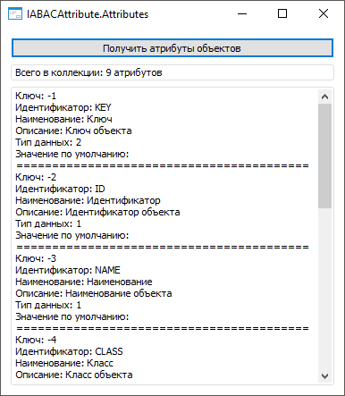

# IABACAttribute.Attributes

IABACAttribute.Attributes
-

# IABACAttribute.Attributes

## Синтаксис

Attributes: [IABACAttributes](../IABACAttributes/IABACAttributes.htm);

## Описание

Свойство Attributes возвращает
 коллекцию атрибутов.

## Комментарии

Для работы с коллекцией атрибутов используйте интерфейс [IABACAttributes](../IABACAttributes/IABACAttributes.htm).

## Пример

Для выполнения примера разместите на форме компонент Button и два компонента
 Memo с наименованиями «Button1», «Memo1» и «Memo2» соответственно. Для
 «Memo1» установите свойству ScrollBars значение «Vertical».

Добавьте ссылки на системные сборки: ABAC, Metabase, Collections, Dal,
 Forms.

Пример является обработчиком события OnClick для компонента «Button1».

Sub Button1OnClick(Sender: Object; Args: IMouseEventArgs);

Var

    MB: IMetabase;

    MS: IMetabasePolicy;

    AttrObj: IMetabaseSecurityObjectsAttributes;

    ABACAttributes: IABACAttributes;

    ABACAttribute: IABACAttribute;

Begin

    MB := MetabaseClass.Active;

    MS := MB.Security.Policy;

    // Получим атрибуты объектов

    AttrObj := MS.ObjectsAttributes;

    ABACAttributes := AttrObj.Global;

    // Выведем свойства каждого атрибута

    For Each ABACAttribute In ABACAttributes Do

        Memo1.Lines.Add("Ключ: " + ABACAttribute.Key.ToString);

        Memo1.Lines.Add("Идентификатор: " + ABACAttribute.Id);

        Memo1.Lines.Add("Наименование: " + ABACAttribute.Name(MB.CurrentLocale));

        Memo1.Lines.Add("Описание: " + ABACAttribute.Description(MB.CurrentLocale));

        Memo1.Lines.Add("Тип данных: " + ABACAttribute.DataType.ToString);

        Memo1.Lines.Add("Значение по умолчанию: " + ABACAttribute.DefaultValue);

        Memo1.Lines.Add("=========================================");

        Memo2.Lines.Add("Всего в коллекции: " + ABACAttribute.Attributes.Count.ToString + " атрибутов");

    End For;

End Sub Button1OnClick;

После нажатия на кнопку будут отображены свойства [системных](admin.chm::/04_SecurityPolicy/Creating_conditions.htm#object)
 и [пользовательских](admin.chm::/04_SecurityPolicy/Creating_attributes.htm)
 атрибутов объектов:

См. также:

[IABACAttribute](IABACAttribute.htm)

		Справочная
		 система на версию 10.9
		 от 18/08/2025,
		 © ООО «ФОРСАЙТ»,
