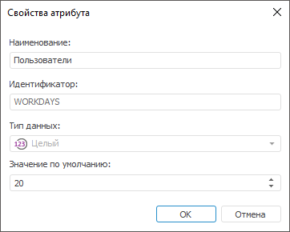

# IABACAttribute.Name

IABACAttribute.Name
-

# IABACAttribute.Name

## Синтаксис

Name(Locale: [LocaleCodeID](ForeSys.chm::/Enums/LocaleCodeID.htm)):
 String;

## Параметры

Locale. Язык наименования.

## Описание

Свойство Name определяет наименование
 атрибута.

## Комментарии

Данное свойство актуально при добавлении нового атрибута пользователям,
 группам пользователей, классам объектов, отдельным типам объектов.

## Пример

Для выполнения примера добавьте ссылки на системные сборки: ABAC, Metabase,
 Dal.

Sub UserProc;

Var

    ABACAttribute: IABACAttribute;

    ABACAttributes: IABACAttributes;

    MB: IMetabase;

    MS: IMetabaseSecurity;

    Lic: Object;

Begin

    MB := MetabaseClass.Active;

    // Получим лицензию для возможности работы с менеджером безопасности

    Lic := MB.RequestLicense(UiLicenseFeatureType.Adm);

    MS := MB.Security;

    // Добавим атрибут для пользователей

    ABACAttributes := MS.Users.Attributes;

    ABACAttribute := ABACAttributes.Add;

    ABACAttribute.Name(MB.CurrentLocale) := "Пользователи";

    ABACAttribute.Id := "WorkDays";

    ABACAttribute.Description(MB.CurrentLocale) := "Количество трудодней";

    ABACAttribute.DefaultValue := 20;

    ABACAttribute.DataType := DbDataType.Integer;

    // Выведем в консоль
 ключ нового атрибута

    Debug.WriteLine("Ключ нового атрибута: " + ABACAttribute.Key.ToString);

    // Сохраним изменения в менеджере безопасности

    MS.Apply;

    // Освободим лицензию

    Lic := Null;

End Sub UserProc;

В результате выполнения примера в менеджере безопасности будет добавлен
 [атрибут](Admin.chm::/04_SecurityPolicy/Creating_attributes.htm#properties_attr)
 для пользователей:

В консоль будет выведен ключ нового атрибута:

Ключ нового атрибута: 17

См. также:

[IABACAttribute](IABACAttribute.htm)

		Справочная
		 система на версию 10.9
		 от 18/08/2025,
		 © ООО «ФОРСАЙТ»,
