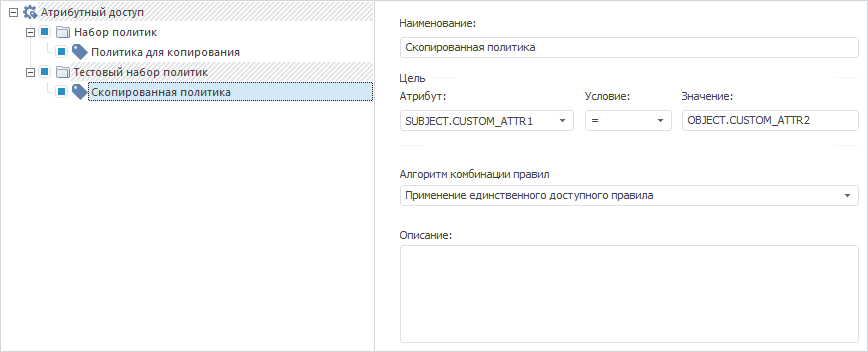

# IABACPolicies.AddCopy

IABACPolicies.AddCopy
-

# IABACPolicies.AddCopy

## Синтаксис

AddCopy(Value: [IABACPolicy](../IABACPolicy/IABACPolicy.htm)):
 [IABACPolicy](../IABACPolicy/IABACPolicy.htm);

## Описание

Метод AddCopy осуществляет добавление
 копии указанной политики в структуру атрибутного доступа.

## Пример

Для выполнения примера убедитесь, что в структуре [атрибутного
 доступа](Admin.chm::/04_SecurityPolicy/Admin_AttributeAccess.htm) содержатся два набора политик. В первом наборе
 политик дополнительно содержится вложенная политика.

Добавьте ссылки на системные сборки: ABAC, Metabase.

Sub UserProc;

Var

    PolicyObject: IABACRootPolicyObject;

    PolicySet: IABACPolicySet;

    Policy: IABACPolicy;

    Policies: IABACPolicies;

    MB: IMetabase;

    MS: IMetabaseSecurity;

    Lic: Object;

Begin

    MB := MetabaseClass.Active;

    // Получим лицензию для возможности работы с менеджером безопасности

    Lic := MB.RequestLicense(UiLicenseFeatureType.Adm);

    MS := MB.Security;

    // Получим структуру атрибутного доступа

    PolicyObject := MB.Security.Policy.ABACRules;

    // Получим первую политику в наборе политик с индексом «0»

    PolicySet := PolicyObject.Policies.Item(0);

    Policy := PolicySet.Policies.Item(0);

    // Получим набор политик с индексом «1»

    PolicySet := PolicyObject.Policies.Item(1);

    Policies := PolicySet.Policies;

    // Скопируем первую политику из набора политик с индексом «0» в набор политик с индексом «1»

    Policies.AddCopy(Policy);

    // Изменим наименование скопированной политики

    Policies.Item(0).Name(MB.CurrentLocale) := "Скопированная политика";

    // Применим изменения в менеджере безопасности

    MS.Apply;

    // Освободим лицензию

    Lic := Null;

End Sub UserProc;

В результате выполнения примера в заданный набор политик с индексом
 «1» будет скопирована существующая политика из набора политик с индексом
 «0» с новым наименованием:

См. также:

[IABACPolicies](IABACPolicies.htm)

		Справочная
		 система на версию 10.9
		 от 18/08/2025,
		 © ООО «ФОРСАЙТ»,
