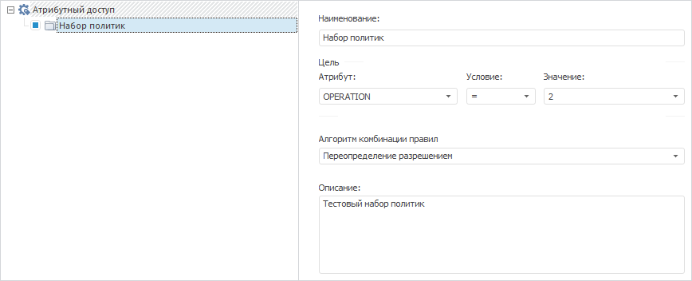

# IABACPolicySet.CombineAlgorithm

IABACPolicySet.CombineAlgorithm
-

# IABACPolicySet.CombineAlgorithm

## Синтаксис

CombineAlgorithm: [ABACCombineAlgorithm](../../Enums/ABACCombineAlgorithm.htm);

## Описание

Свойство CombineAlgorithm определяет
 [алгоритм
 комбинации](Admin.chm::/04_SecurityPolicy/Admin_AttributeAccess.htm#properties) набора политик.

## Пример

Для выполнения примера добавьте ссылки на системные сборки: ABAC, Metabase.

Sub UserProc;

Var

    PolicyObject: IABACRootPolicyObject;

    PolicySet: IABACPolicySet;

    MB: IMetabase;

    MS: IMetabaseSecurity;

    Lic: Object;

Begin

    MB := MetabaseClass.Active;

    // Получим лицензию для возможности работы с менеджером безопасности

    Lic := MB.RequestLicense(UiLicenseFeatureType.Adm);

    MS := MB.Security;

    // Активируем использование атрибутного доступа

    MS.Policy.AttributeBasedAccessControl := True;

    // Очистим структуру атрибутного доступа

    PolicyObject := MB.Security.Policy.ABACRules;

    PolicyObject.Policies.Clear;

    // Добавим набор политик

    PolicySet := PolicyObject.Policies.Add;

    PolicySet.Active := True;

    PolicySet.CombineAlgorithm := ABACCombineAlgorithm.PermitOverride;

    PolicySet.Description(MB.CurrentLocale) := "Тестовый набор политик";

    PolicySet.Id := "POLICY_SET";

    PolicySet.Name(MB.CurrentLocale) := "Набор политик";

    // Зададим цель набора политик

    PolicySet.Target.AttributeId := "OPERATION";

    PolicySet.Target.Operation := ABACTargetOperation.Equal;

    PolicySet.Target.AttributeValue := 2;

    // Применим изменения в менеджере безопасности

    MS.Apply;

    // Освободим лицензию

    Lic := Null;

End Sub UserProc;

В результате выполнения примера в менеджере безопасности активируется
 использование атрибутного доступа, в котором будет добавлен и активирован
 набор политик с заданными параметрами:

См. также:

[IABACPolicySet](IABACPolicySet.htm)

		Справочная
		 система на версию 10.9
		 от 18/08/2025,
		 © ООО «ФОРСАЙТ»,
