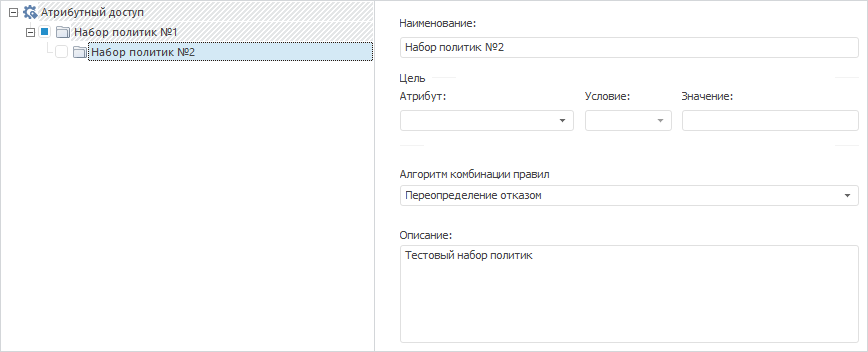

# IABACPolicySet.PolicySets

IABACPolicySet.PolicySets
-

# IABACPolicySet.PolicySets

## Синтаксис

PolicySets: [IABACPolicySets](../IABACPolicySets/IABACPolicySets.htm);

## Описание

Свойство PolicySets предназначено
 для работы с коллекцией наборов политик.

## Пример

Для выполнения примера убедитесь, что в [атрибутном
 доступе](Admin.chm::/04_SecurityPolicy/Admin_AttributeAccess.htm) содержится набор политик с вложенным набором
 политик.

Для выполнения примера добавьте ссылки на системные сборки: ABAC, Metabase.

Sub UserProc;

Var

    PolicyObject: IABACRootPolicyObject;

    PolicySet, EditSet: IABACPolicySet;

    MB: IMetabase;

    MS: IMetabaseSecurity;

    Lic: Object;

Begin

    MB := MetabaseClass.Active;

    // Получим лицензию для возможности работы с менеджером безопасности

    Lic := MB.RequestLicense(UiLicenseFeatureType.Adm);

    MS := MB.Security;

    PolicyObject := MB.Security.Policy.ABACRules;

    // Изменим описание первого набора политик в наборе

    PolicySet := PolicyObject.Policies.Item(0); // первый набор политик в структуре атрибутного доступа

    EditSet := PolicySet.PolicySets.Item(0); // первый набор политик в выбранном наборе

    EditSet.Description(MB.CurrentLocale) := "Тестовый набор политик";

    // Отключим активность набора политик в структуре атрибутного доступа

    EditSet.Active := False;

    // Выведем в консоль ключ измененного набора политик

    Debug.WriteLine("Ключ набора политик: " + EditSet.Key.ToString);

    // Применим изменения в менеджере безопасности

    MS.Apply;

    // Освободим лицензию

    Lic := Null;

End Sub UserProc;

В результате выполнения примера в атрибутном доступе будет изменено
 описание вложенного набора политик и снят флажок активности в структуре
 атрибутного доступа:

В консоль будет выведен ключ вложенного набора политик:

Ключ набора политик: 123

См. также:

[IABACPolicySet](IABACPolicySet.htm)

		Справочная
		 система на версию 10.9
		 от 18/08/2025,
		 © ООО «ФОРСАЙТ»,
