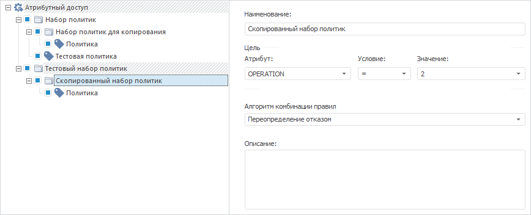

# IABACPolicySets.AddCopy

IABACPolicySets.AddCopy
-

# IABACPolicySets.AddCopy

## Синтаксис

AddCopy(Value: [IABACPolicySet](../IABACPolicySet/IABACPolicySet.htm)):
 [IABACPolicySet](../IABACPolicySet/IABACPolicySet.htm);

## Описание

Метод AddCopy осуществляет добавление
 копии указанного набора политик в структуру атрибутного доступа.

## Пример

Для выполнения примера убедитесь, что в структуре [атрибутного
 доступа](Admin.chm::/04_SecurityPolicy/Admin_AttributeAccess.htm) содержатся два набора политик. В первом наборе
 политик дополнительно содержится вложенный набор политик.

Добавьте ссылки на системные сборки: ABAC, Metabase.

Sub UserProc;

Var

    PolicyObject: IABACRootPolicyObject;

    PolicySet, Sets: IABACPolicySet;

    PolicySets: IABACPolicySets;

    MB: IMetabase;

    MS: IMetabaseSecurity;

    Lic: Object;

Begin

    MB := MetabaseClass.Active;

    // Получим лицензию для возможности работы с менеджером безопасности

    Lic := MB.RequestLicense(UiLicenseFeatureType.Adm);

    MS := MB.Security;

    // Получим структуру атрибутного доступа

    PolicyObject := MB.Security.Policy.ABACRules;

    // Получим первый набор политик в наборе политик с индексом «0»

    PolicySet := PolicyObject.Policies.Item(0);

    PolicySets := PolicySet.PolicySets;

    Sets := PolicySets.Item(0);

    // Получим набор политик с индексом «1»

    PolicySet := PolicyObject.Policies.Item(1);

    PolicySets := PolicySet.PolicySets;

    // Скопируем первый набор политик из набора политик с индексом «0» в набор политик с индексом «1»

    PolicySets.AddCopy(Sets);

    // Изменим наименование скопированного набора политик

    PolicySets.Item(0).Name(MB.CurrentLocale) := "Скопированный набор политик";

    // Применим изменения в менеджере безопасности

    MS.Apply;

    // Освободим лицензию

    Lic := Null;

End Sub UserProc;

В результате выполнения примера в заданный набор политик с индексом
 «1» будет скопирован существующий набор политик из набора политик с индексом
 «0» с новым наименованием:

См. также:

[IABACPolicySets](IABACPolicySets.htm)

		Справочная
		 система на версию 10.9
		 от 18/08/2025,
		 © ООО «ФОРСАЙТ»,
