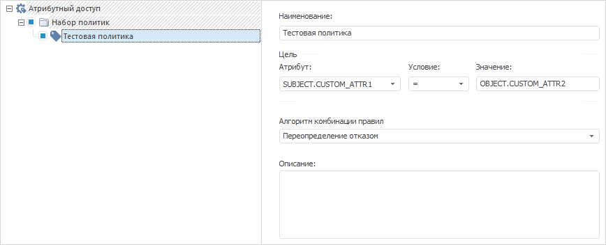

# IABACTarget.SecondAttrId

IABACTarget.SecondAttrId
-

# IABACTarget.SecondAttrId

## Синтаксис

SecondAttrId: String;

## Описание

Свойство SecondAttrId определяет
 значение в виде [пользовательского](admin.chm::/04_SecurityPolicy/Creating_attributes.htm)
 атрибута для сравнения с заданным атрибутом.

## Комментарии

Свойство актуально для сравнения [пользовательских](admin.chm::/04_SecurityPolicy/Creating_attributes.htm)
 атрибутов субъектов или объектов. Первый атрибут задается с помощью свойства
 [IABACTarget.AttributeId](IABACTarget.AttributeId.htm). Второй
 атрибут задается с помощью свойства SecondAttrId
 и автоматически передает значение
 в виде пользовательского атрибута свойству [IABACTarget.AttributeValue](IABACTarget.AttributeValue.htm).

## Пример

Для выполнения примера убедитесь, что в структуре атрибутного доступа
 содержится [набор
 политик](Admin.chm::/04_SecurityPolicy/Admin_AttributeAccess.htm#policies_set).

Добавьте ссылки на системные сборки: ABAC, Metabase.

Sub UserProc;

Var

    PolicyObject: IABACRootPolicyObject;

    PolicySet: IABACPolicySet;

    Policy: IABACPolicy;

    MB: IMetabase;

    MS: IMetabaseSecurity;

    Lic: Object;

Begin

    MB := MetabaseClass.Active;

    // Получим лицензию для возможности работы с менеджером безопасности

    Lic := MB.RequestLicense(UiLicenseFeatureType.Adm);

    MS := MB.Security;

    // Получим структуру атрибутного доступа

    PolicyObject := MB.Security.Policy.ABACRules;

    // Добавим политику в первом наборе политик

    PolicySet := PolicyObject.Policies.Item(0);

    Policy := PolicySet.Policies.Add;

    Policy.Name(MB.CurrentLocale) := "Тестовая политика";

    // Зададим цель политики

    Policy.Target.AttributeId := "SUBJECT.CUSTOM_ATTR1";

    Policy.Target.Operation := ABACTargetOperation.Equal;

    Policy.Target.SecondAttrId := "OBJECT.CUSTOM_ATTR2";

    // Применим изменения в менеджере безопасности

    MS.Apply;

    // Освободим лицензию

    Lic := Null;

End Sub UserProc;

В результате выполнения примера в первом наборе политик будет добавлена
 политика с заданной целью. Структура атрибутного доступа примет вид:

См. также:

[IABACTarget](IABACTarget.htm)

		Справочная
		 система на версию 10.9
		 от 18/08/2025,
		 © ООО «ФОРСАЙТ»,
