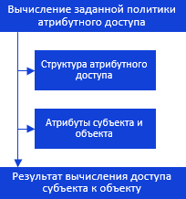
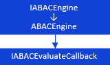
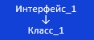
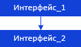

# Иерархия сборки ABAC: Определение прав доступа субъекта к объекту

Иерархия сборки ABAC: Определение прав доступа субъекта к объекту
-

# Определение прав доступа субъекта к объекту

Определение прав доступа субъекта к объекту можно представить в виде
 схемы:

[

 Для определения прав доступа используйте следующие интерфейсы:

 

Примечание.
 Все названия интерфейсов являются гиперссылками, для перехода к их подробному
 описанию щелкните по ним мышью.

## Условные обозначения

		 
		 Класс_1
		 является потомком Интерфейса_1.

		 
		 Интерфейс_2
		 является потомком Интерфейса_1.

		 
		 Интерфейс_2
		 можно получить используя свойства/методы Интерфейса_1.

См. также:

Иерархия
 сборки ABAC](../Interface/IABACEngine/IABACEngine.htm)

		Справочная
		 система на версию 10.9
		 от 18/08/2025,
		 © ООО «ФОРСАЙТ»,
