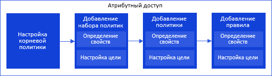
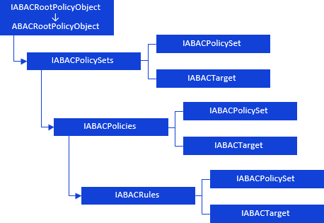

# Иерархия сборки ABAC: Формирование структуры атрибутного доступа

Иерархия сборки ABAC: Формирование структуры атрибутного доступа
-

# Формирование структуры атрибутного доступа

Формирование структуры атрибутного доступа можно представить в виде
 схемы:

[

Для формирования общей структуры атрибутного доступа используйте следующие
 интерфейсы:

Примечание.
 Все названия интерфейсов являются гиперссылками, для перехода к их подробному
 описанию щелкните по ним мышью.

## Условные обозначения

		 
		 Класс_1
		 является потомком Интерфейса_1.

		 
		 Интерфейс_2
		 является потомком Интерфейса_1.

		 
		 Интерфейс_2
		 можно получить используя свойства/методы Интерфейса_1.

См. также:

Иерархия
 сборки ABAC](../Interface/IABACRootPolicyObject/IABACRootPolicyObject.htm)

		Справочная
		 система на версию 10.9
		 от 18/08/2025,
		 © ООО «ФОРСАЙТ»,
