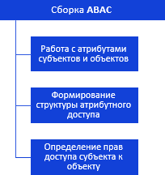

# Иерархия сборки ABAC

Иерархия сборки ABAC
-

# Иерархия сборки ABAC

Все классы и интерфейсы сборки ABAC
 можно разделить на несколько групп.

[

Примечание.
 Все названия групп приведённой схемы являются гиперссылками, для перехода
 к их подробному описанию щелкните по ним мышью.

См. также:

Введение
 в сборку ABAC](KeABAC_TitlePage.htm) | [Интерфейсы
 сборки ABAC](../Interface/KeABAC_Interface.htm) | [Классы сборки
 ABAC](../Class/KeABAC_Classes.htm) | [Перечисления сборки ABAC](../Enums/KeABAC_Enums.htm)
 | [Примеры](../Examples/KeABAC_Example.htm)

		Справочная
		 система на версию 10.9
		 от 18/08/2025,
		 © ООО «ФОРСАЙТ»,
