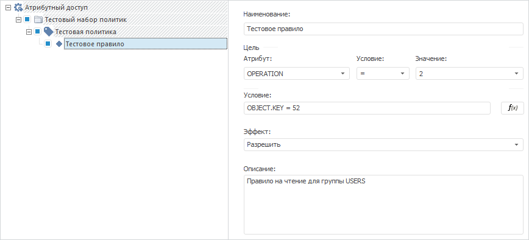

# Формирование структуры атрибутного доступа

Формирование структуры атрибутного доступа
-

# Формирование структуры атрибутного доступа

Формирование структуры атрибутного доступа осуществляется двумя способами:

	- в разделе «[Атрибутный
	 доступ](Admin.chm::/04_SecurityPolicy/Admin_AttributeAccess.htm)» менеджера безопасности;

	- в среде разработки с помощью сборки ABAC.

Структура атрибутного доступа состоит из иерархии элементов:

	- на первом уровне [корневая
	 политика](../Interface/IABACRootPolicyObject/IABACRootPolicyObject.htm);

	- на втором уровне [наборы
	 политик](../Interface/IABACPolicySet/IABACPolicySet.htm);

	- на третьем уровне [политики](../Interface/IABACPolicy/IABACPolicy.htm);

	- на четверном уровне [правила](../Interface/IABACRule/IABACRule.htm).

Проверка атрибутного доступа заключается в последовательном выполнении
 условий каждого уровня иерархии.

Важно. Если
 структура атрибутного доступа не задана, то все операции с объектами запрещены.

Сборка ABAC позволяет формировать
 структуру атрибутного доступа:

	- зависимо от структуры в менеджере безопасности с помощью свойства
	 [IMetabasePolicy.ABACRules](kesom.chm::/interface/imetabasepolicy/imetabasepolicy.abacrules.htm).
	 Структура атрибутного доступа задается и передается через интерфейс
	 менеджера безопасности;

	- не зависимо от структуры в менеджере безопасности с помощью
	 класса [ABACRootPolicyObject](../Class/ABACRootPolicyObject/ABACRootPolicyObject.htm).
	 Структура атрибутного доступа задается вручную, не отображается в
	 интерфейсе менеджера безопасности и не влияет на заданную в интерфейсе
	 структуру.

Рассмотрим пример формирования структуры атрибутного доступа, которая
 отображается в менеджере безопасности.

## Пример

Для выполнения примера убедитесь, что существует группа с наименованием
 «USERS» и объект с ключом «52».

Добавьте ссылки на системные сборки: ABAC, Metabase, Dal.

Sub UserProc;

Var

    PolicyObject: IABACRootPolicyObject;

    PolicySet: IABACPolicySet;

    Policy: IABACPolicy;

    Rules: IABACRules;

    Rule: IABACRule;

    MB: IMetabase;

    MS: IMetabaseSecurity;

    Lic: Object;

Begin

    MB:= MetabaseClass.Active;

    // Получим лицензию для возможности работы с менеджером безопасности

    Lic := MB.RequestLicense(UiLicenseFeatureType.Adm);

    MS:= MB.Security;

    // Активируем использование атрибутного доступа

    MS.Policy.AttributeBasedAccessControl := True;

    PolicyObject := MS.Policy.ABACRules;

    // Зададим алгоритм атрибутного доступа - переопределение разрешением

    PolicyObject.CombineAlgorithm := ABACCombineAlgorithm.PermitOverride;

    // Очистим структуру атрибутного доступа

    PolicyObject.Policies.Clear;

    // Добавим набор политик

    PolicySet := PolicyObject.Policies.Add;

    PolicySet.Name(MB.CurrentLocale) := "Тестовый набор политик";

    // Добавим политику

    Policy := PolicySet.Policies.Add;

    Policy.Active := True;

    Policy.Name(LocaleCodeID.Russian) := "Тестовая политика";

    Policy.Id := "POLICY";

    Policy.Description(LocaleCodeID.Russian) := "Политика содержит правила для класса «Таблица»";

    Policy.CombineAlgorithm := ABACCombineAlgorithm.DenyOverride;

    Policy.Target.AttributeId := "OPERATION";

    Policy.Target.Operation := ABACTargetOperation.Equal;

    Policy.Target.AttributeValue := 2;

    // Добавим правило

    Rules := Policy.Rules;

    Rule := Rules.Add;

    Rule.Active := False;

    Rule.Name(LocaleCodeID.Russian) := "Тестовое правило";

    Rule.Id := "RULE";

    Rule.Description(LocaleCodeID.Russian) := "Правило на чтение для группы USERS";

    Rule.Target.AttributeId := "SUBJECT.NAME";

    Rule.Target.Operation := ABACTargetOperation.Equal;

    Rule.Target.AttributeValue := "USERS";

    Rule.Condition.AsString := "(SUBJECT.PRIVILEGIES = 0) and (OBJECT.KEY = 52)";

    Rule.Effect := ABACRuleEffect.Permit;

    // Применим изменения в менеджере безопасности

    MS.Apply;

    // Освободим лицензию

    Lic := Null;

End Sub UserProc;

В результате выполнения примера в менеджере безопасности будет активировано
 использование атрибутного доступа, добавлена заданная структура атрибутного
 доступа с определенными параметрами политики и правила:

См. также:

[Общие
 принципы программирования с использованием сборки ABAC](KeABAC_Programming.htm)

		Справочная
		 система на версию 10.9
		 от 18/08/2025,
		 © ООО «ФОРСАЙТ»,
