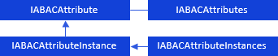
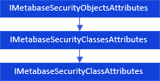

# Работа с атрибутами субъектов и объектов

Работа с атрибутами субъектов и объектов
-

# Работа с атрибутами субъектов и объектов

Работу с атрибутами субъектов и объектов можно представить в виде схемы:

[

Для работы с атрибутами субъектов и объектов используйте следующие интерфейсы:

Примечание.
 Все названия интерфейсов являются гиперссылками, для перехода к их подробному
 описанию щелкните по ним мышью.

Для работы с атрибутами классов и типов объектов используйте интерфейсы:

 

## Условные обозначения

		 
		 Класс_1
		 является потомком Интерфейса_1.

		 
		 Интерфейс_2
		 является потомком Интерфейса_1.

		 
		 Интерфейс_2
		 можно получить используя свойства/методы Интерфейса_1.

См. также:

Иерархия
 сборки ABAC](../Interface/IABACAttribute/IABACAttribute.htm)

		Справочная
		 система на версию 10.9
		 от 18/08/2025,
		 © ООО «ФОРСАЙТ»,
