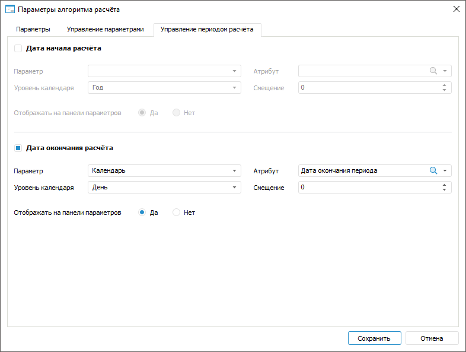

# IAlgorithmSettings.PeriodControlEnd

IAlgorithmSettings.PeriodControlEnd
-

# IAlgorithmSettings.PeriodControlEnd

## Синтаксис

PeriodControlEnd: [IAlgorithmPeriodControl](../IAlgorithmPeriodControl/IAlgorithmPeriodControl.htm);

## Описание

Свойство PeriodControlEnd возвращает
 настройки даты окончания расчёта.

## Пример

Для выполнения примера предполагается наличие в репозитории алгоритма
 расчёта с идентификатором ALGORITHM. В алгоритме расчёта должно быть добавлено
 не менее двух [параметров](CalculationAlgorithm.chm::/Desktop/Work/Parameters_of_the_calculation_algorithm.htm)
 и настроена [дата
 окончания расчёта](CalculationAlgorithm.chm::/Desktop/Work/Calculation_period_management.htm). Ко второму параметру привязан [календарный
 справочник](UiNavObj.chm::/reference_book/Master_Calendar_reference_book/Master_Calendar.htm), в котором содержится [атрибут](UiNavObj.chm::/reference_book/Master_Calendar_reference_book/UiMd_reference_book_Master_Calendar_page3.htm)
 с идентификатором END_DATE.

Добавьте ссылки на системные сборки: Algo, Dimensions, Metabase, Ms.
 Также добавьте ссылки на сборки, которые [необходимы](../../Intro/KeAlgo_Programming.htm)
 для работы с алгоритмами расчёта.

	Sub UserProc;

	Var

	    MB: IMetabase;

	    MObj, Dim: IMetabaseObjectDescriptor;

	    Algo: ICalcObject;

	    CalcAlgo: ICalcAlgorithm;

	    Settings: IAlgorithmSettings;

	    DataEnd: IAlgorithmPeriodControl;

	    Ms: IMsProblem;

	    MetaModel: IMsMetaModel;

	    Params: IMsModelParams;

	    ParamValues: IAlgorithmParameterValues;

	    DimInst: IDimInstance;

	    DimAttr: IDimAttributeInstance;

	    ValueList: IAlgorithmParamValueList;

	Begin

	    MB := MetabaseClass.Active;

	    // Получим алгоритм расчёта

	    MObj := MB.ItemById("ALGORITHM");

	    Algo := CalcObjectFactory.CreateCalcObject(MObj, True);

	    CalcAlgo := Algo As ICalcAlgorithm;

	    // Получим настройки периода расчёта алгоритма

	    Settings := CalcAlgo.Settings;

	    DataEnd := Settings.PeriodControlEnd;

	    Debug.WriteLine(DataEnd.IsEnabled);

	    // Проверим использование настроенной даты окончания расчёта

	    If DataEnd.IsEnabled Then

	        // Сбросим заданные параметры и зададим новые

	        DataEnd.Reset;

	        // Зададим второй параметр алгоритма расчёта в качестве даты окончания расчёта

	        Ms := CalcAlgo.MsProblem;

	        MetaModel := Ms.MetaModel;

	        Params := MetaModel.Params;

	        DataEnd.Parameter := Params.Item(1);

	        // Получим коллекцию параметров алгоритма расчёта

	        ParamValues := CalcAlgo.ParamValues;

	        ValueList := ParamValues.Values;

	        // Получим справочник второго параметра

	        Dim := ValueList.Item(1).LinkedObject;

	        DimInst := Dim.Open(Null) As IDimInstance;

	        // Найдем атрибут с идентификатором «END_DATE»

	        DimAttr := DimInst.Attributes.FindById("END_DATE");

	        // Зададим полученный атрибут справочника

	        DataEnd.Attribute := DimAttr.Attribute;

	        // Зададим уровень календаря

	        DataEnd.OffsetLevel := DimCalendarLevel.Day;

	        // Включим отображение даты окончания расчёта на панели параметров

	        DataEnd.Visible := True;

	        // Сохраним изменения в алгоритме расчёта

	        CalcAlgo.SaveObject;

	    End If;

	End Sub UserProc;

В результате выполнения примера будут сброшены заданные параметры даты
 окончания расчёта алгоритма и добавлены новые:

Заданная дата окончания расчёта алгоритма будет отображаться на [панели
 параметров](CalculationAlgorithm.chm::/Desktop/Work/Beginning_of_work.htm).

См. также:

[IAlgorithmSettings](IAlgorithmSettings.htm)

		Справочная
		 система на версию 10.9
		 от 18/08/2025,
		 © ООО «ФОРСАЙТ»,
