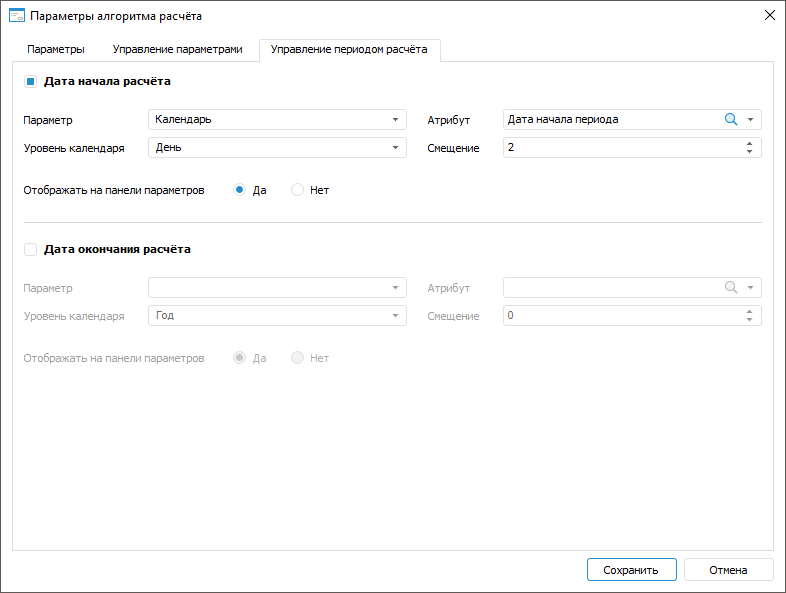

# IAlgorithmSettings.PeriodControlStart

IAlgorithmSettings.PeriodControlStart
-

# IAlgorithmSettings.PeriodControlStart

## Синтаксис

PeriodControlStart: [IAlgorithmPeriodControl](../IAlgorithmPeriodControl/IAlgorithmPeriodControl.htm);

## Описание

Свойство PeriodControlStart
 возвращает настройки даты начала расчёта.

## Пример

Для выполнения примера предполагается наличие в репозитории алгоритма
 расчёта с идентификатором ALGORITHM. В алгоритме расчёта должно быть добавлено
 не менее двух [параметров](CalculationAlgorithm.chm::/Desktop/Work/Parameters_of_the_calculation_algorithm.htm).
 К первому параметру привязан [календарный
 справочник](UiNavObj.chm::/reference_book/Master_Calendar_reference_book/Master_Calendar.htm), в котором содержится [атрибут](UiNavObj.chm::/reference_book/Master_Calendar_reference_book/UiMd_reference_book_Master_Calendar_page3.htm)
 с идентификатором START_DATE.

Добавьте ссылки на системные сборки: Algo, Dimensions, Metabase, Ms.
 Также добавьте ссылки на сборки, которые [необходимы](../../Intro/KeAlgo_Programming.htm)
 для работы с алгоритмами расчёта.

	Sub UserProc;

	Var

	    MB: IMetabase;

	    MObj, Dim: IMetabaseObjectDescriptor;

	    Algo: ICalcObject;

	    CalcAlgo: ICalcAlgorithm;

	    Settings: IAlgorithmSettings;

	    Start: IAlgorithmPeriodControl;

	    Ms: IMsProblem;

	    MetaModel: IMsMetaModel;

	    Params: IMsModelParams;

	    ParamValues: IAlgorithmParameterValues;

	    DimInst: IDimInstance;

	    DimAttr: IDimAttributeInstance;

	    ValueList: IAlgorithmParamValueList;

	Begin

	    MB := MetabaseClass.Active;

	    // Получим алгоритм расчёта

	    MObj := MB.ItemById("ALGORITHM");

	    Algo := CalcObjectFactory.CreateCalcObject(MObj, True);

	    CalcAlgo := Algo As ICalcAlgorithm;

	    // Получим настройки периода расчёта алгоритма

	    Settings := CalcAlgo.Settings;

	    // Получим настройки даты начала расчёта

	    Start := Settings.PeriodControlStart;

	    // Зададим первый параметр алгоритма расчёта в качестве даты начала расчёта

	    Ms := CalcAlgo.MsProblem;

	    MetaModel := Ms.MetaModel;

	    Params := MetaModel.Params;

	    Start.Parameter := Params.Item(0);

	    // Получим коллекцию параметров алгоритма расчёта

	    ParamValues := CalcAlgo.ParamValues;

	    ValueList := ParamValues.Values;

	    // Получим справочник первого параметра

	    Dim := ValueList.Item(0).LinkedObject;

	    DimInst := Dim.Open(Null) As IDimInstance;

	    // Найдем атрибут с идентификатором «START_DATE»

	    DimAttr := DimInst.Attributes.FindById("START_DATE");

	    // Зададим полученный атрибут справочника

	    Start.Attribute := DimAttr.Attribute;

	    // Зададим уровень календаря

	    Start.OffsetLevel := DimCalendarLevel.Day;

	    // Зададим смещение даты начала расчёта

	    Start.OffsetValue := 2;

	    // Включим отображение даты начала расчёта на панели параметров

	    Start.Visible := True;

	    // Выполним проверку на наличие изменений в настройках периода расчёта

	    If Settings.IsDirty Then

	        // Сохраним изменения в алгоритме расчёта

	        CalcAlgo.SaveObject;

	    End If;

	End Sub UserProc;

В результате выполнения примера будут заданы параметры даты начала расчёта
 алгоритма:

Заданная дата начала расчёта алгоритма будет отображаться на [панели
 параметров](CalculationAlgorithm.chm::/Desktop/Work/Beginning_of_work.htm).

См. также:

[IAlgorithmSettings](IAlgorithmSettings.htm)

		Справочная
		 система на версию 10.9
		 от 18/08/2025,
		 © ООО «ФОРСАЙТ»,
