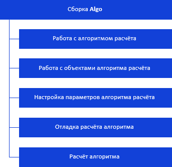
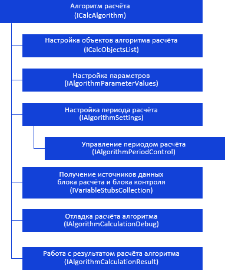
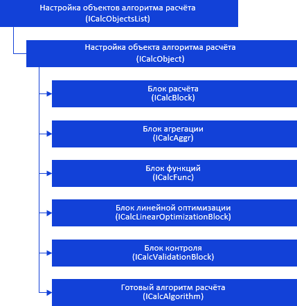
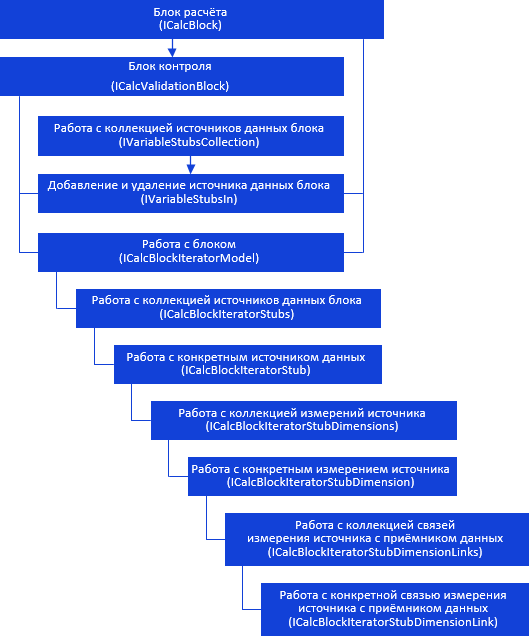
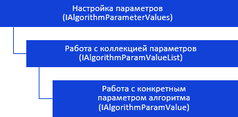
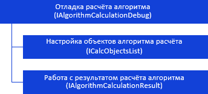
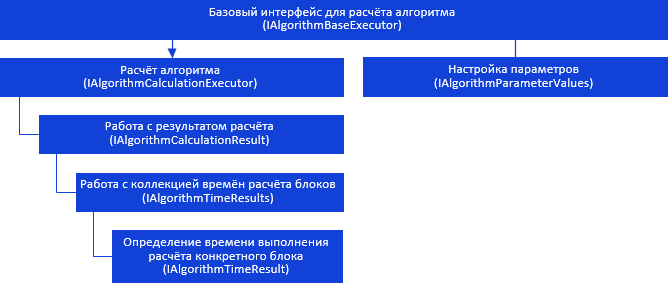
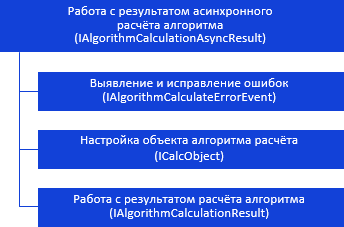
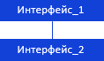

# Иерархия сборки Algo

Иерархия сборки Algo
-

# Иерархия сборки Algo

	Интерфейсы сборки Algo можно
	 разделить на несколько групп.

	

	[

	Ниже приведены схемы взаимодействия интерфейсов отдельных групп.

	Примечание.
	 Все названия интерфейсов, приведённых на схемах, являются гиперссылками,
	 для перехода к их подробному описанию щелкните по ним мышью.

## ](#objects)Работа с алгоритмом расчёта

	Для работы с [алгоритмом
	 расчёта](CalculationAlgorithm.chm::/Purpose.htm)
	 предназначен интерфейс [ICalcAlgorithm](../Interface/ICalcAlgorithm/ICalcAlgorithm.htm),
	 который взаимодействует с другими интерфейсами с помощью свойств и
	 методов.

	

	[

## ](../Interface/ICalcAlgorithm/ICalcAlgorithm.htm)Работа с объектами алгоритма расчёта

	Для работы с [объектами](KeAlgo_Programming.htm) алгоритма
	 расчёта предназначен интерфейс [ICalcObjectsList](../Interface/ICalcObjectsList/ICalcObjectsList.htm),
	 с помощью которого можно получить конкретный объект, изменить его
	 параметры. Также можно добавлять, копировать, сортировать и удалять
	 объекты алгоритма расчёта.

	

	[

	Интерфейс, предназначенный для работы с блоком
	 расчёта](../Interface/ICalcObjectsList/ICalcObjectsList.htm), [ICalcBlock](../Interface/ICalcBlock/ICalcBlock.htm)
	 является родителем интерфейса [ICalcValidationBlock](../Interface/ICalcValidationBlock/ICalcValidationBlock.htm),
	 предназначенного для работы с [блоком
	 контроля](CalculationAlgorithm.chm::/Desktop/Control_Block/Control_Block.htm). С помощью свойств и методов интерфейса
	 [ICalcBlock](../Interface/ICalcBlock/ICalcBlock.htm)
	 можно перейти к настройкам блока из других интерфейсов.

	

	[

## ](../Interface/ICalcBlock/ICalcBlock.htm)Настройка параметров алгоритма расчёта

	Для настройки [параметров
	 алгоритма расчёта](CalculationAlgorithm.chm::/Desktop/Work/Set_up_calculation_parameters.htm) предназначен интерфейс [IAlgorithmParameterValues](../Interface/IAlgorithmParameterValues/IAlgorithmParameterValues.htm), с помощью
	 которого можно получить коллекцию параметров и настраивать конкретный
	 параметр алгоритма расчёта.

	

	[

## ](../Interface/IAlgorithmParameterValues/IAlgorithmParameterValues.htm)Отладка расчёта алгоритма

	Для [отладки
	 расчёта алгоритма](CalculationAlgorithm.chm::/Desktop/Work/Debug.htm) предназначен интерфейс [IAlgorithmCalculationDebug](../Interface/IAlgorithmCalculationDebug/IAlgorithmCalculationDebug.htm),
	 с помощью которого можно получить результат расчёта алгоритма и объекты,
	 используемые при расчёте.

	

	[

## ](../Interface/IAlgorithmCalculationDebug/IAlgorithmCalculationDebug.htm)Расчёт алгоритма

	Для [расчёта
	 алгоритма](CalculationAlgorithm.chm::/Desktop/Work/Perform_calculations.htm) предназначен базовый интерфейс [IAlgorithmBaseExecutor](../Interface/IAlgorithmBaseExecutor/IAlgorithmBaseExecutor.htm), который является
	 родителем интерфейса [IAlgorithmCalculationExecutor](../Interface/IAlgorithmCalculationExecutor/IAlgorithmCalculationExecutor.htm).
	 Расчёт алгоритма может выполняться синхронно или асинхронно при использовании
	 [многопоточного
	 расчёта](CalculationAlgorithm.chm::/Desktop/Calculation_block/Master_calculation_block_page_consumer.htm).

	

	[

	Для работы с результатом расчёта предназначены интерфейсы IAlgorithmCalculationResult](../Interface/IAlgorithmBaseExecutor/IAlgorithmBaseExecutor.htm), [IAlgorithmCalculationAsyncResult](../Interface/IAlgorithmCalculationAsyncResult/IAlgorithmCalculationAsyncResult.htm).

	

	[

## Условные обозначения

		 
		 Класс_1
		 является потомком Интерфейса_1.

		 
		 Интерфейс_2
		 является потомком Интерфейса_1.

		 
		 Интерфейс_2
		 можно получить используя свойства/методы Интерфейса_1.

См. также:

Введение
 в сборку Algo](../Interface/IAlgorithmCalculationAsyncResult/IAlgorithmCalculationAsyncResult.htm) | [Интерфейсы
 сборки Algo](../Interface/KeAlgo_Interface.htm) | [Перечисления сборки
 Algo](../Enums/KeAlgo_Enums.htm)

		Справочная
		 система на версию 10.9
		 от 18/08/2025,
		 © ООО «ФОРСАЙТ»,
