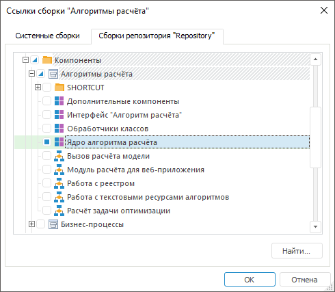
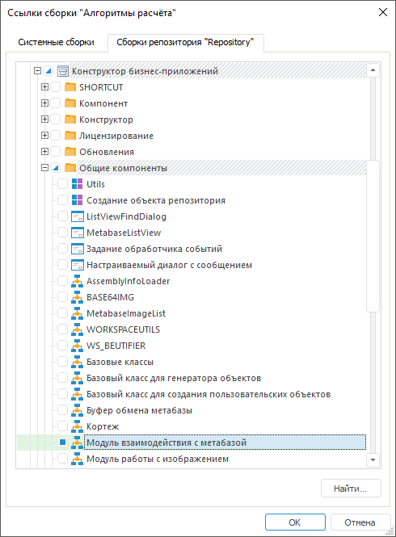

# Общие принципы программирования с использованием сборки Algo

Общие принципы программирования с использованием сборки Algo
-

# Общие принципы программирования с использованием сборки Algo

	Сборка Algo предназначена
	 для работы с расширением «[Алгоритмы
	 расчёта](CalculationAlgorithm.chm::/Purpose.htm)». Программирование на Fore с использованием данной
	 сборки заключается в последовательной настройке алгоритма расчёта.

	Перед началом работы с алгоритмом расчёта:

		- Убедитесь, что [установлено](Setup.chm::/Extensions/install_or_update_extensions.htm)
		 расширение «[Алгоритмы расчёта](CalculationAlgorithm.chm::/Purpose.htm)».

		- В среде разработки добавьте [ссылки](UiDevEnv.chm::/01_Development_Environment/03_Windows_of_Development_Environment/Inspector_assemblies.htm)
		 на системную сборку Algo
		 и пользовательскую сборку «Ядро
		 алгоритма расчёта», которая содержится в компоненте «Алгоритмы расчёта»:

	

	После выполнения действий будут доступны классы и прикладные функции
	 пользовательской сборки «Ядро алгоритма
	 расчёта» для начала работы с алгоритмом расчёта.

## Начало работы с алгоритмом расчёта

	Для начала работы с алгоритмом расчёта:

		- Получите объект репозитория типа «Алгоритм
		 расчёта показателей» с помощью класса CalcObjectFactory
		 и прикладной функции CreateCalcObject,
		 которые реализованы в пользовательской
		 сборке «Ядро алгоритма расчёта».

	Синтаксис функции CreateCalcObject:

	CreateCalcObject(descr:
	 [IMetabaseObjectDescriptor](KeSom.chm::/Interface/IMetabaseObjectDescriptor/IMetabaseObjectDescriptor.htm),
	 [OpenForEdit: Boolean = true]): [ICalcObject](../Interface/ICalcObject/ICalcObject.htm);

	Параметры:

			- descr. Объект
			 репозитория;

			- OpenForEdit.
			 Разрешение или запрет редактирования объекта репозитория.

		- Приведите полученный объект к интерфейсу [ICalcAlgorithm](../Interface/ICalcAlgorithm/ICalcAlgorithm.htm).

	Пример получения алгоритма расчёта с идентификатором ALGORITHM на
	 редактирование:

		Sub UserProc;

		Var

		    MB: IMetabase;

		    MObj: IMetabaseObjectDescriptor;

		    Algo: ICalcObject;

		    CalcAlgo: ICalcAlgorithm;

		Begin

		    MB := MetabaseClass.Active;

		    MObj := MB.ItemById("ALGORITHM");

		    Algo := CalcObjectFactory.CreateCalcObject(MObj, True);

		    CalcAlgo := Algo As ICalcAlgorithm;

		    //...

		End Sub UserProc;

	В процессе настройки алгоритма расчёта участвуют следующие объекты:

		- [Блок расчёта](CalculationAlgorithm.chm::/Desktop/Calculation_block/Calculation_unit.htm).
		 Используется для выполнения расчётов по заданным параметрам. Для
		 работы с блоком расчёта предназначен интерфейс [ICalcBlock](../Interface/ICalcBlock/ICalcBlock.htm);

		- [Блок агрегации](CalculationAlgorithm.chm::/Desktop/Aggregation_block/Aggregation_block.htm).
		 Используется для выполнения агрегации по заданным параметрам.
		 Для работы с блоком агрегации предназначен интерфейс [ICalcAggr](../Interface/ICalcAggr/ICalcAggr.htm);

		- [Блок функций](CalculationAlgorithm.chm::/Desktop/Function_Block/Function_Block.htm).
		 Используется для расчёта прикладной функции. Для работы с блоком
		 функций предназначен интерфейс [ICalcFunc](../Interface/ICalcFunc/ICalcFunc.htm);

		- [Блок линейной оптимизации](CalculationAlgorithm.chm::/Desktop/Linear_optimization_block/Linear_optimization_block.htm).
		 Используется для решения задачи оптимального использования ограниченных
		 ресурсов. Для работы с блоком линейной оптимизации предназначен
		 интерфейс [ICalcLinearOptimizationBlock](../Interface/ICalcLinearOptimizationBlock/ICalcLinearOptimizationBlock.htm);

		- [Блок контроля](CalculationAlgorithm.chm::/Desktop/Control_Block/Control_Block.htm).
		 Используется для проверки вводимых данных в расширении «[Интерактивные
		 формы ввода данных](DataEntryForms.chm::/DataEntryForms_Purpose.htm)». Для работы с блоком
		 контроля предназначен интерфейс [ICalcValidationBlock](../Interface/ICalcValidationBlock/ICalcValidationBlock.htm);

		- [Готовый алгоритм расчёта](CalculationAlgorithm.chm::/Desktop/Work/AddAlgorithm.htm).
		 Используется для расчёта существующего алгоритма расчёта в текущем
		 расчёте. Для работы с готовым алгоритмом расчёта предназначен
		 интерфейс [ICalcAlgorithm](../Interface/ICalcAlgorithm/ICalcAlgorithm.htm).

	Настройка алгоритма расчёта осуществляется по схеме:

	

	Для получения подробной информации о взаимодействии интерфейсов
	 сборки обратитесь к разделу «[Иерархия
	 сборки Algo](KeAlgo_Hierarchy.htm)».

## Создание объекта алгоритма расчёта

	Для создания объекта алгоритма расчёта:

		- В среде разработки добавьте [ссылку](UiDevEnv.chm::/01_Development_Environment/03_Windows_of_Development_Environment/Inspector_assemblies.htm)
		 на пользовательский модуль «Модуль
		 взаимодействия с метабазой», который содержится в компоненте
		 «Конструктор бизнес-приложений
		 > Общие компоненты»:

	

		- Создадим объект с помощью подключенного модуля:

		Sub UserProc;

		Var

		    MB: IMetabase;

		    Descr,MObjAlgo: IMetabaseObjectDescriptor;

		    Block: ICalcFunc;

		    Algo, CalcObject: ICalcObject;

		    List: ICalcObjectsList;

		    CalcAlgo: ICalcAlgorithm;

		    ObjectType: IMetabaseCustomClass;

		Begin

		    MB := MetabaseClass.Active;

		    // Получим алгоритм расчёта, в который будет добавлен объект

		    MObjAlgo := MB.ItemById("<идентификатор
		 алгоритма расчёта>");

		    Algo := CalcObjectFactory.CreateCalcObject(MObjAlgo, True);

		    CalcAlgo := Algo As ICalcAlgorithm;

		    // Зададим тип объекта

		    ObjectType := GetMetabaseHelper.GetCustomClassByEnum(BPClasses.<тип объекта>);

		    Descr := GetMetabaseHelper.CreateObjectDescriptor(ObjectType.ClassId, ObjectType.Name, "", CalcAlgo.Descriptor, False, False, Null, True);

		    // Создадим объект заданного типа

		    CalcObject := New <класс объекта>.Create(Descr);

		    // Приведем полученный объект к соответствующему интерфейсу

		    Block := CalcObject As <интерфейс>;

		    //...

		    // Дальнейшая настройка объекта

		    //...

		    // Сохраним объект

		    CalcObject.SaveObject;

		    // Получим список объектов алгоритма

		    List := CalcAlgo.Items;

		    // Добавим
		 созданный объект в алгоритм

		    List.Add(CalcObject);

		    // Сохраним
		 изменения в алгоритме расчёта

		    CalcAlgo.SaveObject;

		End Sub UserProc;

	В подстановках <тип
	 объекта>, <класс объекта>,
	 <интерфейс> задайте
	 взаимосвязанные значения, соответствующие объекту:

			 Объект
			 Подстановки
			 Значения

			 Блок расчёта
			 <тип объекта>
			 Calc_Block

			 <класс объекта>
			 CalcBlockClass

			 <интерфейс>
			 ICalcBlock

			 Блок агрегации
			 <тип объекта>
			 Aggr_Block

			 <класс объекта>
			 CalcAggrClass

			 <интерфейс>
			 ICalcAggr

			 Блок функций
			 <тип объекта>
			 Func_Block

			 <класс объекта>
			 CalcFuncClass

			 <интерфейс>
			 ICalcFunc

			 Блок линейной оптимизации
			 <тип объекта>
			 LinearOptimization

			 <класс объекта>
			 CalcLinearOptimizationBlock

			 <интерфейс>
			 ICalcLinearOptimizationBlock

			 Блок контроля
			 <тип объекта>
			 Validation_Block

			 <класс объекта>
			 CalcValidationBlockClass

			 <интерфейс>
			 ICalcValidationBlock

			 Готовый алгоритм расчёта
			 <тип объекта>
			 Algorithm

			 <класс объекта>
			 CalcAlgorithmClass

			 <интерфейс>
			 ICalcAlgorithm

	После выполнения действий в алгоритме расчёта будет создан объект
	 с заданными настройками.

## Получение готового объекта алгоритма расчёта

	Для получения готового объекта алгоритма расчёта и работы с ним:

		- Получите список объектов алгоритма расчёта с помощью свойства
		 [ICalcAlgorithm.Items](../Interface/ICalcAlgorithm/ICalcAlgorithm.Items.htm).

		- Получите конкретный объект алгоритма расчёта по индексу
		 с помощью свойства [ICalcObjectsList.Item](../Interface/ICalcObjectsList/ICalcObjectsList.Item.htm).

		- Приведите полученный объект к интерфейсу соответствующего
		 типа объекта: [ICalcBlock](../Interface/ICalcBlock/ICalcBlock.htm),
		 [ICalcAggr](../Interface/ICalcAggr/ICalcAggr.htm),
		 [ICalcFunc](../Interface/ICalcFunc/ICalcFunc.htm),
		 [ICalcLinearOptimizationBlock](../Interface/ICalcLinearOptimizationBlock/ICalcLinearOptimizationBlock.htm),
		 [ICalcValidationBlock](../Interface/ICalcValidationBlock/ICalcValidationBlock.htm), [ICalcAlgorithm](../Interface/ICalcAlgorithm/ICalcAlgorithm.htm).

	После выполнения действий будет доступна настройка полученного объекта
	 и работа с ним.

	Пример получения готового блока расчёта в алгоритме с идентификатором
	 ALGORITHM:

		Sub UserProc;

		Var

		    MB: IMetabase;

		    MObj: IMetabaseObjectDescriptor;

		    Algo, CalcBlock: ICalcObject;

		    List: ICalcObjectsList;

		    CalcAlgo: ICalcAlgorithm;

		    Block: ICalcBlock;

		Begin

		    MB := MetabaseClass.Active;

		    // Получим алгоритм расчёта

		    MObj := MB.ItemById("ALGORITHM");

		    Algo := CalcObjectFactory.CreateCalcObject(MObj, True);

		    CalcAlgo := Algo As ICalcAlgorithm;

		    // Получим список объектов алгоритма расчёта

		    List := CalcAlgo.Items;

		    // Получим блок расчёта

		    CalcBlock := List.Item(0);

		    Block := CalcBlock As ICalcBlock;

		    //...

		End Sub UserProc;

	Также получение готового блока расчёта приведено в примере для [ICalcBlock.StubOut](../Interface/ICalcBlock/ICalcBlock.StubOut.htm),
	 получение блока линейной оптимизации - [ICalcLinearOptimizationBlock.StubCoefficient](../Interface/ICalcLinearOptimizationBlock/ICalcLinearOptimizationBlock.StubCoefficient.htm).

См. также:

[Введение
 в сборку Algo](KeAlgo_Introduction.htm) | [Интерфейсы
 сборки Algo](../Interface/KeAlgo_Interface.htm) | [Перечисления сборки
 Algo](../Enums/KeAlgo_Enums.htm)

		Справочная
		 система на версию 10.9
		 от 18/08/2025,
		 © ООО «ФОРСАЙТ»,
