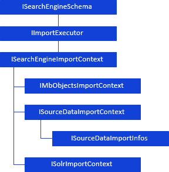

# Индексация

Индексация
-

# Индексация

[Условные обозначения](javascript:TextPopup(this))

			 Обозначение

			 Расшифровка

			 

			 Класс_1 является потомком Интерфейса_1.

			 

			 Интерфейс_2 является потомком Интерфейса_1.

			 

			 Интерфейс_2 можно получить, используя
			 свойства, методы Интерфейса_1.

Базовым интерфейсом, предназначенным для индексации источников данных
 и метаданных объектов репозитория, является IImportExecutor.
 Дальнейшая иерархия доступа к интерфейсам, используемым для указания индексируемых
 объектов и параметров индексации, выглядит следующим образом:

См. также:

[Иерархия
 сборки BISearch](../KeBISearch_Hierarchy.htm)

		Справочная
		 система на версию 10.9
		 от 18/08/2025,
		 © ООО «ФОРСАЙТ»,
