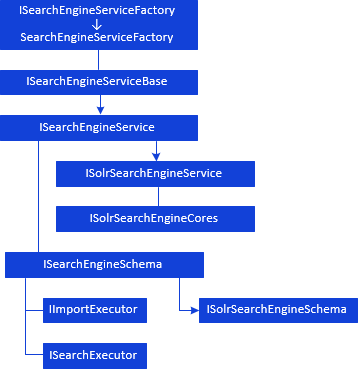

# Доступ к поисковому сервису

Доступ к поисковому сервису
-

# Доступ к поисковому сервису

[Условные обозначения](javascript:TextPopup(this))

			 Обозначение

			 Расшифровка

			 

			 Класс_1 является потомком Интерфейса_1.

			 

			 Интерфейс_2 является потомком Интерфейса_1.

			 

			 Интерфейс_2 можно получить, используя
			 свойства, методы Интерфейса_1.

Для получения доступа к поисковому сервису необходимо инициализировать
 новый объект класса SearchEngineServiceFactory.
 Дальнейшая иерархия доступа к настройкам поискового сервиса и объектам,
 которые осуществляют индексацию и поиск, выглядит следующим образом:

См. также:

[Иерархия
 сборки BISearch](../KeBISearch_Hierarchy.htm)

		Справочная
		 система на версию 10.9
		 от 18/08/2025,
		 © ООО «ФОРСАЙТ»,
