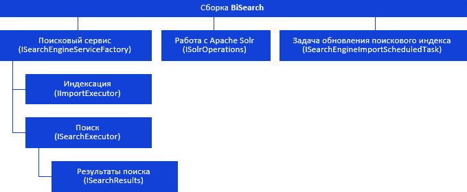

# Иерархия сборки BISearch

Иерархия сборки BISearch
-

# Иерархия сборки BISearch

Все классы и интерфейсы в сборке BISearch
 можно разделить на группы, приведенные ниже.

[

Примечание.
 На схеме все названия групп, интерфейсов и классов являются гиперссылками,
 для перехода к их описанию щелкните по ним мышью.

См. также:

Введение](Hierarchy/H_ISearchEngineServiceFactory.htm)

		Справочная
		 система на версию 10.9
		 от 18/08/2025,
		 © ООО «ФОРСАЙТ»,
