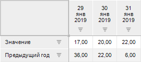

# ICalendarDimensionClass.Day

ICalendarDimensionClass.Day
-

# ICalendarDimensionClass.Day

## Синтаксис

		Day(Calendar: [IDimInstance](kedims.chm::/interface/idiminstance/idiminstance.htm);
		 El: Integer): Integer;

## Параметры

Calendar. Данные календарного
 справочника, по которым выполняется расчет;

El. Индекс элемента, относительно
 которого выполняется расчет.

## Описание

Метод Day возвращает индекс
 элемента, соответствующий началу календарного периода, в который входит
 указанный элемент.

## Комментарии

Для корректного расчёта календарный справочник должен содержать уровень
 «Дни».

Например, если календарный справочник содержит уровни годы, кварталы,
 дни и расчёт выполняется для:

	- элемента квартальной динамики, то метод Day
	 возвращает элемент, соответствующий началу квартала;

	- элемента годовой динамики, то метод Day
	 возвращает элемент, соответствующий началу года.

## Пример

Пример является функцией, используемой для расчёта отношения в стандартном
 кубе.

Для выполнения примера убедитесь, что в репозитории находятся таблица
 с данными по дням, календарный справочник, содержащий уровень «Дни» и
 стандартный куб. Для стандартного куба настройте:

	- На странице «Факты»
	 задайте два [факта](UiNavObj.chm::/Cube/CreateCube/Master_Standart/UiMd_Cube_CreateCube_Master_Standart_1.htm):
	 «Значение» и «Предыдущий
	 год».

	- На странице «Привязка фактов»
	 [добавьте
	 в источники данных](UiNavObj.chm::/Cube/CreateCube/Master_Standart/UiMd_Cube_CreateCube_Master_Standart_2.htm#add_source) таблицу и [свяжите](UiNavObj.chm::/Cube/CreateCube/Master_Standart/UiMd_Cube_CreateCube_Master_Standart_2.htm#binding_facts)
	 числовое поле таблицы с фактом «Значение».

	- На странице «Измерения»
	 [добавьте
	 в качестве измерения](UiNavObj.chm::/Cube/CreateCube/Master_Standart/UiMd_Cube_CreateCube_Master_Standart_3.htm#add_dims) куба календарный справочник
	 и [привяжите
	 измерение к полю источника данных](UiNavObj.chm::/Cube/CreateCube/Master_Standart/UiMd_Cube_CreateCube_Master_Standart_3.htm), содержащего
	 дату, по индексу «Первичный ключ блока дни».

Добавьте ссылки на системные сборки: Cubes, Dimensions.

	Function GetLag(DimInst: IDimInstance; El: Integer): Integer;

	Var

	    Result: Integer;

	Begin

	    // Выполняем вычисления

	    If CalendarDimension.Level(DimInst, El) = DimCalendarLevel.Day Then

	        Result := CalendarDimension.Day(DimInst, CalendarDimension.Shift(DimInst, El, 365));

	    Else

	        Result := -1;

	    End If;

	    // Возвращаем результат

	    Return Result;

	End Function GetLag;

	Public Function Lag(T: Variant): Variant;

	Var

	    Cube: ICubeInstance;

	    CubeDest: ICubeInstanceDestination;

	    DimInsts: ICubeInstanceDimensions;

	    DimInst: IDimInstance;

	    Res: Array Of Integer;

	    I: Integer;

	    Cnt: Integer;

	Begin

	    // Получаем текущий куб

	    Cube := CubeClass.CurrentCube;

	    CubeDest := Cube.Destinations.DefaultDestination;

	    // Находим календарное измерение

	    DimInsts := CubeDest.Dimensions;

	    Cnt := DimInsts.Count;

	    For I := 0 To Cnt - 1 Do

	        If DimInsts.Item(I).Dimension.IsCalendar Then

	            DimInst := DimInsts.Item(I);

	        End If;

	    End For;

	    // Укажем возможность наличия массива в качестве входного параметра T

	    If T.VarType = ForeVariantType.Matrix Then

	        Res := T As Array Of Integer;

	        Cnt := Res.Length;

	        For I := 0 To Cnt - 1 Do

	            Res[I] := GetLag(DimInst, Res[I]);

	        End For;

	        // Возвращаем результат

	        Return Res;

	    Else

	        //Возвращаем целоечисленное значение

	        Return GetLag(DimInst, T);

	    End If;

	End Function Lag;

После создания модуля откройте мастер редактирования стандартного куба
 и выполните действия:

	- На странице «Отношения»
	 [добавьте
	 отношение](UiNavObj.chm::/Cube/CreateCube/Master_Standart/UiMd_Cube_CreateCube_Master_Standart_4.htm#add_relations) c наименованием «Значение
	 за предыдущий год», идентификатором YEAR_BEFORE и [настройте
	 отношение](UiNavObj.chm::/Cube/CreateCube/Master_Standart/UiMd_Cube_CreateCube_Master_Standart_4.htm#relations_expression_editor) в формате пользовательской функции вида
	 [Идентификатор модуля].Lag(T) для Fore.

	- На странице «Вычисляемые факты»
	 для факта «Предыдущий год»
	 [укажите
	 формулу](UiNavObj.chm::/Cube/CreateCube/Master_Standart/UiMd_Cube_CreateCube_Master_Standart_5.htm#calculated_facts) «Значение
	 за предыдущий год[Значение]» через редактор формул. После сохранения
	 формула будет иметь вид YEAR_BEFORE[@[1]].
	  В окне редактирования
	 вычисляемого факта установите флажок «Рассчитать
	 по фактическим данным», чтобы при расчёте отношений пользовательская
	 функция обрабатывала и возвращала массив целочисленных значений.

В результате использования отношения в формуле вычисляемого факта значение
 для факта «Предыдущий год» будет
 браться из того же дня предыдущего года, например:

См. также:

[ICalendarDimensionClass](ICalendarDimensionClass.htm)

		Справочная
		 система на версию 10.9
		 от 18/08/2025,
		 © ООО «ФОРСАЙТ»,
