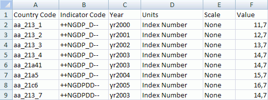

# ICubeMetaLoader.TestLoad

ICubeMetaLoader.TestLoad
-

# ICubeMetaLoader.TestLoad

## Синтаксис

TestLoad: [ICubeMetaLoaderTestLoadResult](../ICubeMetaLoaderTestLoadResult/ICubeMetaLoaderTestLoadResult.htm);

## Описание

Метод TestLoad осуществляет
 тестовую загрузку показателей из источника данных и возвращает объект,
 содержащий результаты.

## Комментарии

При тестовой загрузке осуществляется проверка данных, сохранения загруженных
 данных не происходит.

## Пример

Для выполнения примера предполагается наличие базы данных временных
 рядов с идентификатором OBJ_FC и файла экспорта показателей C:\Fixed.xlsx.
 Также в репозитории должен присутствовать репозиторий НСИ с идентификатором
 RDS_REPO, в данном репозитории предполагается наличие справочников с идентификаторами
 DICT_CTR, DICT_IND и UNITS. В базе данных временных рядов атрибут COUNTRY
 является ссылкой на справочник DICT_CTR, атрибут INDICATOR - ссылкой на
 справочник DICT_IND, а единицы измерения ссылаются на справочник UNITS.

Добавьте ссылки на системные сборки: Cube, Dt, Db, Dimension, Metabase.

[Файл «C:\Fixed.xlsx»,
 для которого создан пример](javascript:TextPopup(this))

	

	Sub UserProc;

	Var

	    Mb: IMetabase;

	    NsiDescr: IMetabaseObjectDescriptor;

	    CubeMetaLoader: ICubeMetaLoader;

	    CrInfo: IMetabaseObjectCreateInfo;

	    Obj: IMetabaseObject;

	    ObjDesc: IMetabaseObjectDescriptor;

	    CubeMetaLoaderBindings: ICubeMetaLoaderBindings;

	    CalendarBinding: ICubeMetaLoaderBinding;

	    CountryBinding: ICubeMetaLoaderBinding;

	    IndicatorBinding: ICubeMetaLoaderBinding;

	    UnitBinding: ICubeMetaLoaderBinding;

	    ScaleBinding: ICubeMetaLoaderBinding;

	    LevelBinding: ICubeMetaLoaderBinding;

	    ValueBinding: ICubeMetaLoaderBinding;

	    Parser: ICubeMetaLoaderBindingParser;

	    Excel: IDtExcelProvider;

	    Provider: IDatasetDataProvider;

	    Log: ICubeMetaLoaderLog;

	    Entry: ICubeMetaLoaderLogEntry;

	    Count, i, key: Integer;

	    TestResult: ICubeMetaLoaderTestLoadResult;

	    TestResultEntry: ICubeMetaLoaderTestLoadResultEntry;

	Begin

	    Mb := MetabaseClass.Active;

	    NsiDescr := Mb.ItemById("RDS_REPO");

	    // Создание загрузчика

	    CrInfo := Mb.CreateCreateInfo;

	    CrInfo.ClassId := MetabaseObjectClass.KE_CLASS_CUBEMETALOADER;

	    CrInfo.Id := "CUBEMETALOADER";

	    CrInfo.Permanent := False;

	    ObjDesc := Mb.CreateObject(CrInfo);

	    Obj := ObjDesc.Edit;

	    CubeMetaLoader := Obj As ICubeMetaLoader;

	    CubeMetaLoader.LoadType := CubeMetaLoaderLoadType.CreateAndUpdate;

	    CubeMetaLoader.Rubricator := Mb.ItemById("OBJ_FC").Bind As IRubricator;

	    CubeMetaLoader.ScaleValues := True;

	    CubeMetaLoaderBindings := CubeMetaLoader.Bindings;

	    // Редактирование параметров календаря

	    CalendarBinding := CubeMetaLoaderBindings.Add;

	    CalendarBinding.BindingType := CubeMetaLoaderBindingType.Calendar;

	    CalendarBinding.CalendarOptions.Levels := DimCalendarLevelSet.Year;

	    CalendarBinding.ByColumns := False;

	    CalendarBinding.CalendarDateFormat := "$Year$";

	    CalendarBinding.FieldType := CubeMetaLoaderFieldType.Name;

	    CalendarBinding.Field := "Year";

	    Parser := CalendarBinding.Parser;

	    Parser.ParserType := CubeMetaLoaderParserType.FixedPosition;

	    Parser.StringPositionStart := 2;

	    Parser.StringPositionEnd := -1;

	    // Редактирование параметров атрибута INDICATOR

	    IndicatorBinding := CubeMetaLoaderBindings.Add;

	    IndicatorBinding.BindingType := CubeMetaLoaderBindingType.Attribute;

	    IndicatorBinding.Attribute := "INDICATOR";

	    IndicatorBinding.Field := "Indicator Code";

	    IndicatorBinding.FieldType := CubeMetaLoaderFieldType.Name;

	    IndicatorBinding.Dimension := Mb.ItemByIdNamespace("DICT_IND", NsiDescr.Key).Bind
	 As IDimensionModel;

	    // «IX_CODE» - уникальный ключ справочника «DICT_IND»

	    IndicatorBinding.Index := "IX_CODE";

	    IndicatorBinding.KeyAttribute := "KEY";

	    Parser := IndicatorBinding.Parser;

	    Parser.ParserType := CubeMetaLoaderParserType.FixedPosition;

	    Parser.StringPositionStart := 2;

	    Parser.StringPositionEnd := 7;

	    // Редактирование параметров атрибута COUNTRY

	    CountryBinding := CubeMetaLoaderBindings.Add;

	    CountryBinding.BindingType := CubeMetaLoaderBindingType.Attribute;

	    CountryBinding.Attribute := "COUNTRY";

	    CountryBinding.Field := "Country Code";

	    CountryBinding.FieldType := CubeMetaLoaderFieldType.Name;

	    CountryBinding.Dimension := Mb.ItemByIdNamespace("DICT_CTR", NsiDescr.Key).Bind As IDimensionModel;

	    // «IX_WEO» - уникальный ключ справочника «DICT_CTR»

	    CountryBinding.Index := "IX_WEO";

	    CountryBinding.KeyAttribute := "KEY";

	    CountryBinding.NameAttribute := "NAME";

	    Parser := CountryBinding.Parser;

	    Parser.ParserType := CubeMetaLoaderParserType.FixedPosition;

	    Parser.StringPositionStart := 3;

	    Parser.StringPositionEnd := 5;

	    // Редактирование атрибутов календаря и единиц измерения

	    LevelBinding := CubeMetaLoaderBindings.Add;

	    LevelBinding.BindingType := CubeMetaLoaderBindingType.Attribute;

	    LevelBinding.Attribute := "DL";

	    LevelBinding.FieldType := CubeMetaLoaderFieldType.ConstValue;

	    LevelBinding.FieldValue := DimCalendarLevel.Year As Integer;

	    UnitBinding := CubeMetaLoaderBindings.Add;

	    UnitBinding.BindingType := CubeMetaLoaderBindingType.Unit;

	    UnitBinding.Field := "Units";

	    UnitBinding.FieldType := CubeMetaLoaderFieldType.Name;

	    Parser := UnitBinding.Parser;

	    Parser.ParserType := CubeMetaLoaderParserType.FixedPosition;

	    Parser.StringPositionStart := 0;

	    Parser.StringPositionEnd := -1;

	    ScaleBinding := CubeMetaLoaderBindings.Add;

	    ScaleBinding.BindingType := CubeMetaLoaderBindingType.Unit;

	    ScaleBinding.Field := "Scale";

	    ScaleBinding.FieldType := CubeMetaLoaderFieldType.Name;

	    ScaleBinding.Dimension := Mb.ItemByIdNamespace("UNITS", NsiDescr.Key).Bind As IDimensionModel;

	    // «IX_WEO_UNIT_SCALE» - уникальный ключ справочника «UNITS»

	    ScaleBinding.Index := "IX_WEO_UNIT_SCALE";

	    ScaleBinding.KeyAttribute := "KEY";

	    Parser := ScaleBinding.Parser;

	    Parser.ParserType := CubeMetaLoaderParserType.FixedPosition;

	    Parser.StringPositionStart := 0;

	    Parser.StringPositionEnd := -1;

	    // Редактирование атрибутов, содержащих значения

	    ValueBinding := CubeMetaLoaderBindings.Add;

	    ValueBinding.BindingType := CubeMetaLoaderBindingType.Value;

	    ValueBinding.Field := "Value";

	    ValueBinding.FieldType := CubeMetaLoaderFieldType.Name;

	    Parser := ValueBinding.Parser;

	    Parser.ParserType := CubeMetaLoaderParserType.FixedPosition;

	    Parser.StringPositionStart := 0;

	    Parser.StringPositionEnd := -1;

	    //  Редактирование параметров загрузчика

	    Excel := New DtExcelProvider.Create;

	    Excel.ImexMode := DtExcelImexMode.Import;

	    Excel.File := "C:\Fixed.xlsx";

	    Excel.Query := "SELECT * FROM [Лист1$]";

	    Excel.HasHeader := True;

	    Excel.CheckFieldName := True;

	    Excel.Open;

	    Provider := Excel As IDatasetDataProvider;

	    // Выполнение загрузки

	    CubeMetaLoader.Data := Provider;

	    TestResult := CubeMetaLoader.TestLoad;

	    Count := TestResult.Count;

	    Debug.WriteLine("Тестирование");

	    Debug.WriteLine("Всего ошибок в логе: " + Count.ToString);

	    If Count > 0 Then

	        For i := 0 To Count - 1 Do

	            TestResultEntry := TestResult.Item(i);

	            Debug.WriteLine(TestResultEntry.Attribute + " : "

	            + TestResultEntry.Value + " = "

	            + TestResultEntry.Count.ToString);

	            If i >= 10 - 1 Then

	                Break;

	            End If;

	        End For;

	    Else

	        CubeMetaLoader.Data := Provider;

	        CubeMetaLoader.LoadData;

	        Log := CubeMetaLoader.Log;

	        For Each key In CubeMetaLoader.InvalidFactors Do

	            Debug.WriteLine("Ошибка при загрузке показателя с ключом: " + key.ToString);

	        End For;

	        Count := Log.Count;

	        Debug.WriteLine("Загрузка данных");

	        Debug.WriteLine("Всего записей в логе: " + Count.ToString);

	        For i := 0 To Count - 1 Do

	            Entry := Log.Item(i);

	            Debug.WriteLine(i.ToString + " : "

	            + Entry.DateBegin.ToString + ","

	            + Entry.RecordNumber.ToString + ","

	            + Entry.Field + ","

	            + Entry.ErrorMessage);

	            If i >= 10 - 1 Then

	                Break;

	            End If;

	        End For;

	    End If;

	End Sub UserProc;

После выполнения примера будет произведена тестовая загрузка данных
 из файла C:\Fixed.xlsx, первые десять записей из отчета о загрузке будут
 выведены в окно консоли. Если тестовая загрузка прошла удачно, то показатели
 будут экспортированы из файла в базу данных временных рядов.

См. также:

[ICubeMetaLoader](ICubeMetaLoader.htm)

		Справочная
		 система на версию 10.9
		 от 18/08/2025,
		 © ООО «ФОРСАЙТ»,
