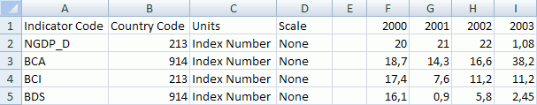

# ICubeMetaLoaderBinding.Filter

ICubeMetaLoaderBinding.Filter
-

# ICubeMetaLoaderBinding.Filter

## Синтаксис

Filter: [IDimSelection](kedims.chm::/interface/idimselection/idimselection.htm);

## Описание

Свойство Filter возвращает отметку
 показателей, по которой будут загружены данные.

## Комментарии

По умолчанию фильтр не создается. При этом загрузка осуществляется по
 всем показателям атрибута.

При первом обращении к данному свойству будет создана отметка показателей.
 В данную отметку будут включены все показатели. При необходимости отметку
 можно изменить.

Примечание.
 Если нет необходимости создавать фильтр по атрибутам, то необходимо избегать
 обращения к данному свойству в коде. Для проверки наличия уже созданного
 фильтра можно использовать свойство [HasFilter](ICubeMetaLoaderBinding.HasFilter.htm).

## Пример

Для выполнения примера предполагается наличие базы данных временных
 рядов с идентификатором OBJ_FC и файла экспорта показателей «C:\Fixed.xlsx».
 Также в репозитории должен присутствовать репозиторий НСИ с идентификатором
 RDS_REPO, в данном репозитории предполагается наличие справочников с идентификаторами
 DICT_CTR, DICT_IND и UNITS. В базе данных временных рядов атрибут COUNTRY
 является ссылкой на справочник DICT_CTR, атрибут INDICATOR - ссылкой на
 справочник DICT_IND, а единицы измерения ссылаются на справочник UNITS.

[Файл «C:\Fixed.xlsx»,
 для которого написан пример](javascript:TextPopup(this))

	

	Sub UserProc;

	Var

	    Mb: IMetabase;

	    NsiDescr: IMetabaseObjectDescriptor;

	    CubeMetaLoader: ICubeMetaLoader;

	    CrInfo: IMetabaseObjectCreateInfo;

	    Obj: IMetabaseObject;

	    ObjDesc: IMetabaseObjectDescriptor;

	    CubeMetaLoaderBindings: ICubeMetaLoaderBindings;

	    CalendarBinding: ICubeMetaLoaderBinding;

	    Filter: IDimSelection;

	    Indexes: IDimIndexesInstance;

	    CountryBinding: ICubeMetaLoaderBinding;

	    IndicatorBinding: ICubeMetaLoaderBinding;

	    UnitBinding: ICubeMetaLoaderBinding;

	    ScaleBinding: ICubeMetaLoaderBinding;

	    LevelBinding: ICubeMetaLoaderBinding;

	    Excel: IDtExcelProvider;

	    Provider: IDatasetDataProvider;

	    Log: ICubeMetaLoaderLog;

	    Entry: ICubeMetaLoaderLogEntry;

	    key, Count, i: Integer;

	Begin

	    Mb := MetabaseClass.Active;

	    NsiDescr := Mb.ItemById("RDS_REPO");

	    CrInfo := Mb.CreateCreateInfo;

	    CrInfo.ClassId := MetabaseObjectClass.KE_CLASS_CUBEMETALOADER;

	    CrInfo.Id := "CUBEMETALOADER";

	    CrInfo.Permanent := False;

	    ObjDesc := Mb.CreateObject(CrInfo);

	    Obj := ObjDesc.Edit;

	    CubeMetaLoader := Obj As ICubeMetaLoader;

	    CubeMetaLoader.LoadType := CubeMetaLoaderLoadType.CreateAndUpdate;

	    CubeMetaLoader.Rubricator := Mb.ItemById("OBJ_FC").Bind As IRubricator;

	    CubeMetaLoaderBindings := CubeMetaLoader.Bindings;

	    CalendarBinding := CubeMetaLoaderBindings.Add;

	    CalendarBinding.BindingType := CubeMetaLoaderBindingType.Calendar;

	    CalendarBinding.CalendarOptions.Levels := DimCalendarLevelSet.Year;

	    CalendarBinding.CalendarDateFormat := "$Year$";

	    CalendarBinding.FieldType := CubeMetaLoaderFieldType.Index;

	    CalendarBinding.Field := "5";

	    CalendarBinding.EndField := "12";

	    CalendarBinding.ByColumns := True;

	    CalendarBinding.HeaderRow := 0;

	    CalendarBinding.FillGaps := True;

	    IndicatorBinding := CubeMetaLoaderBindings.Add;

	    IndicatorBinding.BindingType := CubeMetaLoaderBindingType.Attribute;

	    IndicatorBinding.Attribute := "INDICATOR";

	    IndicatorBinding.Field := "0";

	    IndicatorBinding.FieldType := CubeMetaLoaderFieldType.Index;

	    IndicatorBinding.Dimension := Mb.ItemByIdNamespace("DICT_IND", NsiDescr.Key).Bind As IDimensionModel;

	    // «IX_CODE» - уникальный ключ справочника «DICT_IND»

	    IndicatorBinding.Index := "IX_CODE";

	    IndicatorBinding.KeyAttribute := "KEY";

	    IndicatorBinding.FillGaps := True;

	    CountryBinding := CubeMetaLoaderBindings.Add;

	    CountryBinding.BindingType := CubeMetaLoaderBindingType.Attribute;

	    CountryBinding.Attribute := "COUNTRY";

	    CountryBinding.Field := "1";

	    CountryBinding.FieldType := CubeMetaLoaderFieldType.Index;

	    CountryBinding.Dimension := Mb.ItemByIdNamespace("DICT_CTR", NsiDescr.Key).Bind As IDimensionModel;

	    // «IX_WEO» - уникальный ключ справочника «DICT_CTR»

	    CountryBinding.Index := "IX_WEO";

	    CountryBinding.KeyAttribute := "KEY";

	    CountryBinding.NameAttribute := "NAME";

	    Filter := CountryBinding.Filter;

	    Filter.DeselectAll;

	    Indexes := Filter.Dimension.Indexes;

	    key := Indexes.PrimaryIndex.LookUp("213");

	    Filter.SelectElement(key, False);

	    LevelBinding := CubeMetaLoaderBindings.Add;

	    LevelBinding.BindingType := CubeMetaLoaderBindingType.Attribute;

	    LevelBinding.Attribute := "DL";

	    LevelBinding.FieldType := CubeMetaLoaderFieldType.ConstValue;

	    LevelBinding.FieldValue := DimCalendarLevel.Year As Integer;

	    UnitBinding := CubeMetaLoaderBindings.Add;

	    UnitBinding.BindingType := CubeMetaLoaderBindingType.Unit;

	    UnitBinding.Field := "Units";

	    UnitBinding.FieldType := CubeMetaLoaderFieldType.Index;

	    UnitBinding.Field := "2";

	    ScaleBinding := CubeMetaLoaderBindings.Add;

	    ScaleBinding.BindingType := CubeMetaLoaderBindingType.Unit;

	    ScaleBinding.Field := "3";

	    ScaleBinding.FieldType := CubeMetaLoaderFieldType.Index;

	    ScaleBinding.Dimension := Mb.ItemByIdNamespace("UNITS", NsiDescr.Key).Bind As IDimensionModel;

	    // «IX_WEO_UNIT_SCALE» - уникальный ключ справочника «UNITS»

	    ScaleBinding.Index := "IX_WEO_UNIT_SCALE";

	    ScaleBinding.KeyAttribute := "KEY";

	    CubeMetaLoader.DataOffset := 1;

	    // Источник данных

	    Excel := New DtExcelProvider.Create;

	    Excel.ImexMode := DtExcelImexMode.Import;

	    Excel.File := "C:\Fixed.xlsx";

	    Excel.Query := "SELECT * FROM [Лист1$]";

	    Excel.HasHeader := False;

	    Excel.CheckFieldName := False;

	    Excel.Open;

	    Provider := Excel As IDatasetDataProvider;

	    CubeMetaLoader.Data := Provider;

	    CubeMetaLoader.LoadData;

	    Log := CubeMetaLoader.Log;

	    Count := Log.Count;

	    Debug.WriteLine("Всего записей в журнале: " + Count.ToString);

	    For i := 0 To Count - 1 Do

	        Entry := Log.Item(i);

	        Debug.WriteLine(i.ToString + " : "

	            + Entry.DateBegin.ToString + ","

	            + Entry.RecordNumber.ToString + ","

	            + Entry.Field + ","

	            + Entry.ErrorMessage);

	        If i >= 10 - 1 Then

	            Break;

	        End If;

	    End For;

	End Sub UserProc;

После выполнения примера будет произведен экспорт показателей из указанного
 файла. Экспортированы будут лишь те показатели, атрибут COUNTRY у которых
 равен 213.

См. также:

[ICubeMetaLoaderBinding](ICubeMetaLoaderBinding.htm)

		Справочная
		 система на версию 10.9
		 от 18/08/2025,
		 © ООО «ФОРСАЙТ»,
