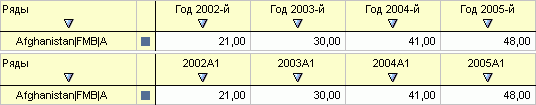

# IRubricator.EditCalendar

IRubricator.EditCalendar
-

# IRubricator.EditCalendar

## Синтаксис

EditCalendar: [IDimensionModel](KeDims.chm::/interface/IDimensionModel/IDimensionModel.htm);

## Описание

Метод EditCalendar позволяет
 получить календарь базы данных временных рядов для редактирования.

## Пример

Для выполнения примера предполагается наличие в репозитории базы данных
 временных рядов с идентификатором FC_COMM.

			Sub UserProc;

Var

    MB: IMetabase;

    Rub: IRubricator;

    CalDim: ICalendarDimension;

    Lev: Integer;

Begin

    MB := MetabaseClass.Active;

    Rub := MB.ItemById("FC_COMM").Edit As IRubricator;

    CalDim := Rub.EditCalendar As ICalendarDimension;

    Lev := CalDim.CalendarLevelIndex(DimCalendarLevel.Year);

    CalDim.NameAttrFormat(Lev) := "Год YYYY-й";

    (Rub As IMetabaseObject).Save;

End Sub UserProc;

После выполнения примера для календаря базы данных временных рядов будет
 задан формат наименования годовой динамики (изображение сверху), отличающийся
 от стандартного (изображение снизу):

См. также:

[IRubricator](IRubricator.htm)

		Справочная
		 система на версию 10.9
		 от 18/08/2025,
		 © ООО «ФОРСАЙТ»,
