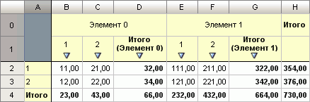

# IStandardCubeServerAggregation.CustomAggregateFunction

IStandardCubeServerAggregation.CustomAggregateFunction
-

# IStandardCubeServerAggregation.CustomAggregateFunction

## Синтаксис

CustomAggregateFunction: String;

## Описание

Свойство CustomAggregateFunction
 определяет пользовательский метод расчета агрегации.

## Комментарии

Данное свойство учитывается, если значение свойства [IStandardCubeServerAggregation.AggregationType](IStandardCubeServerAggregation.AggregationType.htm)
 = [CubeFactBindingAggregationType.Custom](../../Enums/CubeFactBindingAggregationType.htm).

## Пример

Для выполнения примера предполагается наличие в репозитории стандартного
 куба с идентификатором OBJ_CUBE. В данном кубе должно присутствовать два
 измерения.

	Sub UserProc;

	Var

	    MB: IMetabase;

	    CubeStdInst: IStandardCubeInstance;

	    DestInst: ICubeInstanceDestination;

	    Aggregator: IStandardCubeServerAggregator;

	    StdDims: IStandardCubeDimensions;

	    StdDim: IStandardCubeDimension;

	    Aggregation: IStandardCubeServerAggregation;

	    FactDimension: IDimInstance;

	    Iter: IDimIterator;

	    DimsEx: IStandardCubeServerAggregationDimensionsEx;

	    AggDim: IStandardCubeServerAggregationDimension;

	    MatrDS: IMatrixDataSource;

	    DimSS: IDimSelectionSet;

	    DimS: IDimSelection;

	    Matr: IMatrix;

	    Coord: IMatrixCoord;

	    MatrIter: IMatrixIterator;

	    i: Integer;

	    s: String;

	Begin

	    MB := MetabaseClass.Active;

	    CubeStdInst := MB.ItemById("OBJ_CUBE").Open(Null) As IStandardCubeInstance;

	    DestInst := (CubeStdInst As ICubeInstance).Destinations.DefaultDestination;

	    StdDims := DestInst.Dimensions As IStandardCubeDimensions;

	    // Настройка метода агрегации

	    Aggregator := CubeStdInst.CreateAggregator;

	    FactDimension := (DestInst.DestinationModel As IStandardCubeDestination).FactDimension.OpenDimension;

	    Iter := FactDimension.Elements.Elements.Iterator;

	    Iter.First;

	    While Iter.Next Do

	        Aggregation := Aggregator.Aggregations.Add;

	        Aggregation.AggregationType := CubeFactBindingAggregationType.Custom;

	        Aggregation.CustomAggregateFunction := "SUM";

	        Aggregation.FactKey := FactDimension.Indexes.PrimaryIndex.IndexAttributesValues(Iter.Element);

	    End While;

	    // Определение измерений для агрегации

	    DimsEx := Aggregator.Dimensions;

	    AggDim := DimsEx.Item(0);

	    AggDim.GroupIndex := 0;

	    AggDim.Position := 0;

	    AggDim.Others := True;

	    AggDim := DimsEx.Item(1);

	    AggDim.GroupIndex := 1;

	    AggDim.Position := 0;

	    AggDim.Totals := True;

	    // Отметка для расчета агрегации

	    MatrDS := DestInst As IMatrixDataSource;

	    DimSS := MatrDS.CreateDimSelectionSet;

	    For Each DimS In DimSS Do

	        DimS.SelectAll;

	    End For;

	    // Расчет агрегации

	    Matr := Aggregator.Execute(DimSS);

	    // Вывод результатов агрегации

	    MatrIter := Matr.CreateIterator;

	    MatrIter.Move(IteratorDirection.First);

	    If MatrIter.Valid Then

	        For i := 0 To StdDims.Count - 1 Do

	            StdDim := StdDims.Item(i);

	            If StdDim.FactDimension Then

	                Debug.Write("Факт   ");

	            Else

	                Debug.Write(StdDim.OpenDimension.Name + "  ");

	            End If;

	        End For;

	        Debug.Write("Агрегация  ");

	        Debug.WriteLine("Значение");

	        Coord := Matr.CreateCoord;

	        While MatrIter.Valid Do

	            MatrIter.PutCurrentPos(Coord);

	            s := "";

	            For i := 0 To Coord.Count - 1 Do

	                s := s + Coord.Item(i).ToString + "       ";

	            End For;

	            s := s + "= " + MatrIter.Value;

	            Debug.WriteLine(s);

	            MatrIter.Move(IteratorDirection.Next);

	        End While;

	    Else

	        Debug.WriteLine("Данные отсутствуют");

	    End If;

	End Sub UserProc;

После выполнения примера для фактов куба будет рассчитана сумма по измерениям.
 Матрица расчета будет выведена в окно консоли.

[Смотреть результаты](javascript:TextPopup(this))

	Факт   sm1  sm2  Агрегация
	  Значение

	0       -1       -1
	       0       =
	 66

	0       -1       0
	       0       =
	 32

	0       -1       1
	       0       =
	 34

	0       0       -1
	       0       =
	 23

	0       1       -1
	       0       =
	 43

	1       -1       -1
	       1       =
	 664

	1       -1       0
	       1       =
	 322

	1       -1       1
	       1       =
	 342

	1       0       -1
	       1       =
	 232

	1       1       -1
	       1       =
	 432

	Данной матрице расчета соответствует следующее экспресс-представление
	 данных куба:

	

См. также:

[IStandardCubeServerAggregation](IStandardCubeServerAggregation.htm)

		Справочная
		 система на версию 10.9
		 от 18/08/2025,
		 © ООО «ФОРСАЙТ»,
