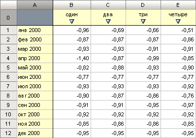
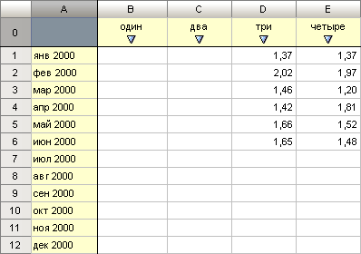
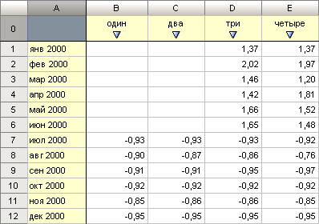
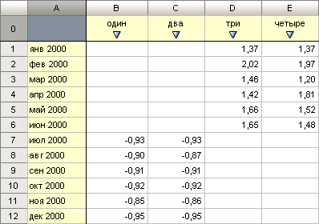

# Использование альтернативного источника данных в стандартном кубе

Использование альтернативного источника данных в стандартном кубе
-

# Использование альтернативного источника данных в стандартном кубе

Для стандартного куба реализована поддержка использования альтернативного
 источника данных. Данные можно хранить и загружать полностью в альтернативном
 источнике, либо использовать фильтрацию по какому-либо измерению.

Рассмотрим механизм работы на следующем примере.

Для выполнения примера предполагается наличие в репозитории стандартного
 куба с идентификатором «Cube_1». В кубе имеется три измерения. Измерения
 основаны на следующих справочниках:

	- DIM_1 - справочник, содержащий какие-либо показатели.

	- FACT - справочник, используемый в качестве измерения
	 фактов куба.

	- CALENDAR - календарный справочник.

В источнике данных куба «Cube_1» имеются следующие данные:

Также в репозитории имеется стандартный куб «Cube_2». Структура куба
 аналогична структуре куба «Cube_1». «Cube_2» будет использоваться в качестве
 альтернативного источника данных для «Cube_1».

В источнике данных куба «Cube_2» имеются следующие данные:

Для подключения и настройки альтернативного источника данных выполним
 следующий код:

	Sub UserProc;

	Var

	    MB: IMetabase;

	    Cube: ICubeModel;

	    AltCube: ICubeModelAlternateSource;

	    Dims: ICubeModelDimensions;

	    Dim: IDimensionModel;

	Begin

	    MB := MetabaseClass.Active;

	    Cube := MB.ItemById("Cube_1").Edit As ICubeModel;

	    AltCube := Cube.Destinations.DefaultDestination.AlternateSource;

	    AltCube.Source := (MB.ItemById("Cube_2").Bind As ICubeModel).Destinations.DefaultDestination;

	    AltCube.AutoSaveToStorage := False;

	    AltCube.UseExecute := True;

	    AltCube.UseStorage := True;

	    Dims := AltCube.Destination.Dimensions;

	    Dim := Dims.FindById("CALENDAR"); //Календарь

	    AltCube.AddDimension(Dim);

	    (Cube As IMetabaseObject).Save;

	End Sub UserProc;

После выполнения кода к кубу «Cube_1» будет подключен альтернативный
 куб «Cube_2». В список измерений, по координатам которых будут загружаться
 данные из альтернативного куба, будет включено календарное измерение.
 При открытии куба «Cube_1» в альтернативном кубе будут искаться и загружаться
 данные по всем точкам календаря. По тем точкам календаря, по которым отсутствуют
 данные в альтернативном кубе, данные будут загружены из собственного источника
 куба «Cube_1»:

Если выполнить следующий код:

	Sub UserProc;

	Var

	    MB: IMetabase;

	    Cube: ICubeModel;

	    AltCube: ICubeModelAlternateSource;

	    Dims: ICubeModelDimensions;

	    Dim: IDimensionModel;

	Begin

	    MB := MetabaseClass.Active;

	    Cube := MB.ItemById("Cube_1").Edit As ICubeModel;

	    AltCube := Cube.Destinations.DefaultDestination.AlternateSource;

	    AltCube.Source := (MB.ItemById("Cube_2").Bind As ICubeModel).Destinations.DefaultDestination;

	    AltCube.AutoSaveToStorage := False;

	    AltCube.UseExecute := True;

	    AltCube.UseStorage := True;

	    Dims := AltCube.Destination.Dimensions;

	    Dim := Dims.FindById("CALENDAR"); //Календарь

	    AltCube.AddDimension(Dim);

	    Dim := Dims.FindById("DIM_1"); //Первый

	    AltCube.AddDimension(Dim);

	    (Cube As IMetabaseObject).Save;

	End Sub UserProc;

После выполнения кода в список измерений альтернативного куба, по координатам
 которых будут загружаться данные, будут включены два измерения: календарное
 измерение и измерение с показателями. При открытии куба «Cube_1» в альтернативном
 кубе сначала будут искаться и загружаться данные, имеющиеся на какую-либо
 точку календаря. Затем будут искаться данные на какую-либо точку измерения
 с показателями. Все остальные значение будут загружены из собственного
 источника куба «Cube_1»:

См. также:

[Примеры](KeCubes_Sample.htm)

		Справочная
		 система на версию 10.9
		 от 18/08/2025,
		 © ООО «ФОРСАЙТ»,
