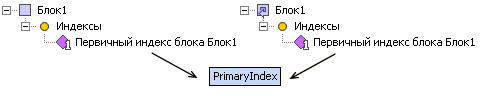
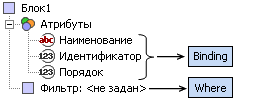
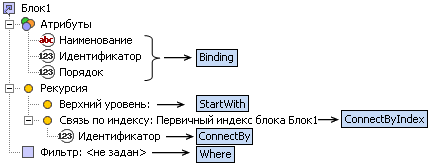

# Структура табличного справочника

Структура табличного справочника
-

# Структура табличного справочника

При работе с табличным справочником необходимо учитывать следующие моменты:

	- класс объекта «Табличный
	 справочник» - [MetabaseObjectClass.KE_CLASS_STDDIM](KeSom.chm::/Enums/MetabaseObjectClass.htm).

	- табличный справочник может
	 быть основан на следующих реляционных источниках данных: [Таблица](UiNavObj.chm::/Table/UiDb_relational_table.htm),
	 [Присоединенная
	 таблица](UiNavObj.chm::/Attach_table/UiDb_relational_AttachTable.htm), [Представление](UiNavObj.chm::/conception/UiDb_relational_conception.htm),
	 [Запрос](UiNavObj.chm::/Query/Query.htm),
	 [Источник
	 данных ODBC](UiNavObj.chm::/ODBC/UiDb_relational_ODBC.htm), [Журнал](UiNavObj.chm::/journal/UiDb_relational_journal.htm).
	 Также в качестве источника могут выступать различные виды [справочников НСИ](UiNavObj.chm::/reference_book/Master_RDS_reference_book/Master_RDS.htm).

Полный пример по созданию табличного справочника с использованием языка
 Fore представлен в разделе [Примеры: Создание табличного
 справочника](../../Samples/KeDims_Sample2.htm). Рассмотрим основные этапы по работе с табличным справочником
 более детально.

Интерфейс [IDimensionModel](../../interface/IDimensionModel/IDimensionModel.htm)
 используется только для просмотра информации о структуре справочника.
 Для настройки параметров нового, либо уже существующего, табличного справочника
 необходимо соответствующий объект репозитория привести к интерфейсу [IStandardDimension](../../interface/IStandardDimension/IStandardDimension.htm).
 Для изменения параметров объект должен быть открыт на редактирование.

Пример создания нового табличного справочника с идентификатором «NewTabDim»:

	Var

	    //...

	    MB: IMetabase;

	    CrInfo: IMetabaseObjectCreateInfo;

	    StdDim: IStandardDimension;

	    //...

	Begin

	    MB := MetabaseClass.Active;

	    CrInfo := MB.CreateCreateInfo;

	    CrInfo.ClassID := MetabaseObjectClass.KE_CLASS_STDDIM;

	    CrInfo.Id := "NewTabDim";

	    CrInfo.Name := "Новый табличный справочник";

	    CrInfo.Parent := MB.Root;

	    //Создание нового табличного справочника и открытие его структуры на редактирование

	    StdDim := MB.CreateObject(CrInfo).Edit As IStandardDimension;

	    //...

Пример доступа к структуре существующего табличного справочника с идентификатором
 «TabDim»:

Var

    //...

    MB: IMetabase;

    StdDim: IStandardDimension;

    //...

Begin

    MB := MetabaseClass.Active;

    //Открытие структуры справочника на редактирование

    StdDim := MB.ItemById("TabDim").Edit As IStandardDimension;

    //...

## Атрибуты

Для работы с коллекцией атрибутов табличного справочника предназначен
 интерфейс [IStandardDimAttributes](../../interface/IStandardDimAttributes/IStandardDimAttributes.htm).
 Для корректной работы справочника в списке атрибутов должны быть созданы
 атрибуты с назначением [Наименование](../../interface/IStandardDimAttributes/IStandardDimAttributes.Name.htm),
 [Идентификатор](../../interface/IStandardDimAttributes/IStandardDimAttributes.Id.htm)
 и [Порядок](../../interface/IStandardDimAttributes/IStandardDimAttributes.Order.htm).

Рассмотрим пример создания четырех новых атрибутов. Три из них будут
 назначены в качестве атрибутов [Наименования](../../interface/IStandardDimAttributes/IStandardDimAttributes.Name.htm),
 [Порядка](../../interface/IStandardDimAttributes/IStandardDimAttributes.Order.htm)
 и [Идентификатора](../../interface/IStandardDimAttributes/IStandardDimAttributes.Id.htm)
 соответственно:

Var

    //...

    StdDim: IStandardDimension;

    StdAttrs: IStandardDimAttributes;

    //Переменные для новых атрибутов

    NameAttr, OrderAttr, IdAttr, Parent: IStandardDimAttribute;

    //...

Begin

    //...

    //Список атрибутов

    StdAttrs := StdDim.Attributes;

    //Создание трех новых атрибутов

    NameAttr := StdAttrs.Add;

    OrderAttr := StdAttrs.Add;

    IdAttr := StdAttrs.Add;

    Parent := StdAttrs.Add;

    //Настройка параметров атрибутов

    NameAttr.DataType := DbDataType.String;

    NameAttr.Id := "NAME";

    NameAttr.Name := "Наименование";

    OrderAttr.DataType := DbDataType.Integer;

    OrderAttr.Id := "ORDER";

    OrderAttr.Name := "Порядок";

    IdAttr.DataType := DbDataType.Integer;

    IdAttr.Id := "ID";

    IdAttr.Name := "Идентификатор";

    Parent.DataType := DbDataType.Integer;

    Parent.Id := "PARENTID";

    Parent.Name := "Родительский элемент";

    //Установка назначения атрибутов

    StdAttrs.Name := NameAttr;

    StdAttrs.Order := OrderAttr;

    StdAttrs.Id := IdAttr;

    //...

## Сортировка

Для настройки сортировки по атрибутам в табличном справочнике предназначен
 интерфейс [IStdDimOrders](../../interface/IStdDimOrders/IStdDimOrders.htm).
 В список сортировки обязательно должен быть включен атрибут, назначение
 которого [Порядок](../../interface/IStandardDimAttributes/IStandardDimAttributes.Order.htm).
 При добавлении в список сортировки какого-либо одного атрибута данный
 атрибут автоматически будет назначен в качестве атрибута [Порядок](../../interface/IStandardDimAttributes/IStandardDimAttributes.Order.htm).
 При необходимости в список сортировки можно включить любое количество
 атрибутов. По атрибуту, добавленному в список в последнюю очередь, сортировка
 также будет осуществляться в последнюю очередь.

Var

    //...

    StdDim: IStandardDimension;

    StdAttrs: IStandardDimAttributes;

    NameAttr, OrderAttr, IdAttr, Parent: IStandardDimAttribute;

    StdOrders: IStdDimOrders;

    //...

Begin

    //...

    //Список атрибутов

    StdAttrs := StdDim.Attributes;

    //...

    //Список сортировки

    StdOrders := StdAttrs.Orders;

    //Добавление атрибутов в список сортировки

    StdOrders.Add(OrderAttr, False);

    StdOrders.Add(NameAttr, True);

    //...

## Структура

Для работы со структурой табличного справочника предназначены два интерфейса:
 [IStandardDimBlocks](../../interface/IStandardDimBlocks/IStandardDimBlocks.htm)
 - для работы с блоками справочника; [IStandardDimIndexes](../../interface/IStandardDimIndexes/IStandardDimIndexes.htm)
 - для работы с индексами справочника.

### Блоки табличного справочника

Базовые свойства блоков, используемых в табличном справочнике, содержатся
 в интерфейсе [IStandardDimBlock](../../interface/IStandardDimBlock/IStandardDimBlock.htm).
 Для организации иерархии элементов в табличном справочнике доступно использование
 двух видов блоков: Обычные и Рекурсивные.

При добавлении нового блока, в методе [Add](../../interface/IStandardDimAttributes/IStandardDimAttributes.Add.htm)
 указывается тип создаваемого блока. В зависимости от указанного типа,
 полученный блок необходимо привести к одному из интерфейсов, унаследованных
 от [IStandardDimBlock](../../interface/IStandardDimBlock/IStandardDimBlock.htm).
 При создании обычного блока -
 к интерфейсу [IStandardDimNotRecursiveBlock](../../interface/IStandardDimNotRecursiveBlock/IStandardDimNotRecursiveBlock.htm),
 при создании рекурсивного блока
 - к интерфейсу [IStandardDimRecursiveBlock](../../interface/IStandardDimRecursiveBlock/IStandardDimRecursiveBlock.htm).

Var

    //...

    StdDim: IStandardDimension;

    StdBlocks: IStandardDimBlocks;

    NotRecBlock: IStandardDimNotRecursiveBlock;

    RecBlock: IStandardDimRecursiveBlock;

    //...

Begin

    //...

    //Коллекция блоков справочника

    StdBlocks := StdDim.Blocks;

    NotRecBlock := StdBlocks.Add(DimBlockType.NotRecursive) As IStandardDimNotRecursiveBlock;

    //...

    RecBlock := StdBlocks.Add(DimBlockType.Recursive) As IStandardDimRecursiveBlock;

    //...

Если осуществляется редактирование существующего блока, то для проверку
 используется свойство [BlockType](../../interface/IStandardDimBlock/IStandardDimBlock.BlockType.htm):

Var

    //...

    StdDim: IStandardDimension;

    StdBlocks: IStandardDimBlocks;

    StdBlock: IStandardDimBlock;

    NotRecBlock: IStandardDimNotRecursiveBlock;

    RecBlock: IStandardDimRecursiveBlock;

    //...

Begin

    //...

    //Коллекция блоков справочника

    StdBlocks := StdDim.Blocks;

    StdBlock := StdBlocks.Item(0);

    //Получение структуры блока в соответствии с его типом

    If StdBlock.BlockType = DimBlockType.Recursive Then

        RecBlock := StdBlock As IStandardDimRecursiveBlock;

    Else

        NotRecBlock := StdBlock As IStandardDimNotRecursiveBlock;

    End If;

    //...

Для более четкого представления сопоставим представление блока в мастере
 справочника с соответствующими свойствами в ядре:

[

В структуре каждого блока автоматически создается первичный индекс.
 В первую очередь необходимо определить список атрибутов этого индекса.
 По значениям атрибутов, включенных в первичный индекс блока, в дальнейшем
 будет настраиваться рекурсия (для рекурсивных блоков) и связь в кубах.
 Для редактирования списка атрибутов необходимо через коллекцию индексов
 блока (свойство IStandardDimBlock.Indexes](../../interface/IStandardDimIndexes/IStandardDimIndexes.PrimaryIndex.htm))
 получить первичный ключ и список его атрибутов. В коллекцию атрибутов
 первичного ключа необходимо включить не менее одного атрибута справочника.

Var

    //...

    StdDim: IStandardDimension;

    StdAttrs: IStandardDimAttributes;

    //Атрибуты индекса

    IndAttrs: IStandardDimIndexAttributes;

    StdBlocks: IStandardDimBlocks;

    StdBlock: IStandardDimBlock;

    //Первичный ключ блока

    PrimKey: IStandardDimIndex;

    //...

Begin

    //...

    StdAttrs := StdDim.Attributes;

    StdBlocks := StdDim.Blocks;

    //...

    //Получение первичного ключа блока

    PrimKey := StdBlock.Indexes.PrimaryIndex;

    //Атрибуты первичного ключа

    IndAttrs := PrimKey.Attributes;

    //Включение в первичный ключ атрибута справочника с назначением Идентификатор

    IndAttrs.Add(StdAttrs.Id);

    //...

### Индексы табличного справочника

Для работы с индексам табличного справочника предназначен интерфейс
 [IStandardDimIndexes](../../interface/IStandardDimIndexes/IStandardDimIndexes.htm).
 Данный интерфейс также используется при работе с индексами блока справочника.

Для получения индексов справочника используется свойство [IStandardDimension.Indexes](../../interface/IStandardDimension/IStandardDimension.Indexes.htm).
 Для получения индексов блока справочника используется свойство [IStandardDimBlock.Indexes](../../interface/IStandardDimBlock/IStandardDimBlock.Indexes.htm).
 В коллекцию атрибутов любого индекса необходимо включить не менее одного
 атрибута табличного справочника.

Var

    //...

    //Табличный справочник

    StdDim: IStandardDimension;

    //Атрибуты табличного справочника

    StdAttrs: IStandardDimAttributes;

    //Индекс

    StdIndex: IStandardDimIndex;

    IndAttrs: IStandardDimIndexAttributes;

    //...

Begin

    //...

    //Получение атрибутов табличного справочника

    StdAttrs := StdDim.Attributes;

    //Создание нового индекса в справочнике

    StdIndex := StdDim.Indexes.Add;

    //Получение атрибутов индекса

    IndAttrs := StdIndex.Attributes;

    //Добавление атрибута с назначением Наименование в индекс

    IndAttrs.Add(StdAttrs.Name);

    //...

## Привязка блоков

	- Обычный блок:

	

	[

	- Рекурсивный блок:

	

После организации структуры осуществляется привязка блоков к реляционным
 источникам данных. В первую очередь в свойстве Dataset](../../interface/IStandardDimBlock/IStandardDimBlock.Binding.htm)
 необходимо указать реляционный источник данных, на основании которого
 будет строиться справочник.

Примечание.
 Любой блок справочника может быть подключен только к одному реляционному
 источнику данных.

После указания источника данных можно настроить привязку атрибутов справочника
 к полям источника. Для этого используется выражение, возвращаемое свойством
 [Binding](../../interface/IStandardDimBlock/IStandardDimBlock.Binding.htm),
 по каждому атрибуту справочника. В выражении можно использовать как поля
 реляционного источника данных, так и сами атрибуты справочника. В выражении
 поля/атрибуты указываются в следующем формате: <идентификатор
 источника>.<идентификатор
 поля>.

Рассмотрим пример создания нового блока и привязку его к таблице репозитория.

### Пример создания и привязки обычного блока табличного справочника

Var

    //...

    MB: IMetabase;

    StdDim: IStandardDimension;

    StdAttrs: IStandardDimAttributes;

    StdBlocks: IStandardDimBlocks;

    NotRecBlock: IStandardDimNotRecursiveBlock;

    id: String;

    //...

Begin

    //...

    //Идентификатор таблицы, к которой осуществляется привязка

    id := "Table_1";

    StdAttrs := StdDim.Attributes;

    StdBlocks := StdDim.Blocks;

    //Создание обычного блока

    NotRecBlock := StdBlocks.Add(DimBlockType.NotRecursive) As IStandardDimNotRecursiveBlock;

    NotRecBlock.Dataset := MB.ItemById(id).Bind As IDatasetModel;

    //Привязка атрибутов справочника в блоке

    NotRecBlock.Binding(StdAttrs.Id).AsString := id + ".ID";

    NotRecBlock.Binding(StdAttrs.Name).AsString := id + ".NAME";

    NotRecBlock.Binding(StdAttrs.Order).AsString := id + ".ORD";

    //Установка условия для блока

    NotRecBlock.Where.AsString := "(" + id + ".ID>=10) AND (" + id + ".ID<=100)";

    //...

В примере создается новый обычный блок табличного справочника. Три атрибута
 в блоке связываются с полями таблицы. Для блока будет установлено условие,
 по которому будет осуществляться фильтрация данных: значения поля ID таблицы
 должно быть в диапазоне [10;100].

### Пример создания и привязки рекурсивного блока табличного справочника

Var

    //...

    MB: IMetabase;

    StdDim: IStandardDimension;

    StdAttrs: IStandardDimAttributes;

    StdBlocks: IStandardDimBlocks;

    RecBlock: IStandardDimRecursiveBlock;

    BlockIdx: IStandardDimIndex;

    id: String;

    //...

Begin

    //...

    //Идентификатор таблицы, к которой осуществляется привязка

    id := "Table_1";

    StdAttrs := StdDim.Attributes;

    StdBlocks := StdDim.Blocks;

    //Создание обычного блока

    RecBlock := StdBlocks.Add(DimBlockType.Recursive) As IStandardDimRecursiveBlock;

    RecBlock.Dataset := MB.ItemById(id).Bind As IDatasetModel;

    //Привязка атрибутов справочника в блоке

    RecBlock.Binding(StdAttrs.Id).AsString := id + ".ID";

    RecBlock.Binding(StdAttrs.Name).AsString := id + ".NAME";

    RecBlock.Binding(StdAttrs.Order).AsString := id + ".ORD";

    RecBlock.Binding(StdAttrs.Item("PARENTID")).AsString := id + ".PARENTID";

    //Настройка рекурсии

    //Условие для выборки элементов верхнего уровня

    RecBlock.StartWith.AsString := id + ".PARENTID=0";

    //Первичный индекс блока

    BlockIdx := RecBlock.Indexes.PrimaryIndex;

    //Связь по первичному индексу блока

    RecBlock.ConnectByIndex := BlockIdx;

    //Привязка атрибута первичного индекса

    RecBlock.ConnectBy(BlockIdx.Attributes.Item("ID")).AsString := id + ".PARENTID";

    //Установка условия для блока

    RecBlock.Where.AsString := "(" + id + ".ID>=0) AND (" + id + ".ID<=100)";

    //...

В примере создается новый рекурсивный блок табличного справочника. Четыре
 атрибута в блоке связываются с полями таблицы. В параметрах рекурсии блока
 устанавливаются следующие настройки:

	- в качестве элементов верхнего уровня будут выступать
	 элементы, у которых значение поля «PARENTID» равно нулю.

	- для настройки связи элементов будет использоваться
	 первичный индекс блока.

	- атрибут «ID», включенный в первичный индекс, будет
	 связан с атрибутом «PARENTID». При открытии справочника иерархия элементов
	 будет построена на основе именно этой связи «ID-PARENTID». Для элементов,
	 имеющих какое-либо значение в поле «ID» в качестве дочерних элементов
	 будут установлены все элементы, имеющие такое же значение в поле «PARENTID».

Для блока будет установлено условие, по которому будет осуществляться
 фильтрация данных: значения поля ID таблицы должно быть в диапазоне [10;100].

## Уровни

Для работы с коллекцией уровней табличного справочника предназначен
 интерфейс [IStandardDimLevels](../../interface/IStandardDimLevels/IStandardDimLevels.htm).

Var

    //...

    StdDim: IStandardDimension;

    StdLevels: IStandardDimLevels;

    StdLevel: IStandardDimLevel;

    //...

Begin

    //...

    //Список уровней

    StdLevels := StdDim.Levels;

    StdLevel := StdLevels.Add;

    StdLevel.Id := "RFLVL";

    StdLevel.Name := "РФ";

    StdLevel := StdLevels.Add;

    StdLevel.Id := "FOLVL";

    StdLevel.Name := "ФО";

    StdLevel := StdLevels.Add;

    StdLevel.Id := "AREALVL";

    StdLevel.Name := "Области";

    //...

См. также:

[Работа
 со структурой справочников](KeDims_StructureDimensions.htm)

		Справочная
		 система на версию 10.9
		 от 18/08/2025,
		 © ООО «ФОРСАЙТ»,
