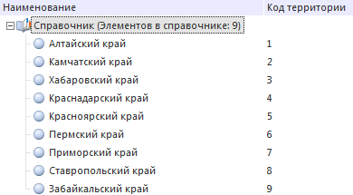
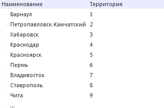

# Использование справочника для управления другим справочником

Использование справочника для управления другим справочником
-

# Использование справочника для управления другим справочником

В различных видах кубов реализовано управление параметрическими измерениями
 с помощью других измерений куба. При этом в качестве значения параметра
 передается значение выбранного атрибута измерения. Подобное поведение
 можно реализовать и на уровне справочников, используя параметры справочника
 и макрос, реализующий необходимое поведение.

Для примера создадим два справочника:

	- Справочник со списком регионов (табличный справочник НСИ, идентификатор
	 «DICT_REGION»):

	

	- Справочник со списком городов, расположенных в каждом регионе
	 (табличный справочник, идентификатор «DICT_CITY»):

	

В справочнике с городами создан дополнительный атрибут с кодами регионов,
 к которым относится каждый город. Для того чтобы настроить управление
 справочником с городами на основании выбранных регионов, выполните следующие
 действия:

	- В справочнике «DICT_CITY» создайте параметр (идентификатор «TERRITORY»)
	 с пользовательским типом данных, в параметрах отображения задайте
	 редактор - Раскрывающийся список справочника. В качестве справочника
	 выберите «DICT_REGION». Полученная строка связи должна иметь следующий
	 вид: UI="DimCombo" ID="DICT_REGION"
	 ATTRIBUTEVALUE="KEY".

	- Создайте модуль (идентификатор «M_FILTER»), в котором будет
	 управляющий макрос. Добавьте в него следующий код:

Function CheckTerritoryCode(Current: Variant; Selected: Variant): Boolean;

Var

    Arr: Array;

Begin

    //Получение списка ключей и преобразование их в массив

    Arr := Selected As Array;

    //Проверка кодов территорий

    If Arr.IndexOf(Current) <> -1 Then

        Return True

    Else

        Return False

    End If;

End Function CheckTerritoryCode;

	- На вкладке «Привязка блоков»
	 в качестве выражение фильтрации укажите созданный модуль и макрос.
	 В качестве параметров макроса укажите идентификатор атрибута с кодами
	 территорий и параметр, созданный на первом шаге: M_FILTER.CheckTerritoryCode(DICT_CITY.TerrCode,
	 :TERRITORY).

При открытии справочника «DICT_CITY» будет выдан диалог на указание
 значений параметров. В диалоге в раскрывающемся списке выберите необходимые
 регионы. После нажатия кнопки «OK» для каждого элемента справочника «DICT_CITY»
 будет вызван макрос CheckTerritoryCode.
 В макрос передается ключ территории, которой соответствует город, и массив
 ключей выделенных территорий. Если город соответствует выделенной территории,
 то для него макрос вернет значение True,
 иначе - False. В результирующем
 наборе элементов останутся только те города, для которых макрос вернул
 значение True.

См. также:

[Примеры](KeDims_Sample.htm)

		Справочная
		 система на версию 10.9
		 от 18/08/2025,
		 © ООО «ФОРСАЙТ»,
