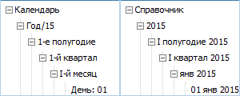

# ICalendarDimension.CalendarLevelIndex

ICalendarDimension.CalendarLevelIndex
-

# ICalendarDimension.CalendarLevelIndex

## Синтаксис

CalendarLevelIndex(Level: [DimCalendarLevel](../../Enums/DimCalendarLevel.htm)):
 Integer;

## Параметры

Level - уровень календаря.

## Описание

Свойство CalendarLevelIndex
 возвращает индекс для указанного уровня календаря.

## Пример

Для выполнения примера в репозитории предполагается наличие календарного
 справочника с идентификатором «DICT_CALEND».

	Sub UserProc;

	Var

	    MB: IMetabase;

	    MObj: IMetabaseObject;

	    CalDim: ICalendarDimension;

	    UserAttrs: ICalendarDimAttributes;

	    UserAttr: ICalendarDimAttribute;

	    LevInd: Integer;

	Begin

	    MB := MetabaseClass.Active;

	    MObj := MB.ItemById("DICT_CALEND").Edit;

	    CalDim := MObj As ICalendarDimension;

	    UserAttrs := CalDim.Attributes;

	    UserAttrs.Clear;

	    UserAttr := UserAttrs.Add;

	    LevInd := CalDim.CalendarLevelIndex(DimCalendarLevel.Root);

	    UserAttr.Format(LevInd) := "Календарь";

	    LevInd := CalDim.CalendarLevelIndex(DimCalendarLevel.Year);

	    UserAttr.Format(LevInd) := "Год/YY";

	    LevInd := CalDim.CalendarLevelIndex(DimCalendarLevel.HalfYear);

	    UserAttr.Format(LevInd) := "SA-е полугодие";

	    LevInd := CalDim.CalendarLevelIndex(DimCalendarLevel.Quarter);

	    UserAttr.Format(LevInd) := "QA-й квартал";

	    LevInd := CalDim.CalendarLevelIndex(DimCalendarLevel.Month);

	    UserAttr.Format(LevInd) := "ML-й месяц";

	    LevInd := CalDim.CalendarLevelIndex(DimCalendarLevel.Day);

	    UserAttr.Format(LevInd) := "День: DD";

	    UserAttrs.Name := UserAttr;

	    MObj.Save;

	End Sub UserProc;

После выполнения примера в календарный справочник будет добавлен новый
 пользовательский атрибут. Для элементов всех уровней будут заданы различные
 форматы наименования элементов (изображение слева), которые отличаются
 от стандартных (изображение справа):

См. также:

[ICalendarDimension](ICalendarDimension.htm)

		Справочная
		 система на версию 10.9
		 от 18/08/2025,
		 © ООО «ФОРСАЙТ»,
