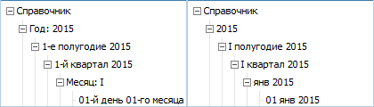

# ICalendarDimension.NameAttrFormat

ICalendarDimension.NameAttrFormat
-

# ICalendarDimension.NameAttrFormat

## Синтаксис

NameAttrFormat(LevelIndex: Integer): String;

## Параметры

LevelIndex
 - индекс уровня, для которого необходимо задать формат представления наименования
 элементов.

## Описание

Свойство NameAttrFormat определяет
 формат представления наименования элементов указанного уровня. Строка
 формата состоит из элементов формата. Каждый элемент возвращает часть
 значения, например, это может быть месяц. Основные элементы формата, которые
 допустимы описаны в таблице:

		 Элемент формата
		 Краткое описание

		 DD
		 День месяца (01 - 31).

		 WW
		 Номер недели в арабских цифрах (1 - n).

		 ML
		 Номер месяца в римских цифрах (I - XII).

		 MM (MA)
		 Номер месяца в арабских цифрах (1 - 12).

		 Mon
		 Сокращенное наименование месяца (янв - дек).

		 QL
		 Номер квартала в римских цифрах (I - IV).

		 QA
		 Номер квартала в арабских цифрах (1 - 4).

		 SL
		 Номер полугодия в римских цифрах (1, 2).

		 SA
		 Номер полугодия в арабских цифрах (I, II).

		 YY
		 Две последние цифры года.

		 YYYY
		 Год в четырехзначном формате.

Кроме того в шаблоне можно использовать любые слова или символы. Например:
 «SA-е полугодие».

Примечание.
 Элементы форматов чувствительны к регистру. При формировании формата используйте
 коды, указанные в таблице.

## Пример

Для выполнения примера в репозитории предполагается наличие календарного
 справочника с идентификатором «D_CALENDAR».

			Sub Main;

Var

    MB: IMetabase;

    MObj: IMetabaseObject;

    CalDim: ICalendarDimension;

    LevInd: Integer;

Begin

    MB := MetabaseClass.Active;

    MObj := MB.ItemById("D_CALENDAR").Edit;

    CalDim := MObj As ICalendarDimension;

    LevInd := CalDim.CalendarLevelIndex(DimCalendarLevel.Year);

    CalDim.NameAttrFormat(LevInd) := "Год: YYYY";

    LevInd := CalDim.CalendarLevelIndex(DimCalendarLevel.HalfYear);

    CalDim.NameAttrFormat(LevInd) := "SA-е полугодие YYYY";

    LevInd := CalDim.CalendarLevelIndex(DimCalendarLevel.Quarter);

    CalDim.NameAttrFormat(LevInd) := "QA-й квартал YYYY";

    LevInd := CalDim.CalendarLevelIndex(DimCalendarLevel.Month);

    CalDim.NameAttrFormat(LevInd) := "Месяц: ML";

    LevInd := CalDim.CalendarLevelIndex(DimCalendarLevel.Day);

    CalDim.NameAttrFormat(LevInd) := "DD-й день MA-го месяца";

    MObj.Save;

End Sub Main;

При выполнении примера в календарном справочнике будет задан различный
 формат представления наименований элементов на разных уровнях (изображение
 слева), который отличается от стандартного (изображение справа):

См. также:

[ICalendarDimension](ICalendarDimension.htm)

		Справочная
		 система на версию 10.9
		 от 18/08/2025,
		 © ООО «ФОРСАЙТ»,
