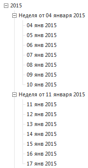

# ICalendarWeekLevel.FirstDayOfWeek

ICalendarWeekLevel.FirstDayOfWeek
-

# ICalendarWeekLevel.FirstDayOfWeek

## Синтаксис

FirstDayOfWeek: [DayOfWeekSet](../../Enums/DayOfWeekSet.htm);

## Описание

Свойство FirstDayOfWeek определяет
 первый день недели.

## Пример

			Sub UserProc;

Var

    MB: IMetabase;

    CrInfo: IMetabaseObjectCreateInfo;

    ClnDim: ICalendarDimension;

    WeekLvl: ICalendarWeekLevel;

Begin

    MB := MetabaseClass.Active;

    // Создание календарного справочника

    CrInfo := MB.CreateCreateInfo;

    CrInfo.ClassID := MetabaseObjectClass.KE_CLASS_CLNDIM;

    CrInfo.Id := "CALENDAR_DIM";

    CrInfo.Name := "Календарный справочник";

    CrInfo.Parent := MB.Root;

    ClnDim := MB.CreateObject(CrInfo).Edit As ICalendarDimension;

    // Настройка параметров календарного справочника

    ClnDim.Hierarchy := 3;

    ClnDim.StartYear := 2015;

    ClnDim.EndYear := 2016;

    ClnDim.IncludeYears := True;

    ClnDim.IncludeWeek := True;

    ClnDim.IncludeDays := True;

    WeekLvl := ClnDim.WeekLevel;

    WeekLvl.FirstDayOfWeek := DayOfWeekSet.Sunday;

    (ClnDim As IMetabaseObject).Save;

End Sub UserProc;

При выполнении примера в корневом каталоге репозитория будет создан
 календарный справочник с идентификатором «CALENDAR_DIM». В иерархии справочника
 будут присутствовать уровни «Годы», «Недели» и «Дни». Первым днем уровня
 «Недели» будет воскресение:

См. также:

[ICalendarWeekLevel](ICalendarWeekLevel.htm)

		Справочная
		 система на версию 10.9
		 от 18/08/2025,
		 © ООО «ФОРСАЙТ»,
