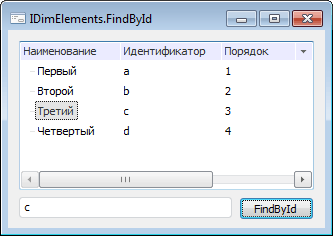

# IDimElements.FindById

IDimElements.FindById
-

# IDimElements.FindById

## Синтаксис

FindById(Id: String): Integer;

## Параметры

Id. Значение
 атрибута, которое необходимо найти.

## Описание

Метод FindById осуществляет
 поиск элемента по значению атрибута, назначение которого - Идентификатор.

## Комментарии

В различных справочниках атрибут с назначением Идентификатор может иметь
 различный тип данных. Данный метод осуществляет поиск по строковым значениям,
 поэтому перед поиском необходимо осуществить соответствующее преобразование
 искомых значений. Если значение атрибута найдено, то метод возвращает
 индекс соответствующего элемента, иначе «-1».

## Пример

Для выполнения примера предполагается наличие формы. На форме расположены
 следующие компоненты: [Button](UiDevEnv.chm::/02_Components_constructor_forms/01_Standart_Components/Button.htm),
 [EditBox](UiDevEnv.chm::/02_Components_constructor_forms/01_Standart_Components/EditBox.htm),
 [UiDimension](UiDevEnv.chm::/02_Components_constructor_forms/03_Components_of_the_access_to_data/UiDimension.htm)[UiDimension](../../../uidevenv/02_components_constructor_forms/03_components_of_the_access_to_data/uidimension.htm),
 [DimensionTree](UiDevEnv.chm::/02_Components_constructor_forms/03_Components_of_the_access_to_data/DimensionTree.htm).
 Для кнопки описано событие [OnClick](ModForms.chm::/Interface/IControl/IControl.OnClick.htm).
 Компонент [UiDimension](UiDevEnv.chm::/02_Components_constructor_forms/03_Components_of_the_access_to_data/UiDimension.htm)[UiDimension](../../../uidevenv/02_components_constructor_forms/03_components_of_the_access_to_data/uidimension.htm)
 подключен к справочника репозитория. Атрибут справочника с назначением
 Идентификатор имеет строковый тип.

			Class UserForm: Form

    Button1: Button;

    EditBox1: EditBox;

    UiDimension1: UiDimension;

    DimensionTree1: DimensionTree;

    Sub Button1OnClick(Sender: Object; Args: IMouseEventArgs);

    Var

        Inst: IDimInstance;

        Elem: IDimElements;

        i: Integer;

    Begin

        Inst := UiDimension1.DimInstance;

        Elem := Inst.Elements;

        i := Elem.FindById(EditBox1.Text);

        If i <> -1 Then

            DimensionTree1.SetFocus;

            DimensionTree1.Selection.SelectElement(i, False);

        End If;

    End Sub Button1OnClick;

End Class UserForm;

После запуска формы в компоненте «EditBox1» необходимо ввести значение,
 которое будет искаться по значениям атрибута с назначением Идентификатор.
 При нажатии на кнопку будет осуществлен поиск. Если элемент найден, то
 фокус будет передан компоненту «DimensionTree1» и найденный элемент будет
 добавлен в отметку.

См. также:

[IDimElements](IDimElements.htm)

		Справочная
		 система на версию 10.9
		 от 18/08/2025,
		 © ООО «ФОРСАЙТ»,
