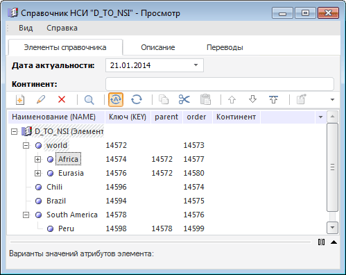

# IDimSelection.ToString

IDimSelection.ToString
-

# IDimSelection.ToString

## Синтаксис

ToString(

[Format: String = "";]

[Separator: String =
 ",";]

[CollectRanges: Boolean
 = False]): String;

## Параметры

Format - необязательный параметр,
 определяющий идентификатор атрибута справочника, по значениям которого
 необходимо организовать отметку. По умолчанию значение отметки формируется
 из значений атрибута Наименование элементов.

Separator - необязательный
 параметр, определяющий разделитель, используемый при преобразовании. По
 умолчанию используется - ",".

CollectRanges - необязательный
 параметр, определяющий будут ли числовые значения атрибутов группироваться
 в диапазоны, разделенные знаком "-". По умолчанию установлено
 значение False - группировка не
 производится.

## Описание

Метод ToString формирует значение
 отметки в строковом виде в соответствии с установленными параметрами.

## Комментарии

Для добавления всех элементов справочника в отметку используйте метод
 [IDimSelection.SelectAll](IDimSelection.SelectAll.htm).

## Пример

Для выполнения примера, предполагается наличие справочника НСИ с ключом
 «6443», содержащего атрибуты с идентификаторами «KEY», «NAME»:

Добавьте ссылки на системные сборки «Metabase», «Dimensions».

			Sub UserProc;

Var

    MB: IMetabase;

    Dimen: IDimInstance;

    Selection: IDimSelection;

Begin

    MB := MetabaseClass.Active;

    Dimen := MB.Item(6443).Open(Null) As IDimInstance;

    Selection := Dimen.CreateSelection;

    // добавим все элементы в отметку:

    Selection.SelectAll;

    // Названия элементов:

    Debug.WriteLine(Selection.ToString(Format := "NAME", Separator := ", ", CollectRanges := True));

    // Ключи элементов:

    Debug.WriteLine(Selection.ToString(Format := "KEY", Separator := " | ", CollectRanges := False));

End Sub UserProc;

После выполнения примера в окно консоли будут выведены наименования
 и ключи элементов.

См. также:

[IDimSelection](IDimSelection.htm)

		Справочная
		 система на версию 10.9
		 от 18/08/2025,
		 © ООО «ФОРСАЙТ»,
