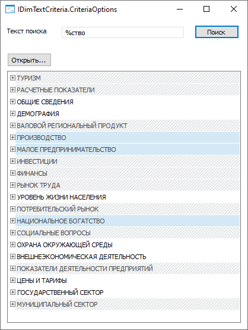

# IDimTextCriteria.CriteriaOptions

IDimTextCriteria.CriteriaOptions
-

# IDimTextCriteria.CriteriaOptions

## Синтаксис

CriteriaOptions: [TextCriteriaOptions](../../Enums/TextCriteriaOptions.htm);

## Описание

Свойство CriteriaOptions определяет
 параметры поиска.

## Пример

Для выполнения примера разместите на форме компонент Label с наименованием
 Label1, EditBox с наименованием EditBox1, два компонента Button с наименованиями
 Button1, Button2, компонент DimensionTree с наименованием DimensionTree1,
 UiDimension с наименованием UiDimension1 и MetabaseOpenDialog с наименованием
 MetabaseOpenDialog1.

Добавьте ссылки на системные сборки: Dimensions, Metabase.

	Class TestForm: Form

	    EditBox1: EditBox;

	    Button1: Button;

	    Button2: Button;

	    Label1: Label;

	    UiDimension1: UiDimension;

	    MetabaseOpenDialog1: MetabaseOpenDialog;

	    DimensionTree1: DimensionTree;

	    Function Search(DimInst: IDimInstance; SearchStr: String): IDimSelection;

	    Var

	        Result: IDimSelection;

	        TextCriteria: IDimTextCriteria;

	        OrmManager: IDimOrmManager;

	    Begin

	        If IsNull(DimInst) Or SearchStr.IsEmpty Then

	            Return Result;

	        End If;

	        TextCriteria := New DimTextCriteria.Create;

	        TextCriteria.CriteriaOptions := TextCriteriaOptions.LikeText Or TextCriteriaOptions.SearchStringAttributes;

	        TextCriteria.Text := SearchStr;

	        Result := DimInst.CreateSelection;

	        OrmManager := New DimOrmManager.Create;

	        OrmManager.CreateCondition(DimInst.Dimension, TextCriteria).SelectElements(Result);

	        Return Result;

	    End Function Search;

	    Sub Button1OnClick(Sender: Object; Args: IMouseEventArgs);

	    Begin

	        UiDimension1.Selection := Search(UiDimension1.DimInstance, EditBox1.Text);

	    End Sub Button1OnClick;

	    Sub Button2OnClick(Sender: Object; Args: IMouseEventArgs);

	    Begin

	        If MetabaseOpenDialog1.Execute(Self) Then

	            UiDimension1.Active := False;

	            UiDimension1.Dimension := MetabaseOpenDialog1.Object.Bind As IDimensionModel;

	            UiDimension1.Active := True;

	        End If;

	    End Sub Button2OnClick;

	End Class TestForm;

После запуска формы нажмите кнопку «Открыть» и выберите справочник.
 В результате в форме отобразится иерархический список элементов справочника.
 Введите текст для поиска и нажмите кнопку «Поиск». В результате отметка
 в списках будет изменена: будут отмечены только те элементы, которые соответствуют
 критерию поиска.

См. также:

[IDimTextCriteria](IDimTextCriteria.htm)

		Справочная
		 система на версию 10.9
		 от 18/08/2025,
		 © ООО «ФОРСАЙТ»,
