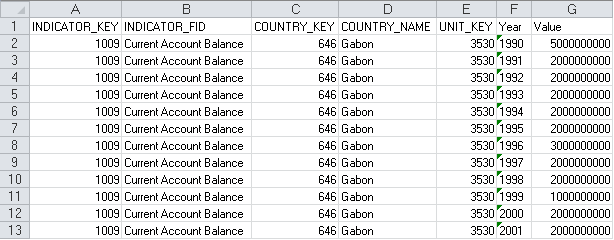

# IDtExcelProviderEx.File

IDtExcelProviderEx.File
-

# IDtExcelProviderEx.File

## Синтаксис

File: String;

## Описание

Свойство File определяет полное
 наименование файла источника данных.

## Комментарии

Наименование листа, на котором располагаются данные, определяет свойство
 [IDtExcelProviderEx.Sheet](IDtExcelProviderEx.Sheet.htm).

## Пример

Для выполнения примера предполагается наличие файла C:\Data.xlsx.

Добавьте ссылку на системную сборку Dt.

[Фрагмент файла
 «C:\Data.xlsx», для которого написан пример](javascript:TextPopup(this))

	

	Sub UserProc;

	Var

	    ExcelProviderEx: IDtExcelProviderEx;

	    Fields: IDtFieldDefinitions;

	    Field: IDtFieldDefinition;

	    FieldName, Val: String;

	    v: Array;

	    i: Integer;

	    s: double;

	    rez: boolean;

	Begin

	    ExcelProviderEx := New DtExcelProviderEx.Create;

	    ExcelProviderEx.File := "C:\Data.xlsx";

	    ExcelProviderEx.Sheet := "Sheet1";

	    ExcelProviderEx.HasHeader := True;

	    ExcelProviderEx.HeaderRow := 0;

	    ExcelProviderEx.AutoFillFieldsMode := DtAutoFillFieldsMode.DataRow;

	    ExcelProviderEx.TypeGuessRows := 5;

	    ExcelProviderEx.Format := "XLSX";

	    ExcelProviderEx.DataRow := 1;

	    ExcelProviderEx.Open;

	    Fields := ExcelProviderEx.Fields;

	    Debug.WriteLine("Количество полей: " + Fields.Count.ToString);

	    FieldName := "Наименования полей: ";

	    // Формируем строку с наименованиями полей

	    For Each Field In Fields Do

	        FieldName := FieldName + Field.Name + "; "

	    End For;

	    Debug.WriteLine(FieldName);

	    Debug.WriteLine("Данные:");

	    While Not ExcelProviderEx.Eof Do

	        Val := "";

	        ExcelProviderEx.Fetch(v);

	        // Формируем строку с данными

	        For i := 0 To v.Length - 1 Do

	            rez := CultureInfo.Current.TryParseDouble(v[i], s);

	            If Not rez Then

	                val := val + v[i] + "; ";

	            Else

	                val := val + s.ToString + "; ";

	            End If;

	        End For;

	        Debug.WriteLine(val);

	    End While;

	    ExcelProviderEx.Close;

	End Sub UserProc;

После выполнения примера в окно консоли будут выведены данные, считанные
 из указанного файла.

См. также:

[IDtExcelProviderEx](IDtExcelProviderEx.htm)

		Справочная
		 система на версию 10.9
		 от 18/08/2025,
		 © ООО «ФОРСАЙТ»,
