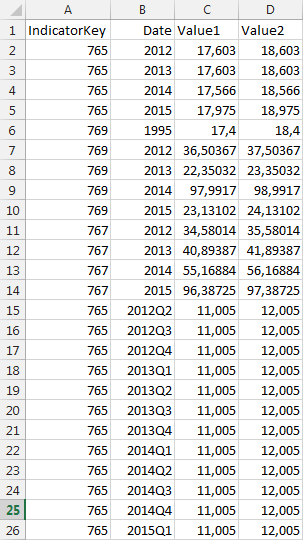

# IDtFieldDefinition.Expression

IDtFieldDefinition.Expression
-

# IDtFieldDefinition.Expression

## Синтаксис

Expression: [IExpression](ForeSys.chm::/Interface/IExpression/IExpression.htm);

## Описание

Свойство Expression определяет
 выражение для расчета значения вычисляемого поля.

## Комментарии

Корректная работа вычисляемого поля возможна, если для приёмника/источника
 данных указан репозиторий, то есть задано свойство [IDtObject.Metabase](../IDtObject/IDtObject.Metabase.htm).

## Пример

Для выполнения примера репозитории предполагается наличие базы данных
 временных рядов с идентификатором TSDB_IMPORT. Данная база данных временных
 рядов должна содержать атрибуты временных рядов с идентификаторами CITY
 и INDICATOR. Данные атрибуты должны являться ссылками на справочники.

В файловой системе предполагается наличие файла «C:\Import.xlsx» содержащего
 лист с данными с наименованием «Лист1».

Добавьте ссылки на системные сборки: Cubes, Dal, Db, Dimensions, Dt,
 Metabase, Rds.

[Содержимое листа
 «Лист1» в файле «C:\Import.xlsx»](javascript:TextPopup(this))

	

	Sub UserProc;

	Var

	    mb: IMetabase;

	    desc: IMetabaseObjectDescriptor;

	    importObject: IImportRequestDefinition;

	    createInfo: IMetabaseObjectCreateInfo;

	    params: IImportRequestProviderParams;

	    importBinding: ICubeMetaLoaderBinding;

	    rdsDictionary: IRdsDictionary;

	    excel: IDtExcelProviderEx;

	    instance: IImportRequestInstance;

	    rub: IRubricator;

	    Atts: IMetaAttributes;

	    Fields: IDtFieldDefinitions;

	    FieldDef: IDtFieldDefinition;

	Begin

	    // Получаем репозиторий

	    mb := MetabaseClass.Active;

	    // Получаем базу данных временных рядов

	    desc := mb.ItemById("TSDB_IMPORT");

	    rub := desc.Bind As IRubricator;

	    // Получаем атрибуты временных рядов

	    Atts := rub.Facts.Attributes;

	    // Создаем объект импорта

	    createInfo := mb.CreateCreateInfo;

	    createInfo.ClassId := MetabaseObjectClass.KE_CLASS_IMPORTREQUEST;

	    createInfo.Name := "Импорт с вычисляемым полем";

	    createInfo.KeepEdit := True;

	    createInfo.Permanent := False;

	    createInfo.Parent := desc;

	    // Создаем объект для импорта временных рядов

	    importObject := mb.CreateObject(createInfo) As IImportRequestDefinition;

	    // Указываем тип источника

	    importObject.SourceType := ImportRequestSourceType.Provider;

	    // Указываем базу данных временных рядов, в которую будут импортироваться данные

	    importObject.DestinationRubricator := desc.Bind As IRubricator;

	    // Задаем параметры импорта

	    params := importObject.ProviderParams;

	    // Указываем, что ошибки при импорте недопустимы

	    (params As ICubeMetaLoader).Log.MaxErrors := -1;

	    // Указываем параметры импорта атрибута «CITY»

	    desc := Atts.FindById("CITY").ValuesObject;

	    rdsDictionary := desc.Bind As IRdsDictionary;

	    importBinding := params.Bindings.Add;

	    importBinding.BindingType := CubeMetaLoaderBindingType.Attribute;

	    importBinding.Attribute := "CITY";

	    importBinding.Dimension := rdsDictionary As IDimensionModel;

	    importBinding.KeyAttribute := rdsDictionary.Attributes.Key.Id;

	    importBinding.Index := rdsDictionary.UniqueKeys.Item(0).Id;

	    // Значение атрибута будет задано постоянным значением

	    importBinding.FieldType := CubeMetaLoaderFieldType.ConstValue;

	    // Значение будет браться из справочника, на который ссылается данный атрибут

	    importBinding.FieldValue := (rdsDictionary.Open(Null) As IDimInstance).Elements.Id(0);

	    // Указываем параметры импорта атрибута «INDICATOR»

	    desc := Atts.FindById("INDICATOR").ValuesObject;

	    rdsDictionary := desc.Bind As IRdsDictionary;

	    importBinding := params.Bindings.Add;

	    importBinding.BindingType := CubeMetaLoaderBindingType.Attribute;

	    importBinding.Attribute := "INDICATOR";

	    importBinding.Dimension := rdsDictionary As IDimensionModel;

	    importBinding.KeyAttribute := rdsDictionary.Attributes.Key.Id;

	    importBinding.Index := rdsDictionary.UniqueKeys.Item(0).Id;

	    // Значение будет браться из поля источника данных

	    importBinding.FieldType := CubeMetaLoaderFieldType.Index;

	    // Указываем индекс поля, из которого будут браться данные

	    importBinding.Field := "0";

	    // Указываем параметры импорта атрибута «UNIT»

	    desc := Atts.FindById("UNIT").ValuesObject;

	    rdsDictionary := desc.Bind As IRdsDictionary;

	    importBinding := params.Bindings.Add;

	    importBinding.BindingType := CubeMetaLoaderBindingType.Unit;

	    importBinding.Dimension := rdsDictionary As IDimensionModel;

	    importBinding.KeyAttribute := rdsDictionary.Attributes.Key.Id;

	    importBinding.Index := rdsDictionary.UniqueKeys.Item(0).Id;

	    // Значение атрибута будет задано постоянным значением

	    importBinding.FieldType := CubeMetaLoaderFieldType.ConstValue;

	    // Значение будет браться из справочника, на который ссылается данный атрибут

	    importBinding.FieldValue := (rdsDictionary.Open(Null) As IDimInstance).Elements.Id(0);

	    // Задаем параметры экспорта календаря

	    importBinding := params.Bindings.Add;

	    importBinding.BindingType := CubeMetaLoaderBindingType.Calendar;

	    importBinding.ByColumns := False;

	    // Задаем формат календарных данных

	    importBinding.CalendarDateFormatEx(DimCalendarLevel.Year) := "$Year$";

	    importBinding.CalendarDateFormatEx(DimCalendarLevel.HalfYear) := "$Year$A$Halfyear$";

	    importBinding.CalendarDateFormatEx(DimCalendarLevel.Quarter) := "$Year$Q$Quarter$";

	    importBinding.CalendarOptions.Levels := DimCalendarLevelSet.Year Or DimCalendarLevelSet.HalfYear Or DimCalendarLevelSet.Quarter;

	    // Значение будет браться из поля источника данных

	    importBinding.FieldType := CubeMetaLoaderFieldType.Index;

	    // Указываем индекс поля, из которого будут браться данные

	    importBinding.Field := "1";

	    // Указываем параметры экспорта значений временных рядов

	    importBinding := params.Bindings.Add;

	    importBinding.BindingType := CubeMetaLoaderBindingType.Value;

	    // Значение будет браться из поля источника данных

	    importBinding.FieldType := CubeMetaLoaderFieldType.Index;

	    // Указываем индекс поля, из которого будут браться данные

	    importBinding.Field := "4";

	    // Создаем объект для импорта из Excel

	    excel := New DtExcelProviderEx.Create;

	    // Указываем параметры исходного файла

	    excel.File := "C:\Import.xlsx";

	    excel.Sheet := "Лист1";

	    excel.Format := "XLSX";

	    excel.HasHeader := True;

	    excel.Metabase := MB;

	    // Загружаем поля из файла-источника

	    excel.FieldsFromFile;

	    // Получаем загруженные поля

	    Fields := excel.Fields;

	    // Указываем типы данных для полей с индексом 2 и 3

	    FieldDef := Fields.Item(2);

	    FieldDef.DataType := DbDataType.Float;

	    FieldDef := Fields.Item(3);

	    FieldDef.DataType := DbDataType.Float;

	    // Добавляем новое вычисляемое поле,

	    // из которого будут загружаться значения временных рядов

	    FieldDef := Fields.Add;

	    // Задаем выражение для расчета значения поля

	    FieldDef.Expression.AsString := Fields.Item(2).Name + '*' + Fields.Item(3).Name;

	    // Указываем созданный объект для импорта из Excel в качестве источника данных для импорта

	    importObject.ProviderParams.Provider := excel As IDatasetDataProvider;

	    // Импортируем данные

	    instance := (importObject As IMetabaseObject).Open(Null) As IImportRequestInstance;

	    instance.LoadData;

	End Sub UserProc;

В результате выполнения примера в базу данных временных рядов будут
 загружены данные из файла «C:\Import.xlsx». Значения временных полей будут
 рассчитаны как произведение полей «Value1» и «Value2» из данного файла.

См. также:

[IDtFieldDefinition](IDtFieldDefinition.htm)

		Справочная
		 система на версию 10.9
		 от 18/08/2025,
		 © ООО «ФОРСАЙТ»,
