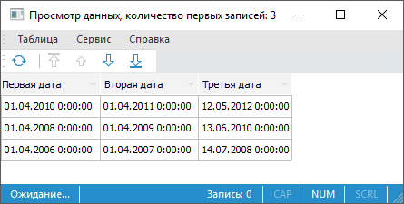

# IDtObjectDataFormat.UsePredefinedDateFormats

IDtObjectDataFormat.UsePredefinedDateFormats
-

# IDtObjectDataFormat.UsePredefinedDateFormats

## Синтаксис

UsePredefinedDateFormats: Boolean;

## Описание

Свойство UsePredefinedDateFormats
 определяет использование предопределения формата даты поля, согласно заданному
 формату через свойство [IDtFieldDefinition.DateFormat](../IDtFieldDefinition/IDtFieldDefinition.DateFormat.htm).

## Комментарии

Допустимые значения свойства:

	- False (по умолчанию).
	 Предопределение формата даты поля не используется.

	- True. Использовать предопределение
	 формата даты поля.

## Пример

Для выполнения примера предполагается наличие в репозитории задачи ETL
 с идентификатором «ELT». Также имеется текстовый файл «Data_Import.txt»,
 располагающийся в папке «C:\Temp\Data_Import».

[Содержимое файла](javascript:TextPopup(this))

	Первая дата, Вторая дата, Третья дата

	2010A2,2011M2,20120512

	2008A2,2009M2,20100613

	2006A2,2007M2,20080714

Добавьте ссылки на системные сборки: Andy, Dal, Drawing, Dt, Etl, Forms
 и Metabase.

					Sub UserProc;

		Var

		    MB: IMetabase;

		    EtlTask: IEtlTask;

		    EtlProvider: IEtlPlainDataProvider;

		    TextProvider: IDtTextProvider;

		    DateFormat: IDtObjectDataFormat;

		    WxProvider: IWxRectangle;

		    WxETLProvider: IWxETLObject;

		Begin

		    MB := MetabaseClass.Active;

		    EtlTask := MB.ItemById("ETL").Edit As IEtlTask;

		    //Создание объекта "Импорт из текста"

		    EtlProvider := EtlTask.Create(EtlObjectType.PlainDataTextProvider) As IEtlPlainDataProvider;

		    EtlProvider := EtlProvider.Edit;

		    EtlProvider.Id := "Data_Import";

		    EtlProvider.Name := "Data_Import";

		    EtlProvider.Description := "Data_Import";

		    //Настройка источника данных

		    TextProvider := EtlProvider.Provider As IDtTextProvider;

		    TextProvider.File := "C:\Temp\Data_Import.txt";

		    DateFormat := TextProvider.StringDataFormat;

		    DateFormat.UsePredefinedDateFormats := True;

		    TextProvider.FieldsFromFile;

		    TextProvider.Fields.item(0).DateFormat := "$Year$A$Quarter$";

		    TextProvider.Fields.item(0).DataType := dbdatatype.Date;

		    TextProvider.Fields.item(1).DateFormat := "$Year$M$Quarter$";

		    TextProvider.Fields.item(1).DataType := dbdatatype.Date;

		    TextProvider.Fields.item(2).DateFormat := "$Year$$Month$$Day$";

		    TextProvider.Fields.item(2).DataType := dbdatatype.Date;

		    EtlProvider.FillDefault;

		    //Сохраняем источник

		    EtlProvider.Save;

		    //Создание визуального объекта

		    WxProvider := EtlTask.Workspace.CreateRectangle;

		    WxETLProvider := New WxETLObject.Create;

		    WxETLProvider.ETLObject := EtlProvider;

		    WxProvider.Style.TextPosition := WxTextPosition.Bottom;

		    WxProvider.Style.PictureMarginTop := -10;

		    WxProvider.PinPosition := New GxPointF.Create(50, 50);

		    WxProvider.Extension := WxETLProvider As IWxShapeExtension;

		    //Сохранение задачи Etl

		    (EtlTask As IMetabaseObject).Save;

		End Sub UserProc;

При выполнении примера в задаче ETL будет создан
 новый источник данных - Импорт из текста. Источник будет связан с указанным
 текстовым файлом, для разбора дат в различных полях будут предопределены
 различные форматы. В результате импорта будут получены следующие значения:

См. также:

[IDtObjectDataFormat](idtobjectdataformat.htm)

		Справочная
		 система на версию 10.9
		 от 18/08/2025,
		 © ООО «ФОРСАЙТ»,
