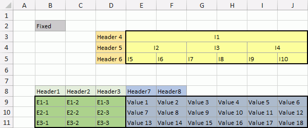

# IDtUnpivotProvider.Provider

IDtUnpivotProvider.Provider
-

# IDtUnpivotProvider.Provider

## Синтаксис

Provider: [IDtProvider](../IDtProvider/IDtProvider.htm);

## Описание

Свойство Provider определяет
 табличный источник данных, содержащий области.

## Комментарии

Остальные свойства данного интерфейса предназначены для задания параметров
 областей, содержащихся в источнике данных.

## Пример

Для выполнения примера в файловой системе предполагается наличие файла
 «C:\Data.xls», содержащего данные, разделенные на области. Данные в файле
 расположены на листе с наименованием «Лист1». Также в файловой системе
 должен быть файл «C:\DataTransform.txt», в который будут экспортированы
 данные из «C:\Data.xls».

Добавьте ссылку на системную сборку Dt.

[Содержимое файла
 Data.xls](javascript:TextPopup(this))

	

	Sub UserProc;

	Var

	    XlsProvider: IDtExcelProvider;

	    UnpivotProvider: IDtUnpivotProvider;

	    FixCells: Array Of Integer;

	    TextConsumer: IDtTextConsumer;

	    ProviderFields, ConsumerFields: IDtFieldDefinitions;

	    i, Row, Col: integer;

	    Field, NewField: IDtFieldDefinition;

	Begin

	    // Создаем объект для импорта данных из файлов Microsoft Excel

	    XlsProvider := New DtExcelProvider.Create;

	    // Указываем файл с данными

	    XlsProvider.File := "C:\Data.xls";

	    // Указываем версию драйвера Microsoft Excel

	    XlsProvider.DriverVersion := "Excel 8.0";

	    // Задаем запрос для выборки данных

	    XlsProvider.Query := "Select * From [Лист1$]";

	    // Создаем объект для работы с табличным источником, разделенным на области

	    UnpivotProvider := New DtUnpivotProvider.Create;

	    // Задаем файл Microsoft Excel в качестве табличного источника данных

	    UnpivotProvider.Provider := XlsProvider;

	    // Задаем параметры области A4

	    UnpivotProvider.DataBottom := 10;

	    UnpivotProvider.DataRight := 9;

	    UnpivotProvider.DataTop := 7;

	    UnpivotProvider.DataWidth := 3;

	    // Задаем параметры области A2

	    UnpivotProvider.HeadBottom := 4;

	    UnpivotProvider.HeadColumn := 1;

	    UnpivotProvider.HeadTop := 1;

	    // Задаем параметры области A3

	    UnpivotProvider.LeftBegin := 1;

	    UnpivotProvider.LeftEnd := 3;

	    // Задаем фиксированные ячейки

	    FixCells := New Integer[2, 1];

	    FixCells[0, 0] := 1;

	    FixCells[1, 0] := 1;

	    UnpivotProvider.FixedCells := FixCells;

	    // Получаем поля из источника данных

	    UnpivotProvider.FieldsFromFile;

	    // Открываем источник данных

	    UnpivotProvider.Open;

	    // Создаем объект для экспорта данных в текстовый файл

	    TextConsumer := New DtTextConsumer.Create;

	    // Указываем выходной файл

	    TextConsumer.File := "C:\DataTransform.txt";

	    // Задаем параметры экспорта

	    TextConsumer.WriteHeader := True;

	    // Задаем экспортируемые поля

	    ProviderFields := UnpivotProvider.Fields;

	    ConsumerFields := TextConsumer.Fields;

	    For i := 0 To ProviderFields.Count - 1 Do

	        Field := ProviderFields.Item(i);

	        NewField := ConsumerFields.Add;

	        NewField.DataType := Field.DataType;

	        NewField.Name := Field.Name;

	        NewField.Precision := Field.Precision;

	        NewField.Size := Field.Size;

	    End For;

	    // Открываем и очищаем файл экспорта

	    TextConsumer.Open;

	    TextConsumer.Clear;

	    // Выполняем экспорт из табличного источника данных, разделенного на области

	    TextConsumer.PutProvider(UnpivotProvider);

	    // Получаем соответствие ячейки в итоговом файле и ячейки в исходном файле

	    UnpivotProvider.ToSource(1, 0, Row, Col);

	    Debug.WriteLine("В итоговом файле ячейке в строке с индексом 1 и " +

	        "столбце с индексом 0 в исходном файле соответствует ячейка в строке с индексом "

	        + Row.ToString + " и столбце с индексом " + Col.ToString);

	    // Получаем соответствие ячейки в исходном файле и ячейки в итоговом файле

	    UnpivotProvider.FromSource(7, 1, Row, Col);

	    Debug.WriteLine("В исходном файле ячейке в строке с индексом 7 и " +

	        "столбце с индексом 1 в итоговом файле соответствует ячейка в строке с индексом "

	        + Row.ToString + " и столбце с индексом " + Col.ToString);

	    // Закрываем источник данных и экспортируемый файл

	    UnpivotProvider.Close;

	    TextConsumer.Close;

	End Sub UserProc;

В результате выполнения примера данные из файла «C:\Data.xls» будут
 преобразованы и экспортированы в файл «C:\DataTransform.txt».

См. также:

[IDtUnpivotProvider](IDtUnpivotProvider.htm)

		Справочная
		 система на версию 10.9
		 от 18/08/2025,
		 © ООО «ФОРСАЙТ»,
