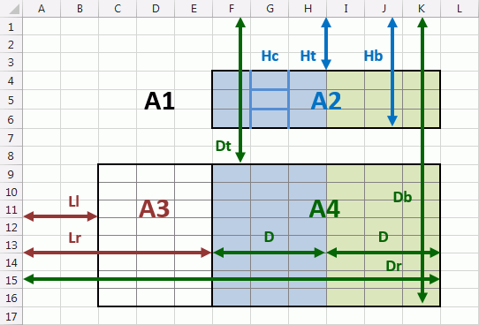
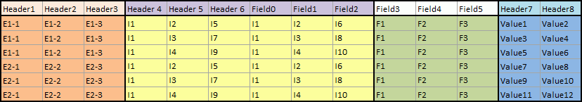
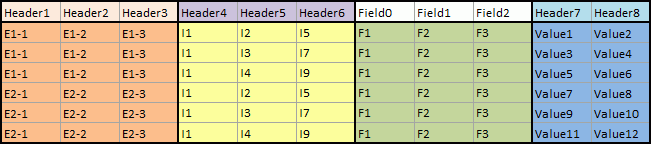
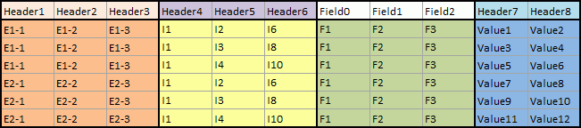

# IDtUnpivotProvider

IDtUnpivotProvider
-

# IDtUnpivotProvider

Сборка: Dt;

## Описание

Интерфейс IDtUnpivotProvider
 предназначен для работы с табличным источником данных, разделенным на
 области.

## Иерархия наследования

           [IDtObject](../IDtObject/IDtObject.htm)

           [IDtProvider](../IDtProvider/IDtProvider.htm)

           IDtUnpivotProvider

## Комментарии

Интерфейс IDtUnpivotProvider
 позволяет получить данные из табличного источника данных, разделенного
 на следующие области:

Стрелками на схеме показано какие размеры могут задаваться, цветом -
 для каких областей.

Условные обозначения:

	- A1, A2,
	 A3, A4.
	 Формальные области, на которые могут быть разделены данные в табличном
	 источнике данных;

	- A1. Уголок таблицы.
	 Размеры уголка не задаются;

	- A2. Область данных.
	 Могут быть заданы:

		- Ht. Строка, определяющий
		 верхнюю границу области;

		- Hb. Строка, определяющий
		 нижнюю границу области;

		- Hc. Столбец в области
		 A2, соответствующий блоку
		 данных, по которому будут формироваться столбцы результирующей
		 таблицы. На схеме выбран второй столбец;

	- А3. Область данных.
	 Могут быть заданы:

		- Ll. Столбец, определяющий
		 левую границу области;

		- Lr. Столбец, определяющий
		 правую границу области;

	- A4. Область данных.
	 Могут быть заданы:

		- Dt. Строка, определяющая
		 начало данных. Начиная с данной строки будут считываться данные
		 в результирующую таблицу;

		- Dr. Столбец, определяющий
		 правую границу области;

		- Db. Строка, определяющая
		 нижнюю границу области;

		- D. Количество столбцов
		 в блоке данных. Относительно данного блока будет происходить формирование
		 столбцов и заполнение строк в результирующей таблице. На схеме
		 указано два блока данных размером три столбца.

Примечание.
 Между А3 и A4
 не должно быть промежутков.

Все значения размеров должны быть заданы в абсолютных единицах.

Дополнительно могут быть заданы фиксированные ячейки. Каждая ячейка
 должна быть задана отдельно. Фиксированные ячейки могут быть расположены
 только выше области A4.

Результирующая таблица будет состоять из следующей последовательности
 столбцов:

	- Столбцы с данными из области A3.
	 Количество столбцов совпадает с количеством столбцов в A3.
	 В качестве заголовков будет использована строка, расположенная выше
	 A3.

	- Столбцы с данными из области A2.
	 Количество столбцов вычисляется по формуле:

		- если Hc
		 задано: Hb-Ht+1;

		- если Hc
		 не задано: (Hb-Ht+1)*D.

В качестве заголовков будет использован столбец,
 расположенный левее A2.

	- Столбцы, соответствующие фиксированным ячейкам. Заголовки будут
	 сгенерированы автоматически.

	- Столбцы, соответствующие блоку данных D.
	 Количество столбцов совпадает с количеством столбцов в D.
	 В качестве заголовков будет использована строка, расположенная выше
	 A4.

Количество строк в результирующей таблице будет равно количеству блоков
 данных D, которые умещаются в
 A4.

Автоматическая генерация заголовков выполняется в следующем формате:
 «FIELD0», «FIELD1» и так далее. Нумерация заголовков сквозная в пределах
 одной таблицы.

[Пример](javascript:TextPopup(this))

	Исходная таблица:

	

	Результирующая таблица, если D=2,
	 Hc - не задано:

	

	Результирующая таблица, если D=2,
	 Hc=0:

	

	Результирующая таблица, если D=2,
	 Hc=1:

	

## Свойства

		 Имя свойства
		 Краткое описание

		 
		 [DataBottom](IDtUnpivotProvider.DataBottom.htm)
		 Свойство DataBottom
		 определяет строку, задающую нижнюю границу области A4.

		 
		 [DataRight](IDtUnpivotProvider.DataRight.htm)
		 Свойство DataRight
		 определяет столбец, задающий правую границу области A4.

		 
		 [DataTop](IDtUnpivotProvider.DataTop.htm)
		 Свойство DataTop определяет
		 строку, задающую начало данных в области A4.

		 
		 [DataWidth](IDtUnpivotProvider.DataWidth.htm)
		 Свойство DataWidth
		 определяет количество столбцов в блоке данных, расположенном в
		 области A4.

		 
		 [FixedCells](IDtUnpivotProvider.FixedCells.htm)
		 Свойство FixedCells
		 определяет двумерный массив с координатами фиксированных ячеек.

		 
		 [HeadBottom](IDtUnpivotProvider.HeadBottom.htm)
		 Свойство HeadBottom
		 определяет строку, задающую нижнюю границу области A2.

		 
		 [HeadColumn](IDtUnpivotProvider.HeadColumn.htm)
		 Свойство HeadColumn
		 определяет столбец в области A2,
		 соответствующий блоку данных, по которому будут формироваться
		 столбцы результирующей таблицы.

		 
		 [HeadTop](IDtUnpivotProvider.HeadTop.htm)
		 Свойство HeadTop определяет
		 строку, задающую верхнюю границу области A2.

		 
		 [LeftBegin](IDtUnpivotProvider.LeftBegin.htm)
		 Свойство LeftBegin
		 определяет первый столбец с данными, задающий левую границу области
		 A3.

		 
		 [LeftEnd](IDtUnpivotProvider.LeftEnd.htm)
		 Свойство LeftEnd определяет
		 столбец, задающий правую границу области A3.

		 
		 [Provider](IDtUnpivotProvider.Provider.htm)

		 Свойство Provider
		 определяет табличный источник данных, содержащий области.

## Свойства, унаследованные от [IDtProvider](../IDtProvider/IDtProvider.htm)

		 Имя свойства
		 Краткое описание

		 
		 [AutoFillFieldsMode](../IDtProvider/IDtProvider.AutoFillFieldsMode.htm)
		 Свойство AutoFillFieldsMode
		 определяет режим распознавания типа полей источника данных.

		 
		 [CalcFieldsErrors](../IDtProvider/IDtProvider.CalcFieldsErrors.htm)
		 Свойство CalcFieldsErrors
		 возвращает коллекцию ошибок, возникших при расчете вычисляемых
		 полей.

		 
		 [Eof](../IDtProvider/IDtProvider.Eof.htm)
		 Свойство Eof возвращает
		 признак расположения курсора в источнике данных на последней записи.

		 
		 [FetchErrors](../IDtProvider/IDtProvider.FetchErrors.htm)
		 Свойство FetchErrors
		 возвращает ошибки, возникшие при импорте данных.

		 
		 [FilterIf](../IDtProvider/IDtProvider.FilterIf.htm)
		 Свойство FilterIf
		 возвращает условие загрузки записей из источника данных.

		 
		 [StringDataFormat](../IDtProvider/IDtProvider.StringDataFormat.htm)
		 Свойство StringDataFormat
		 возвращает настройки, используемые при идентификации данных.

		 
		 [TypeGuessRows](../IDtProvider/IDtProvider.TypeGuessRows.htm)
		 Свойство TypeGuessRows
		 определяет количество строк, по которым будет определяться тип
		 данных каждого поля.

## Свойства, унаследованные от [IDtObject](../IDtObject/IDtObject.htm)

		 Имя свойства
		 Краткое описание

		 
		 [Active](../IDtObject/IDtObject.Active.htm)
		 Свойство Active возвращает
		 состояние источника/приёмника данных.

		 
		 [Fields](../IDtObject/IDtObject.Fields.htm)
		 Свойство Fields возвращает
		 описание полей источника/приёмника данных.

		 
		 [GetType](../IDtObject/IDtObject.GetType.htm)
		 Свойство GetType возвращает
		 тип источника/приёмника данных.

		 
		 [Metabase](../IDtObject/IDtObject.Metabase.htm)
		 Свойство Metabase
		 определяет репозиторий, в котором выполняется импорт или экспорт
		 данных.

## Методы

		 Имя метода
		 Краткое описание

		 
		 [FromSource](IDtUnpivotProvider.FromSource.htm)

		 Метод FromSource позволяет
		 определить координаты ячейки в исходной таблице по координатам
		 ячейки в итоговой таблице.

		 
		 [SourceCellPosition](IDtUnpivotProvider.SourceCellPosition.htm)

		 Метод SourceCellPosition
		 определяет место расположение ячейки в исходной кросс-таблице
		 по расположению в полученной преобразованной таблице.

		 
		 [ToSource](IDtUnpivotProvider.ToSource.htm)

		 Метод ToSource позволяет
		 определить координаты ячейки в исходной таблице по координатам
		 ячейки в итоговой таблице.

## Методы, унаследованные от [IDtProvider](../IDtProvider/IDtProvider.htm)

		 Имя метода
		 Краткое описание

		 
		 [Fetch](../IDtProvider/IDtProvider.Fetch.htm)
		 Метод Fetch осуществляет
		 чтение данных текущей записи из источника данных.

		 
		 [FetchRows](../IDtProvider/IDtProvider.FetchRows.htm)
		 Метод FetchRows осуществляет
		 чтение данных указанного количества записей из источника данных
		 и возвращает количество фактически считанных записей.

		 
		 [ReadingRowsCount](../IDtProvider/IDtProvider.ReadingRowsCount.htm)
		 Метод ReadingRowsCount
		 возвращает количество записей, считанных из источника данных с
		 учетом условия загрузки.

		 
		 [ReadingRowsTotalCount](../IDtProvider/IDtProvider.ReadingRowsTotalCount.htm)
		 Метод ReadingRowsTotalCount
		 возвращает количество записей, считанных из источника данных без
		 учета условия загрузки.

## Методы, унаследованные от [IDtObject](../IDtObject/IDtObject.htm)

		 Имя метода
		 Краткое описание

		 
		 [ClearFields](../IDtObject/IDtObject.ClearFields.htm)
		 Метод ClearFields
		 очищает список полей приёмника/источника данных.

		 
		 [Close](../IDtObject/IDtObject.Close.htm)
		 Метод Close закрывает
		 источник/приёмник данных.

		 
		 [FieldsFromFile](../IDtObject/IDtObject.FieldsFromFile.htm)
		 Метод FieldsFromFile
		 осуществляет чтение списка полей из файла-источника.

		 
		 [Load](../IDtObject/IDtObject.Load.htm)
		 Метод Load загружает
		 параметры источника/приёмника данных из XML.

		 
		 [Open](../IDtObject/IDtObject.Open.htm)
		 Метод Open открывает
		 источник/приёмник данных.

		 
		 [Save](../IDtObject/IDtObject.Save.htm)
		 Метод Save сохраняет
		 параметры источника/приёмника данных в формате XML.

См. также:

[Интерфейсы
 сборки Dt](../KeDt_Interface.htm)

		Справочная
		 система на версию 10.9
		 от 18/08/2025,
		 © ООО «ФОРСАЙТ»,
