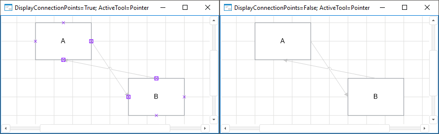

# IEtlBox.DisplayConnectionPoints

IEtlBox.DisplayConnectionPoints
-

# IEtlBox.DisplayConnectionPoints

## Синтаксис

DisplayConnectionPoints: Boolean;

## Описание

Свойство DisplayConnectionPoints
 определяет признак отображения точек соединения.

## Комментарии

Допустимые значения:

	- True. По умолчанию.
	 Точки соединения отображаются;

	- False. Точки соединения
	 не отображаются.

## Пример

См. также:

[IEtlBox](IEtlBox.htm)

		Справочная
		 система на версию 10.9
		 от 18/08/2025,
		 © ООО «ФОРСАЙТ»,
